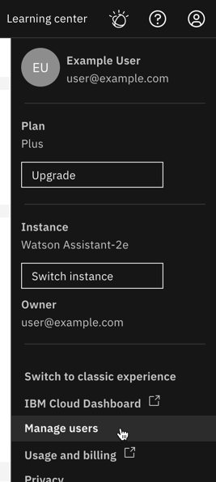

---

copyright:
  years: 2020, 2021
lastupdated: "2021-11-16"

subcollection: watson-assistant

---

{:shortdesc: .shortdesc}
{:new_window: target="_blank"}
{:deprecated: .deprecated}
{:important: .important}
{:note: .note}
{:tip: .tip}
{:pre: .pre}
{:codeblock: .codeblock}
{:screen: .screen}
{:javascript: .ph data-hd-programlang='javascript'}
{:java: .ph data-hd-programlang='java'}
{:python: .ph data-hd-programlang='python'}
{:swift: .ph data-hd-programlang='swift'}

{{site.data.content.classiclink}}

# Managing access
{: #access-control}

If you need to collaborate with others on your assistants, you can use the [Identity and Access Management (IAM) page](https://cloud.ibm.com/iam/users) in IBM Cloud to add users.
{: shortdesc}

In the new Watson Assistant, each assistant contains all the draft and live resolution methods (actions and search integration) and channels you add (such as web chat, Facebook, or Slack), so the simplest way to provide access is to add users to your Watson Assistant instance with Administrator and Manager permissions. This gives other users the same level of access to a Watson Assistant service instance as you, and ensures they have all the privileges they need to build and deploy any assistant. Unlike classic Watson Assistant, you no longer need to provide specific access to individual assistants and skills. Now in the new Watson Assistant, each assistant includes everything you need and access is more efficient.

## Opening Identity and Access Management
{: #access-control-iam}

1.  Open the **Manage** menu.

    

1.	Click **Manage users**.

1.	In **Access and permissions**, click **Identity and Access Management** in step 2.

    {: caption="Access and permissions" caption-side="bottom"}

1.	You’ll use Identity and Access Management (IAM) for all steps to share access.

## Providing access to your assistants
{: #access-control-provide-access}

1.	In IAM, click **Invite users**.

1.	Enter the email address of the person who needs access.

1.	Expand **Assign users additional access**, and then click **IAM services**.

    {: caption="IAM services" caption-side="bottom"}

1.	In **Which service do you want to assign access to?**, choose **Watson Assistant**.

1.	In **How do you want to scope the access?**, choose **Resources based on selected attributes**.

    {: caption="Resources based on selected attributes" caption-side="bottom"}

1.	In **Add attributes**, check **Service Instance**, then choose your instance from the list.

    {: caption="Service instance" caption-side="bottom"}

1.	In **Platform access**, check **Administrator**, and in **Service access**, check **Manager**. 

1.	Click **Add** to add the access policy.

    {: caption="Platform and service access" caption-side="bottom"}

1.	To finish, click the **Invite** button.

    {: caption="Invite button" caption-side="bottom"}

The user you invited appears in your list with the status of **Processing**. Once they accept the invite, status changes to **Active** and can now work on your assistants with you.