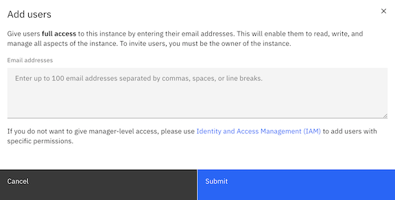
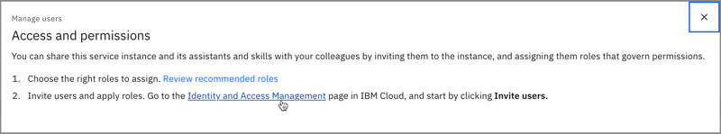
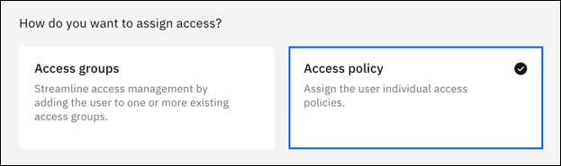
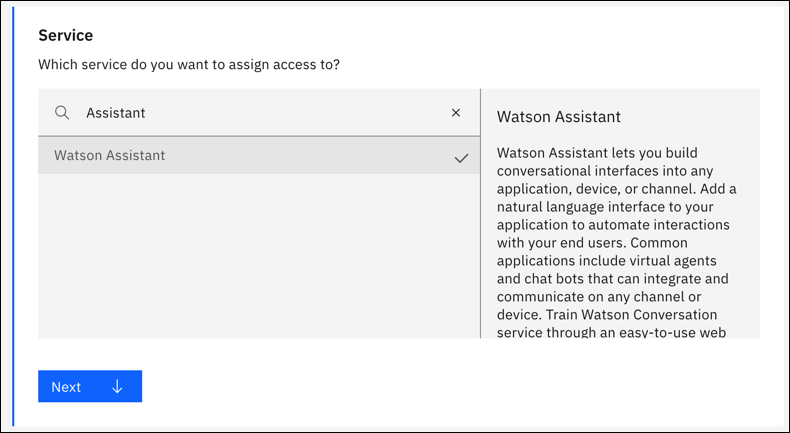
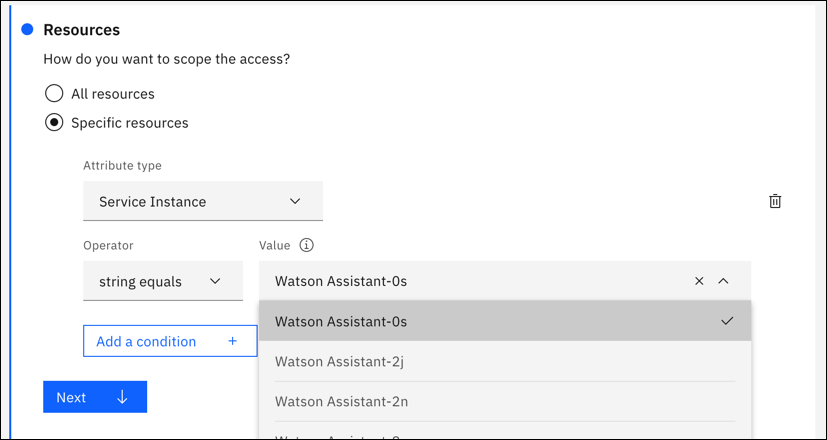
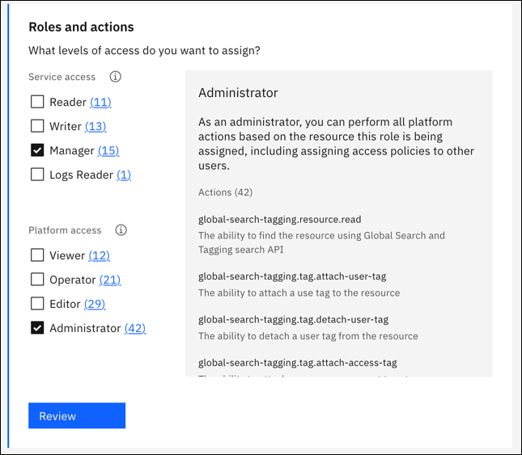
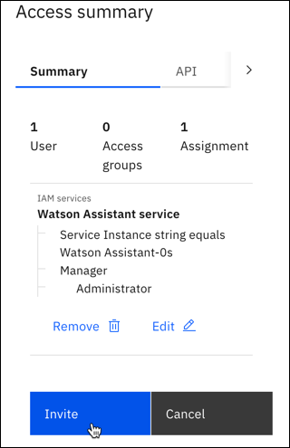
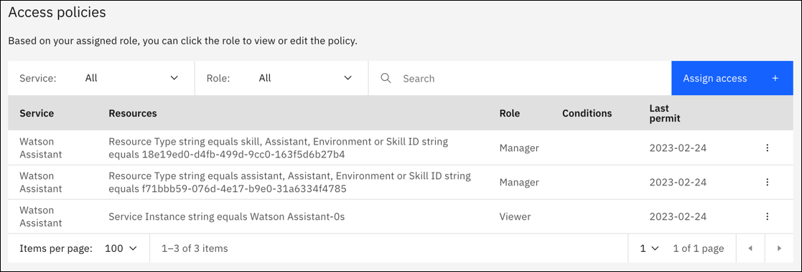

---

copyright:
  years: 2020, 2023
lastupdated: "2023-10-03"

subcollection: watson-assistant

---

{{site.data.keyword.attribute-definition-list}}

# Managing access
{: #access-control}

If you need to collaborate with others on your assistants, you can quickly add users to your service instance from the **Manage** menu. Or to tailor specific access to your assistants, use the [Identity and Access Management (IAM) page](https://cloud.ibm.com/iam/users) in IBM Cloud.
{: shortdesc}

## Adding users from the Manage menu
{: #access-control-add-users}

In {{site.data.keyword.conversationshort}}, each assistant contains all the draft and live resolution methods (actions and search integration) and channels you add (such as web chat, Facebook, or Slack). The simplest way to provide access is to add users to your {{site.data.keyword.conversationshort}} service instance with manager access to all assistants. Users get all the privileges that they need to build and deploy any assistant.

To quickly add users with manager access to all assistants, complete the following steps:

1.  Open the **Manage** menu.
    

1. Click **Add users**.

1. Enter the email addresses of the users that you want to provide full access to. Separate email addresses with commas, spaces, or line breaks.

    {: caption="Add users" caption-side="bottom"}

    Adding users from this menu enables them to read, write, and manage all assistants in the service instance.
    {: important}

1. Click **Submit**.

After you click **Submit**, any user that you invite receives an email to access the instance. After they accept the invite, they can open the service instance and manage all assistants.

## Managing access with Identity and Access Management
{: #access-control-iam}

Another way to add users to your assistants is using Identity and Access Management (IAM). If you want to add users, and you don't want them to have full Manager access, use IAM to add them. From IAM, you can also manage access roles of those users that are already added to your assistants.

### Opening Identity and Access Management
{: #access-control-open-iam}

1.  Open the **Manage** menu.
    

1.	Click **Manage users**.

1.	In **Access and permissions**, click **Identity and Access Management** in step 2.

    {: caption="Access and permissions" caption-side="bottom"}

### Adding users in Identity and Access Management
{: #access-control-manage-access}

1.	In IAM, click **Invite users**.

1.	Enter the email address of the person who needs access.

1.	In **How do you want to assign access?**, choose **Access policy**.

    {: caption="Access policy" caption-side="bottom"}

1.	In **Service**, choose **{{site.data.keyword.conversationshort}}**, then click **Next**.

    {: caption="Service" caption-side="bottom"}

1.	In **Resources**, choose either **All resources** or **Specific resources**. 

    If you choose **All resources**, the user can access all the instances of {{site.data.keyword.conversationshort}} in your account.

    If you choose **Specific resources**, you can narrow access in **Attribute type**. With this setting, you might need to add multiple access policies for a user to grant the correct access. For more information, see [Example of limiting access to one assistant](#access-control-limit-access).
    
    Choices include:

    | Resource attribute type | Description |
    | - | - |
    | Service Instance | Choose a specific service instance of {{site.data.keyword.conversationshort}} |
    | Assistant, Environment, or Skill ID | Enter the ID value for the resource. Use the **Assistant IDs and API details** section in **Assistant settings** to get the ID values for your assistant, environments, action skill, or dialog skill. |
    | Resource Type | If you enter an ID value, choose Assistant ID, Environment ID, or Skill ID to identify the ID type |
    | Region | Choose a specific region (for example, Dallas or London) |
    | Resource Group | Enter or choose a resource group that you created |
    {: caption="Attribute types" caption-side="top"}

    {: caption="Resources" caption-side="bottom"}

1.	In **Roles and actions**, select the [service role](#access-control-service-roles) that you want the user to have. Service access controls what a person can do in {{site.data.keyword.conversationshort}}. Next, select the [platform role](#access-control-platform-roles) that you want the user to have. Platform access controls a person's ability to access a service instance in {{site.data.keyword.cloud_notm}}. Then, click **Review**.

    {: caption="Roles and actions" caption-side="bottom"}

1.	Click **Add** to add the access policy.

    {: caption="Platform and service access" caption-side="bottom"}

1.	To finish, click **Invite**.

    {: caption="Invite" caption-side="bottom"}

The user that you invited appears in your list with the status of **Processing**. After they accept the invite, status changes to **Active**, and the user can work on your assistant with you.

### Platform roles
{: #access-control-platform-roles}

A platform role controls a user's ability to open and work with a service instance in {{site.data.keyword.cloud_notm}}. 

At a minimum, each user needs the *Viewer* platform role for a service instance
{: important}

| Role | Open | Modify | Delete | Manage access |
|---|---|---|---|---|
| **Viewer** |  | | | |
| **Operator** |  |  | | | |
| **Editor** |  |  | | | |
| **Administrator** |  |  |  |  |
{: caption="Platform role details" caption-side="top"}

### Service roles
{: #access-control-service-roles}

A service role controls what a person can do within each service instance.

| Role | Description |
|---|---|
| **Reader** | Read-only access to a resource. Use with Logs Reader to provide access to Analytics. | 
| **Writer** | Create and edit within a resource. |
| **Manager** | Manage everything in a resource. |
| **Logs Reader** | Use Logs Reader in combination with the Reader or Writer role to provide access to Analytics. |
| **Version Maker** | Create or delete versions of an assistant. Doesn't provide publish access. |
{: caption="Service role details" caption-side="top"}

This table explains the minimum service roles that are required for common tasks in an assistant.

| Task | Resource | Minimum service role required |
| --- | --- | --- |
| **Assistant** | | |
| Create assistant | Service instance | Writer |
| View assistant settings | Assistant | Writer |
| View assistant ID | Assistant | Writer |
| Update assistant settings | Assistant | Writer |
| Enable or disable dialog | Assistant | Writer |
| Delete assistant | Service instance | Writer |
| **Actions** | | |
| Create action | Action skill | Writer |
| Update action | Action skill | Writer |
| Delete action | Action skill | Writer |
| Download actions JSON file | Action skill | Reader |
| Upload actions JSON file | Action skill | Writer |
| Copy action | Action skill (in destination assistant) | Writer |
| **Publish** | | |
| Publish version | Environment | Writer |
| Create version without publishing | Assistant | Writer or Version Maker |
| Delete unpublished version | Assistant | Writer or Version Maker |
| Download version | Assistant | Reader |
| **Environments** | | |
| Create environment (Enterprise plan only) | Assistant | Writer |
| Update environment settings | Environment | Writer |
| Delete environment (Enterprise plan only) | Service instance | Writer |
| **Integrations** | | |
| Add integration | Service instance | Writer |
| Update integration | Service instance | Writer |
| Delete integration | Service instance | Writer |
| **Dialog** | | |
| Create intent | Dialog skill | Writer |
| Update intent | Dialog skill | Writer |
| Delete intent | Dialog skill | Writer |
| Import intents | Dialog skill | Writer |
| Export intents | Dialog skill | Reader |
| Create entity | Dialog skill | Writer |
| Update entity | Dialog skill | Writer |
| Delete entity | Dialog skill | Writer |
| Download intents and entities | Dialog skill | Reader |
{: caption="Minimum service role details" caption-side="top"}

### Example of limiting access to one assistant
{: #access-control-limit-access}

This example explains how to follow the steps in [Adding users from the Manage menu](#access-control-add-users) and set specific resources that limit a user to building and publishing actions in one assistant. For each user, you need to add three access policies that identify the service instance, assistant ID, and skill ID. (Use **Assistant settings** to get the ID values for your assistant and action skill.)

This table lists the values that you need to add for each policy:

| Policy | Specific resources | Value | Service role | Platform role |
| --- | --- | --- | --- | --- |
| 1 | `Service Instance` | Choose the instance that includes the assistant | None | `Viewer` |
| 2 | `Resource Type` | `Assistant ID` | `Manager` | None |
| 2 | `Assistant, Environment, or Skill ID` | ID for the assistant | `Manager` | None |
| 3 | `Resource Type` | `Skill ID` | `Manager` | None |
| 3 | `Assistant, Environment, or Skill ID` | ID for the action skill | `Manager` | None |
{: caption="Settings to limit access to one assistant" caption-side="top"}

The access policies for your user should look like this example:

{: caption="Access policies example" caption-side="bottom"}

With this set of access policies, your user can build and publish actions in one assistant. The user can't add integrations because the service instance is set to `Reader`. The user has read-only access to other assistants but can't build or publish actions.
