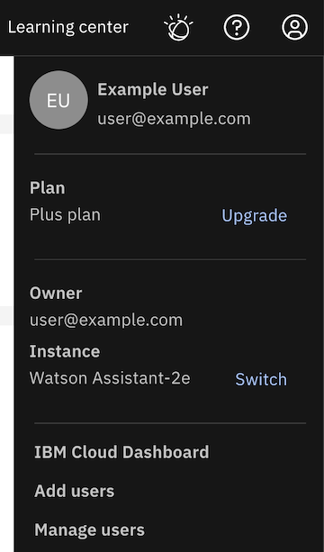
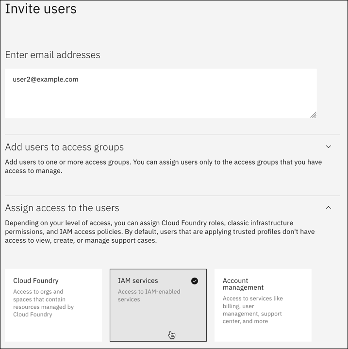
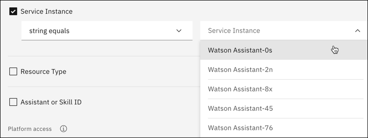
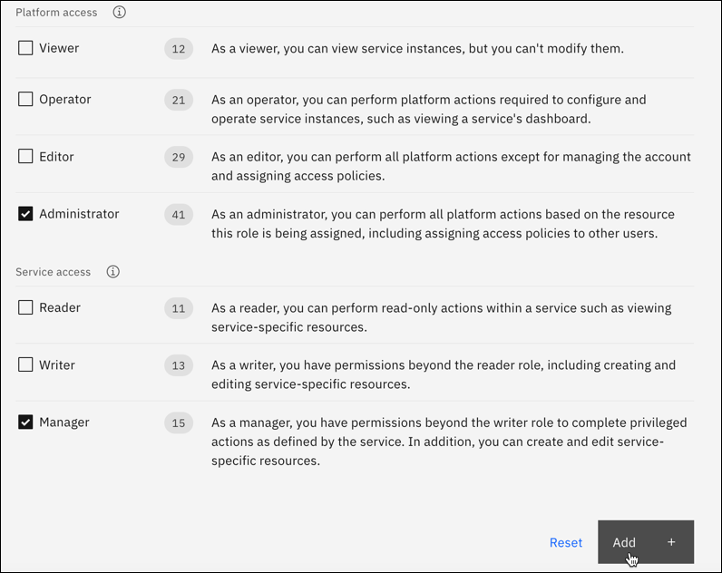
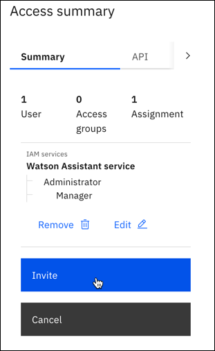

---

copyright:
  years: 2020, 2022
lastupdated: "2022-02-17"

subcollection: watson-assistant

---

{:shortdesc: .shortdesc}
{:new_window: target="_blank"}
{:deprecated: .deprecated}
{:important: .important}
{:note: .note}
{:tip: .tip}
{:pre: .pre}
{:codeblock: .codeblock}
{:screen: .screen}
{:javascript: .ph data-hd-programlang='javascript'}
{:java: .ph data-hd-programlang='java'}
{:python: .ph data-hd-programlang='python'}
{:swift: .ph data-hd-programlang='swift'}

{{site.data.content.classiclink}}

# Managing access
{: #access-control}

If you need to collaborate with others on your assistants, you can quickly add users with Administrator and Manager access from the **Manage** menu. To manage access to your assistants, use the [Identity and Access Management (IAM) page](https://cloud.ibm.com/iam/users) in IBM Cloud.
{: shortdesc}

## Adding users from the Manage menu
{: #access-control-add-users}

In the new Watson Assistant, each assistant contains all the draft and live resolution methods (actions and search integration) and channels you add (such as web chat, Facebook, or Slack), so the simplest way to provide access is to add users to your Watson Assistant instance with Administrator and Manager permissions. This gives other users the same level of access to a Watson Assistant service instance as you, and ensures they have all the privileges they need to build and deploy any assistant. If you want to add users without full access or manage the access of existing users, see the steps for [Managing access with Identity and Access Management](#access-control-iam).

To add users with Administrator and Manager access, complete the following steps:

1.  Open the **Manage** menu.

    

1. Click **Add users**.

1. Enter the email addresses of the users that you want to provide full access to. Separate email addresses with commas, spaces, or line breaks.

    

    Adding users from this menu enables them to read, write, and manage all aspects of the instance.
    {: important}

1. Click **Submit**.

After you click **Submit**, any user that you invite receives an email to access the assistant. After they accept the invite, they can now work on your assistant with you.

## Managing access with Identity and Access Management
{: #access-control-iam}

Another way to add users to your assistants is using Identity and Access Management (IAM). If you want to add users, and you don't want them to have full Administrator and Manager access, use IAM to add them. From IAM, you can also manage access roles of those users that are already added to your assistants.

### Opening Identity and Access Management
{: #access-control-open-iam}

1.  Open the **Manage** menu.

    

1.	Click **Manage users**.

1.	In **Access and permissions**, click **Identity and Access Management** in step 2.

    {: caption="Access and permissions" caption-side="bottom"}

### Adding users in Identity and Access Management
{: #access-control-manage-access}

1.	In IAM, click **Invite users**.

1.	Enter the email address of the person who needs access.

1.	Expand **Assign users additional access**, and then click **IAM services**.

    {: caption="IAM services" caption-side="bottom"}

1.	In **Which service do you want to assign access to?**, choose **Watson Assistant**.

1.	In **How do you want to scope the access?**, choose **Resources based on selected attributes**.

    {: caption="Resources based on selected attributes" caption-side="bottom"}

1.	In **Add attributes**, check **Service Instance**, then choose your instance from the list.

    {: caption="Service instance" caption-side="bottom"}

1.	In **Platform access**, select the platform role that you want the user to have. A platform role controls a person's ability to access a service instance in IBM Cloud. In **Service access**, select the service role that you want the user to have. A service role controls what a person can do in Watson Assistant.

1.	Click **Add** to add the access policy.

    {: caption="Platform and service access" caption-side="bottom"}

1.	To finish, click the **Invite** button.

    {: caption="Invite button" caption-side="bottom"}

The user you invited appears in your list with the status of **Processing**. After they accept the invite, status changes to **Active** and can now work on your assistants with you.
