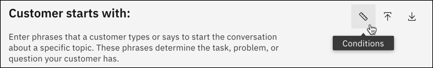
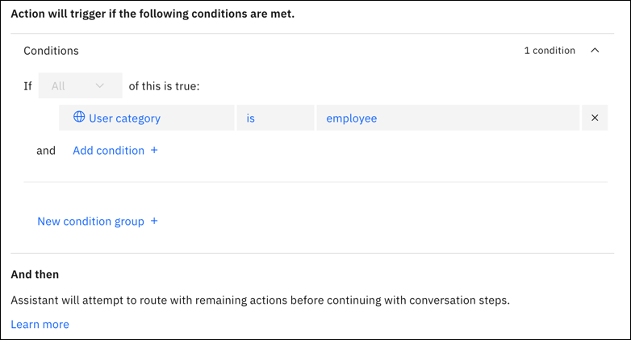

---

copyright:
  years: 2023
lastupdated: "2023-02-03"

subcollection: watson-assistant

---

{:shortdesc: .shortdesc}
{:new_window: target="_blank"}
{:external: target="_blank" .external}
{:deprecated: .deprecated}
{:important: .important}
{:note: .note}
{:tip: .tip}
{:pre: .pre}
{:codeblock: .codeblock}
{:screen: .screen}
{:javascript: .ph data-hd-programlang='javascript'}
{:java: .ph data-hd-programlang='java'}
{:python: .ph data-hd-programlang='python'}
{:swift: .ph data-hd-programlang='swift'}
{:beta: .beta}

# Adding conditions to an action
{: #action-conditions}

An action condition is a boolean test, based on some runtime value; the action executes only if the test evaluates as true. This test can be applied to any variable. By defining action conditions, you can do things such as control user access to actions or create date-specific actions.

This is a beta feature that is available for evaluation and testing purposes.
{: beta}

For more information about variables, see [Using variables to manage conversation information](/docs/watson-assistant?topic=watson-assistant-manage-info).

A basic action condition is expressed in the following form:

`If` `{variable}` `{operator}` `{value}`

where:

- `{variable}` is the name of a variable or an expression.
- `{operator}` is the type of test to apply to the variable value (for example, `is` or `is not`).
- `{value}` is the value to compare to the variable.

For example, an action condition might read:

`If` `User category?` `is` `employee`

In this example, `User category` can be a list of employees at your organization. This condition evaluates as true if the user is an active employee. If false, you can control access so that former employees can't use the action.

Conditions can be grouped together to construct complex tests.

To add an action condition:

1.  In an action, click **Customer starts with**.

1. Click **Conditions**.

   {: caption="Conditions" caption-side="bottom"}

1. Choose the variable for the condition. You can select any of the following:

   - An action variable storing the customer response from a previous step in the action
   - A session variable containing a value stored by any action
   - A built-in variable set by the assistant or by an integration

   You can also define a complex condition by writing an expression defining some other value. For more information about expressions, see [Writing expressions](/docs/watson-assistant?topic=watson-assistant-expressions).
   {: note}

1. Select the operator representing the test you want to perform on the variable (for example, `is` or `is not`). The available operators for a particular value depend upon its data type. For more information, see [Operators](#action-conditions-operators).

1. Select the value you want to evaluate the condition against. The values available depend upon the type of value you are testing. For example, an variable containing an options response can be tested against any of the defined options, and a date value can be tested against any date.

   {: caption="Conditions" caption-side="bottom"}

1.  To add more than one condition to an action, click **Add condition**.

1.  To add another group of conditions, click **New condition group**.

    You can use groups to build complex action conditions. Each group is evaluated true or false as a whole, and then these results are evaluated together. For example, you might build an action that executes only if all conditions in group 1 are true *or* any condition in group 2 is true. (Groups function like parentheses in the boolean conditions of many programming languages.)

    After you add a group, you can define one or more conditions in the new group. Between groups, choose **and** or **or** to indicate whether the conditions in both conditional groups or only one of them must be met for the step to be included in the conversational flow.

## Operators
{: #action-conditions-operators}

An operator specifies the kind of test you are performing on a value in a condition. The specific operators available in a condition depend on the customer response type of the value, as shown in the following table.

| Response type                        | Operators                           |
|--------------------------------------|-------------------------------------|
| - Options                            | - is\n- is not\n- is any of\n- is none of |
| - Regex                              | - is\n- is not                      |
| - Number\n- Currency\n- Percent      | - is defined\n- is not defined\n- is equal to (==)\n- is not equal to (≠)\n- is less than (&lt;)\n- is less than or equal to (&lt;=)\n- is greater than (&gt;)\n- is greater than or equal to (&gt;=) |
| - Date                               | - is defined\n- is not defined\n- is on (also allows specific day of the week)\n- is not on\n- is before\n- is after\n- is on or before\n- is on or after |
| - Time                               | - is defined\n- is not defined\n- is at\n- is not at\n- is before\n- is after\n- is at or before\n- is at or after |
| - Free text                          | - is\n- is not\n- contains\n- does not contain\n- matches\n- does not match |
{: caption="Operators" caption-side="top"}
