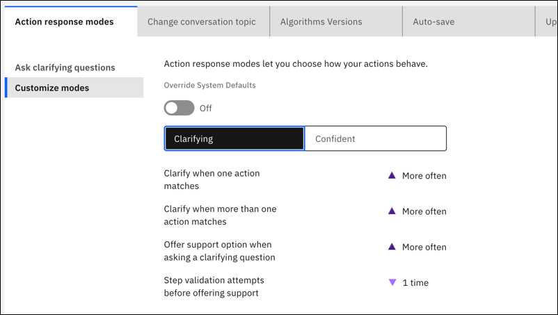
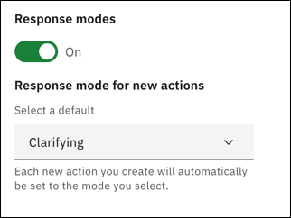
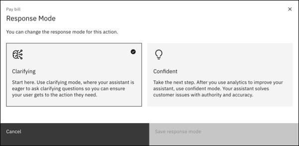

---

copyright:
  years: 2022, 2023
lastupdated: "2023-03-21"

subcollection: watson-assistant

---

{{site.data.keyword.attribute-definition-list}}

# Action response modes
{: #action-response-modes}

You can choose a response mode for each action. This lets you set how each action behaves. There are two modes: *clarifying* and *confident*.
{: shortdesc}

**Clarifying mode**: Start here. In the clarifying mode, your assistant is eager to ask questions so you can ensure that your customer gets to the action they need. An assistant is more likely to ask questions to be sure an action matches what a customer is asking. This lets you be sure a new or untested action gets the training that it needs.

**Confident mode**: Take the next step. After you use analytics to improve your assistant, use the confident mode. Your assistant solves customer issues with authority and accuracy. An assistant is less likely to ask questions and is more likely to trigger actions that match. Use confident mode after you test and train actions.

This is a beta feature that is available for evaluation and testing purposes.
{: beta}

## Settings
{: #action-response-modes-settings}

Settings for the two modes are in the global settings. For more information, see [Global settings for actions](/docs/watson-assistant?topic=watson-assistant-actions-global-settings).

{: caption="Global settings" caption-side="bottom"}

The settings are:

**Clarify when one action matches**: If an assistant prioritizes one action that it thinks matches the customer's request, it can clarify the match by asking the customer to confirm. This helps you ensure that the action is the right one and allows the customer to give input before proceeding. For example, if the assistant thinks that a single action named `Pay Bill` is the right one, it can clarify the choice by asking the customer `Did you mean: Pay Bill`.

**Clarify when more than one action matches**: When your assistant finds that more than one action might fulfill a customer's request, it can automatically ask for clarification. Instead of guessing which action to use, your assistant shows a list of the possible actions to the customer and asks the customer to pick the right one.

**Offer support option when asking a clarifying question**: When asking for clarification, the assistant can include a choice to connect to other support. If the customer picks this choice, the assistant uses your Fallback action.

**Step validation attempts before offering support**: If a customer provides invalid answers for a step in an action, the assistant can offer to connect to other support in the Fallback action. The step validation count measures how many invalid answers can occur before providing this choice.

This table shows the default settings for each mode. 

|  | Clarifying | Confident |
| --- | --- | --- |
| Clarify when one action matches | More often | Sometimes |
| Clarify when more than one action matches | More often | Sometimes |
| Offer support option when asking a clarifying question | More often | Sometimes |
| Step validation attempts before offering support | 1 time | 3 times |
{: caption="Default settings" caption-side="bottom"}

## Default for new actions
{: #action-response-modes-default}

In global settings for actions, you can choose what mode to use when you create a new action. Clarifying mode is the default and is designed for use with new, untested actions that need training.

{: caption="Default for new actions" caption-side="bottom"}

## Choosing a mode for individual actions
{: #action-response-modes-individual-actions}

When editing an action, you can see the mode that it uses and change it if you need to.

1. Click the Action response mode icon . The mode in use is checked.

   {: caption="Action response mode" caption-side="bottom"}

1. Click the other mode if you want to change it, and then click **Save response mode**.

## Override system defaults modes
{: #action-response-modes-customize}

[Enterprise]{: tag-purple}

For Lite and Plus plans, the default settings can’t be changed. For Enterprise plans, you can override system defaults to customize each mode in global settings for actions.

To override system defaults:

1. Set the **Override System Defaults** toggle to **On**. This toggle is available only for Enterprise plans.

1. Use the dropdown menu to any of the settings for either mode.

If you customize, here are the choices for each setting:

| Setting | Choices |
| --- | --- |
| Clarify when one action matches | More often, Sometimes, Less often |
| Clarify when more than one action matches | More often, Sometimes, Less often |
| Offer support option when asking a clarifying question | More often, Sometimes, Less often |
| Step validation attempts before offering support | 1 time, 2 times, 3 times |
{: caption="Mode customization choices" caption-side="bottom"}

If you customize modes, be sure to test any changes.
{: note}
