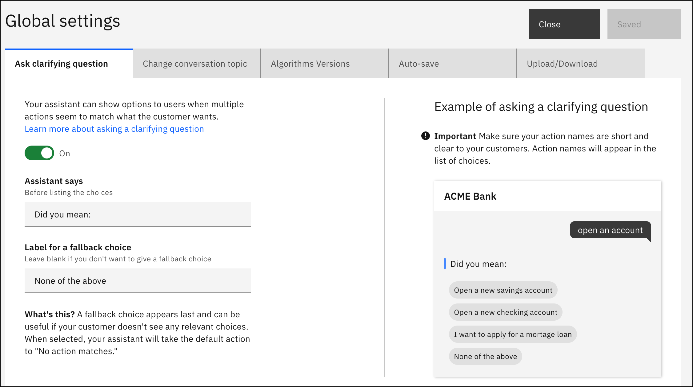

---

copyright:
  years: 2022
lastupdated: "2022-06-16"
keywords: settings
subcollection: watson-assistant

---

{:shortdesc: .shortdesc}
{:new_window: target="_blank"}
{:external: target="_blank" .external}
{:deprecated: .deprecated}
{:important: .important}
{:note: .note}
{:tip: .tip}
{:pre: .pre}
{:codeblock: .codeblock}
{:screen: .screen}
{:javascript: .ph data-hd-programlang='javascript'}
{:java: .ph data-hd-programlang='java'}
{:python: .ph data-hd-programlang='python'}
{:swift: .ph data-hd-programlang='swift'}

{{site.data.content.classiclink}}

# Global settings for actions
{: #actions-global-settings}

Use **Global settings** to configure features across all actions.
{: shortdesc}

On the **Actions** page, click **Global settings** . 

This page provides options, configurations, and tasks for the following:

- [Ask clarifying question](#actions-global-settings-ask-clarifying-question)
- [Change conversation topic](#actions-global-settings-change-conversation-topic)
- [Algorithms versions](#actions-global-settings-algorithms-versions)
- [Auto-save](#actions-global-settings-auto-save)
- [Upload/Download](#actions-global-settings-upload-download)

## Ask clarifying question
{: #actions-global-settings-ask-clarifying-question}

When your assistant finds that more than one action might fulfill a customer's request, it can automatically ask for clarification. Instead of guessing which action to take, your assistant shows a list of the possible actions to the customer, and asks the customer to pick the right one. For more information, see [Asking clarifying questions](/docs/watson-assistant?topic=watson-assistant-understand-questions#understand-questions-ask-clarifying-question).

On the **Ask clarifying question** tab, you can make the following changes:

- In the **Assistant says** field, edit the text that is displayed before the list of clarification choices.

    The default text is *Did you mean:*. You can change it to something else, such as *What do you want to do?* or *Pick what to do next*.
    
- In the **Label for a fallback choice** field, edit the label that is displayed for the choice that customers can click when none of the other choices are quite right. When a user picks this choice, the *No action matches* system action is taken next.

    The label *None of the above* is used if you don't change it.  

    This fallback choice gives customers a way to get out of the clarification process if it's not helping them. If you don't want to give customers a fallback choice, remove the text from the field.

If necessary, you can disable clarifying questions for all actions. To disable clarification for all actions:

1. On the **Ask clarifying question** tab, set the switch to **Off**.

1. Click **Save**, and then click **Close**.

## Change conversation topic
{: #actions-global-settings-change-conversation-topic}

The **Change conversation topic** feature enables your assistant to handle digressions, dynamically responding to the user by changing the conversation topic as needed. For more information, see [Allowing your customers to change the topic of the conversation](/docs/watson-assistant?topic=watson-assistant-change-topic).

If necessary, you can disable changing the topic for all actions:

1. On the **Change conversation topic** tab, set the switch to **Off**.

1. Click **Save**, and then click **Close**.

## Algorithms versions
{: #actions-global-settings-algorithms-versions}

**Algorithms versions** allows you to choose which version of {{site.data.keyword.conversationshort}} algorithms to apply to your future trainings. 

You can choose to use the more stable and fully supported version of algorithms by selecting **Baseline**. This is the latest mature version that you might want to use for your live assistant. Or you can choose **Beta** to preview and test what is coming. The capability in the beta version at any given time is likely to become the baseline version later on.

The baseline and beta versions are labeled with dates such as **Baseline (2022-06-01)** or **Beta (2022-06-10)**. This refers to the release of a specific baseline or beta version. You can consult the [{{site.data.keyword.conversationshort}} release notes](/docs/watson-assistant?topic=watson-assistant-watson-assistant-release-notes) for details of updates made in that algorithms version release.

Algorithm version options are currently available for Chinese (Simplified), English, French, German, Italian, Portuguese, Spanish and the Universal Language model. Other languages use default algorithm versions.

## Auto-save
{: #actions-global-settings-auto-save}

When working on actions, your assistant automatically saves changes when you do one of the following:

- Click on a new step
- Open Preview
- Reset Preview

For more information, see [Saving your actions](/docs/watson-assistant?topic=watson-assistant-save-actions)

If you want to disable auto-save, you can toggle it off:

1. On the **Auto-save** tab, set the switch to **Off**.

1. Click **Save**, and then click **Close**.

## Upload/Download
{: #actions-global-settings-upload-download}

You can upload or download actions.

### Downloading
{: #actions-global-settings-download}

To back up actions, download a JSON file and store it. On the **Upload/Download** tab, click the **Download** button.

### Uploading
{: #actions-global-settings-upload}

To reinstate a backup copy of actions that you exported from another service instance or environment, import the JSON file of the actions you exported.

If the {{site.data.keyword.conversationshort}} service changes between the time you export the actions and import it, due to functional updates that are regularly applied to instances in cloud-hosted continuous delivery environments, your imported actions might function differently than before.
{: important}

On the **Upload/Download** tab, drag and drop a JSON file onto the tab or click to select a file from your local system, then click **Upload**.

The imported JSON file must use UTF-8 encoding, without byte order mark (BOM) encoding. The JSON file cannot contain tabs, newlines, or carriage returns.
{: important}
