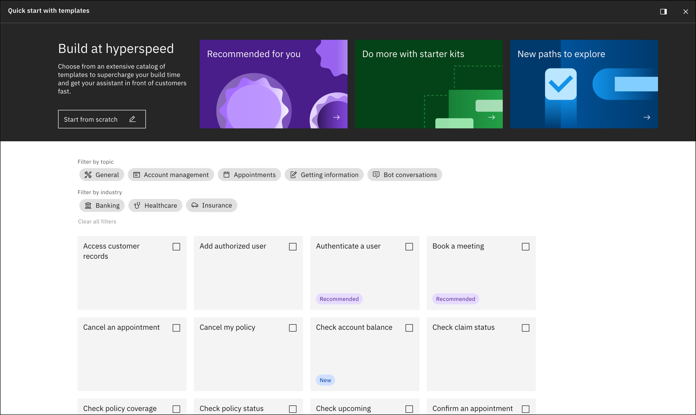
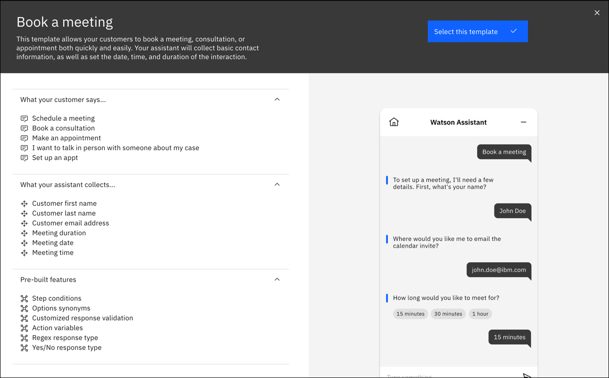
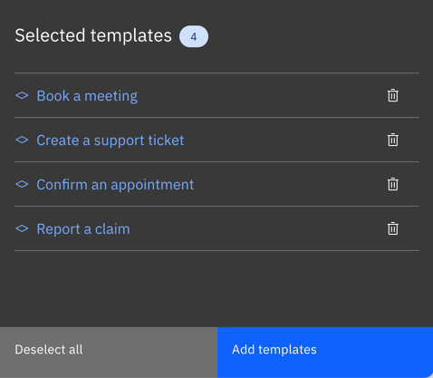
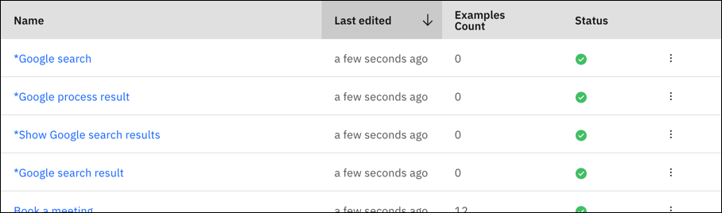

---

copyright:
  years: 2021, 2023
lastupdated: "2023-02-22"

subcollection: watson-assistant

---

{:shortdesc: .shortdesc}
{:new_window: target="_blank"}
{:external: target="_blank" .external}
{:deprecated: .deprecated}
{:important: .important}
{:note: .note}
{:tip: .tip}
{:pre: .pre}
{:codeblock: .codeblock}
{:screen: .screen}
{:javascript: .ph data-hd-programlang='javascript'}
{:java: .ph data-hd-programlang='java'}
{:python: .ph data-hd-programlang='python'}
{:swift: .ph data-hd-programlang='swift'}

# Building actions from templates
{: #actions-templates}

When you create actions, you can choose a template that relates to the problem you’re trying to solve. Templates help tailor your actions to include items specific to your business need. The examples in each template can also help you to learn how actions work.
{: shortdesc}

Templates are available for different use cases, for example, booking a meeting, creating a support ticket, or making a payment. Templates include all the pieces that make up an action, such as steps, conditions, and different response types to collect customer answers.

You can use templates in English-language assistants only.
{: note}

Some or all of these features are included as examples in action templates:

| Feature | Description | More information |
| --- | --- | --- |
| Step conditions | A step condition is a Boolean test, based on a runtime value. The step is used only if the test evaluates as true. | [Adding conditions to a step](/docs/watson-assistant?topic=watson-assistant-step-conditions) |
| Options synonyms | Synonyms are variations of an option value that customers might enter. | [Options](/docs/watson-assistant?topic=watson-assistant-collect-info#customer-response-type-options) |
| Customized response validation | When you edit a step that expects a customer response, you can customize how validation errors are handled. | [When your customer gives invalid answers](/docs/watson-assistant?topic=watson-assistant-handle-errors#step-validation)
| Action variables | When customers reply to your assistant, they share information about themselves and what they want. Your assistant remembers this information, and other information about a conversation, as variables. | [Using variables to manage conversation information](/docs/watson-assistant?topic=watson-assistant-manage-info) |
| Session variables | A value that is not necessarily tied to a particular action can be stored as a session variable. Session variables are long-term memory: they persist throughout the user's interaction with the assistant, and your assistant can reference them from any action. | [Using variables to manage conversation information](/docs/watson-assistant?topic=watson-assistant-manage-info) |
| Regex response type | A regex response collects a text string that matches a pattern that is expressed as a regular expression. Use this response to capture a value that must conform to a particular pattern or format, such as an email address or telephone number. | [Regex](/docs/watson-assistant?topic=watson-assistant-collect-info#customer-response-type-regex) |
 | Yes/No response type | A confirmation response presents customers with the choices of either Yes or No as buttons. | [Confirmation](/docs/watson-assistant?topic=watson-assistant-collect-info#customer-response-type-confirmation) |
 | Connect to agent | If your assistant is integrated with one of the supported service desk systems, you can build in logic that transfers the conversation to a live agent when necessary. | [Connecting to a live agent](/docs/watson-assistant?topic=watson-assistant-human-agent) |
 | Embedded video | Includes a video to display a how-to demonstration, promotional clip, or other video content. In the web chat, a video response renders as an embedded video player. | [Adding a Video response](/docs/watson-assistant?topic=watson-assistant-respond#respond-add-video) |
 | Customer responses referenced in URLs | In your assistant's output, you can reference variables to personalize a URL link, including information specific to the customer such as account number or email address | [Adding and referencing variables](/docs/watson-assistant?topic=watson-assistant-respond#respond-variables) |
 | Customized agent handoff information | If your assistant is integrated with one of the supported service desk systems, you can build in logic that transfers the conversation to a live agent when necessary. You can customize messages the assistant displays as part of the transfer | [Connecting to a live agent](/docs/watson-assistant?topic=watson-assistant-human-agent) |
{: caption="Features" caption-side="bottom"}

## Creating actions from templates
{: #actions-templates-create}

To create actions from templates:

1. Open the **Actions** page.

1. If you have no actions, choose **Create a new action**. If you already have some actions, choose **New action**.

1. On **Create an action**, choose **Quick start with templates**.

<!--   {: caption="Create an action" caption-side="bottom"}-->

1. On **Quick start with templates**, click a template to read details about what it does. Or, you can click the checkbox to select the template right away.

<!--   {: caption="Quick start with templates" caption-side="bottom"}-->

1. Review the details of the template, then click **Select this template**.

<!--   {: caption="Template details" caption-side="bottom"}-->

1. Your list of selected templates includes all the ones that you chose. You can select as many templates as you want. If you change your mind, click the trash can icon to remove a template from the list.

<!--   {: caption="Selected templates" caption-side="bottom"}-->

1. When you're ready, click **Add templates**. Most templates add one action. Some starter kit templates add multiple actions, marked with an asterisk, that require setup. For more information, see [Starter kit extension setup](#actions-templates-extension-setup).

1. In the actions editor, you can use a new action as-is, or modify it to fit your use case.

<!--   {: caption="New action" caption-side="bottom"}-->

You can create multiple actions from the same template. For example, if you used the **Book a meeting** template to create an action, you can choose that template again. If the first action is still named **Book a meeting**, the new action is added with the name **Book a meeting (1)**.
{: note}

## Preview actions
{: #actions-templates-preview}

Most action templates are complete. (Starter kit templates are marked with an asterisk and require setup.) You can try out an action right away even without making any changes. 

To preview the action that you created from a template:

1. In the actions editor, click **Preview**.

1. Try some of the example phrases from **Customer starts with** to see how the assistant responds.

<!--   {: caption="Preview" caption-side="bottom"}-->

## Starter kit extension setup
{: #actions-templates-extension-setup}

Starter kit templates add actions that can use extensions to connect to data and systems outside of {{site.data.keyword.conversationshort}}. When you add a starter kit template, the resulting actions and variables are marked with an asterisk. These require setup of an extension. To learn more about extensions in general, see [Build a custom extension](/docs/watson-assistant?topic=watson-assistant-build-custom-extension).

<!-- {: caption="Starter kit actions" caption-side="bottom"}-->

This table lists each starter kit, a link to download an OpenAPI specification file that you need to set up the extension, and a link to setup instructions.

| Starter kit | OpenAPI specification file | Setup instructions |
| --- | --- | --- |
| Coveo search | [coveo.openapi.json](https://github.com/watson-developer-cloud/assistant-toolkit/blob/master/integrations/extensions/starter-kits/coveo/coveo.openapi.json){: external} | [Coveo search setup](#actions-templates-extension-setup-coveo) |
| Google custom search | [google-custom-search-openapi.json](https://github.com/watson-developer-cloud/assistant-toolkit/blob/master/integrations/extensions/starter-kits/google-custom-search/basic/google-custom-search-openapi.json){: external} | [Google custom search setup](#actions-templates-extension-setup-google) |
| HubSpot | [hubspot.advanced.openapi.json](https://github.com/watson-developer-cloud/assistant-toolkit/blob/master/integrations/extensions/starter-kits/hubspot/advanced/hubspot.advanced.openapi.json){: external} | [HubSpot setup](#actions-templates-extension-setup-hubspot) |
| NeuralSeek | Requires a file specific to your instance of NeuralSeek. Refer to the setup instructions. | [NeuralSeek extension setup](#actions-templates-extension-setup-neuralseek) |
| ServiceNow | [sn.openapi.json](https://github.com/watson-developer-cloud/assistant-toolkit/blob/master/integrations/extensions/starter-kits/servicenow/sn.openapi.json){: external} | [ServiceNow extension setup](#actions-templates-extension-setup-servicenow) |
| Zendesk | [zendesk-openapi.json](https://github.com/watson-developer-cloud/assistant-toolkit/blob/master/integrations/extensions/starter-kits/zendesk-support/zendesk.openapi.json){: external} | [Zendesk extension setup](#actions-templates-extension-setup-zendesk) |
{: caption="Starter kits" caption-side="bottom"}

### Coveo search extension setup
{: #actions-templates-extension-setup-coveo}

To set up the extension for Coveo search, see [Coveo search extension setup](/docs/watson-assistant?topic=watson-assistant-search-extension-coveo).

### Google custom search extension setup
{: #actions-templates-extension-setup-google}

To set up the extension for Google custom search, see [Google custom search extension setup](/docs/watson-assistant?topic=watson-assistant-search-extension-google).

### HubSpot extension setup
{: #actions-templates-extension-setup-hubspot}

To set up the extension for HubSpot:

1. In HubSpot, you need to create a developer account and then create a private app. The private app includes an access token that you need for authentication. For detailed instructions, see [Getting private app access token](https://github.com/watson-developer-cloud/assistant-toolkit/blob/master/integrations/extensions/starter-kits/hubspot/readme.md#pre-req-1-getting-private-apps-access-token){: external} in the HubSpot Custom Extension starter kit GitHub repository.

1. Your HubSpot account needs custom properties. Follow the instructions in [Adding Custom Properties in HubSpot](https://github.com/watson-developer-cloud/assistant-toolkit/blob/master/integrations/extensions/starter-kits/hubspot/readme.md#pre-req-2-adding-custom-properties-in-hubspot){: external} in the HubSpot Custom Extension starter kit GitHub repository.

1. Download the OpenAPI specification file: [hubspot.advanced.openapi.json](https://github.com/watson-developer-cloud/assistant-toolkit/blob/master/integrations/extensions/starter-kits/hubspot/advanced/hubspot.advanced.openapi.json){: external}.

1. In your assistant, on the **Integrations** page, click **Build custom extension** and use the OpenAPI specification file to build a custom extension. For general instructions on building any custom extension, see [Building the custom extension](/docs/watson-assistant?topic=watson-assistant-build-custom-extension#building-the-custom-extension).

1. After you build the HubSpot custom search extension and it appears on your **Integrations** page, click **Add** to add it to your assistant. Use your HubSpot private app access token to authenticate. For general instructions on adding any custom extension, see [Adding an extension to your assistant](/docs/watson-assistant?topic=watson-assistant-add-custom-extension). 

1. On the **Actions** page, edit each HubSpot action to use the HubSpot extension in the **And then** section of different steps.

   This table explains the edit to each action:

   | Action | Step | Operation | Parameters |
   | --- | --- | --- | --- |
   | *Personalized greeting | 2 | Get Contact by ID | Set `contactId` to `1. Hi! Please tell me your customer ID ...` |
   | *Dispute a charge | 4 | Create Ticket | <ul><li>Set `properties.subject` to `*subject`</li><li>Set `properties.charge_date` to `3. What was the date?`</li><li>Set `properties.charge_name` to `1. Sure, we can help you create a ticket`</li><li>Set `properties.charge_amount` to `2. How much was the charge for?`</li><li>Set `properties.hs_pipeline_stage` to `*hs_pipeline_stage`</li></ul> |
   | *View all HubSpot tickets | 1 | List Tickets | Add an expression to set `limit` to `10` |
   | *Check ticket status | 8 | Get Ticket Info | Set `ticketId` to `*ticketId` |
   | *Delete a ticket | 2 | Archive Ticket | Set `ticketId` to `*ticketId` |
   {: caption="HubSpot use extension" caption-side="bottom"}

In the ***Dispute a charge** action, `subject` and `hs_pipeline_stage` exist by default in HubSpot's ticketing schema. The action adds default values in step 4. The `subject` field in the API corresponds to the ticket name of a HubSpot ticket. The `hs_pipeline_stage` field in the API corresponds to the ticket status of a HubSpot ticket. Submit a value of `1` for the `hs_pipeline_stage` field, which sets the ticket status to `New`. 
{: note}

### NeuralSeek extension setup
{: #actions-templates-extension-setup-neuralseek}

To set up the extension for NeuralSeek, see [NeuralSeek extension setup](/docs/watson-assistant?topic=watson-assistant-search-extension-neuralseek).

### ServiceNow extension setup
{: #actions-templates-extension-setup-servicenow}

To set up the extension for ServiceNow:

1. Request a ServiceNow Personal Developer Instance. For detailed instructions, see [Personal Developer Instances](https://developer.servicenow.com/dev.do#!/learn/learning-plans/rome/new_to_servicenow/app_store_learnv2_buildmyfirstapp_rome_personal_developer_instances){: external}.

1. Download the OpenAPI specification file: [sn.openapi.json](https://github.com/watson-developer-cloud/assistant-toolkit/blob/master/integrations/extensions/starter-kits/servicenow/sn.openapi.json){: external}.

1. In your assistant, on the **Integrations** page, click **Build custom extension** and use the OpenAPI specification file to build a custom extension. For general instructions on building any custom extension, see [Building the custom extension](/docs/watson-assistant?topic=watson-assistant-build-custom-extension#building-the-custom-extension).

1. After you build the ServiceNow extension and it appears on your **Integrations** page, click **Add** to add it to your assistant. Use your ServiceNow admin username and password to authenticate. Replace the default instance server variable with your own. For general instructions on adding any custom extension, see [Adding an extension to your assistant](/docs/watson-assistant?topic=watson-assistant-add-custom-extension).

1. On the **Actions** page, edit the ***Create an incident report** action to use the extension. In step 5, click **Edit extension**. 

1. In the **Extension** field, choose the ServiceNow extension that you built.

1. In the **Operation** field, choose `Create Incident`.

1. In the **Parameters** list, set:

   - `impact` to `*urgency`
   - `urgency` to `*urgency`
   -  `assignment_group` to `*assignment_group`
   -  `short_description` to `1. Sure, we can help you create an incident report`

### Zendesk extension setup
{: #actions-templates-extension-setup-zendesk}

To set up the extension for Zendesk:

1. In Zendesk, open the **Admin Center**, for example, `https://{server-domain}.zendesk.com/admin`.

1. In **Apps and integrations**, click **Zendesk API**.

1. On the **Settings** tab, enable **Password access**.

1. Download the OpenAPI specification file: [zendesk-openapi.json](https://github.com/watson-developer-cloud/assistant-toolkit/blob/master/integrations/extensions/starter-kits/zendesk-support/zendesk.openapi.json){: external}.

1. In your assistant, on the **Integrations** page, click **Build custom extension** and use the OpenAPI specification file to build a custom extension. For general instructions on building any custom extension, see [Building the custom extension](/docs/watson-assistant?topic=watson-assistant-build-custom-extension#building-the-custom-extension).

1. After you build the Zendesk extension and it appears on your **Integrations** page, click **Add** to add it to your assistant. Use your Zendesk username and password to authenticate. For general instructions on adding any custom extension, see [Adding an extension to your assistant](/docs/watson-assistant?topic=watson-assistant-add-custom-extension).

1. On the **Actions** page, edit each Zendesk action to use the Zendesk extension in the **And then** section of different steps.

   This table explains the edit to each action:

   | Action | Step | Operation | Parameters |
   | --- | --- | --- | --- |
   | *Create a Zendesk support ticket | 2 | Create Ticket | <ul><li>Set `request.subject` to `3. Thanks! Alright, in just a few words...`</li><li>Set `request.comment.body` to `4. I'm sorry to hear that ...`</li></ul> |
   | *Update existing ticket | 3 | Update Ticket | Set `id` to `1. Let's get your ticket updated...` |
   | *View all Zendesk tickets | 1 | List Tickets | None |
   | *View comments on a ticket | 3 | Get Ticket Comments | Set `id` to `2. What's the ticket ID you're looking for?` |
   {: caption="Zendesk use extension" caption-side="bottom"}

