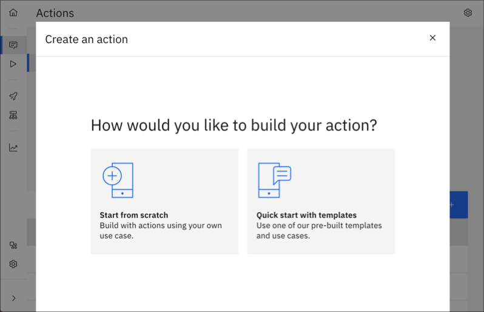
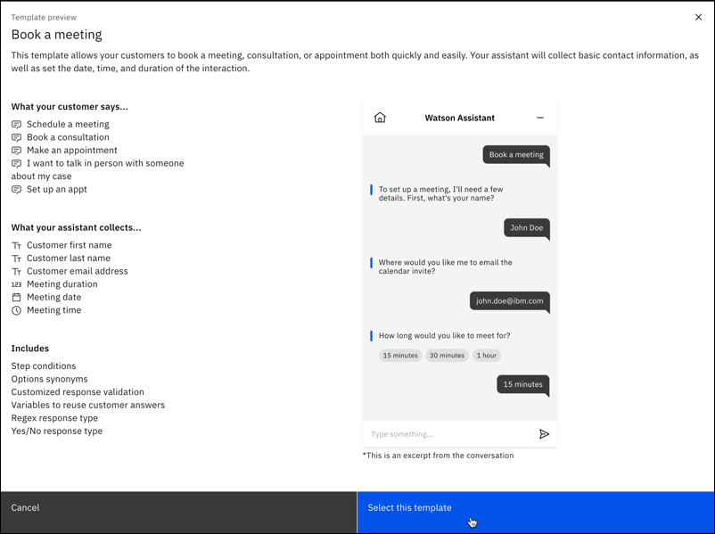
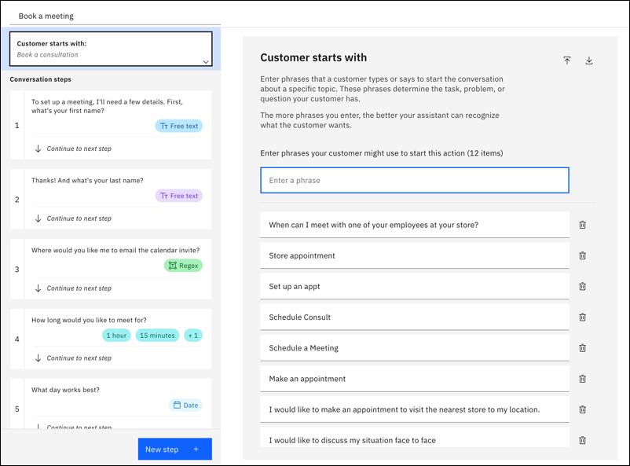
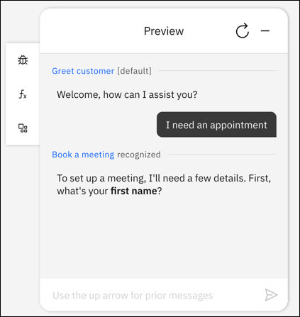

---

copyright:
  years: 2021, 2022
lastupdated: "2022-08-12"

subcollection: watson-assistant

---

{:shortdesc: .shortdesc}
{:new_window: target="_blank"}
{:external: target="_blank" .external}
{:deprecated: .deprecated}
{:important: .important}
{:note: .note}
{:tip: .tip}
{:pre: .pre}
{:codeblock: .codeblock}
{:screen: .screen}
{:javascript: .ph data-hd-programlang='javascript'}
{:java: .ph data-hd-programlang='java'}
{:python: .ph data-hd-programlang='python'}
{:swift: .ph data-hd-programlang='swift'}

{{site.data.content.classiclink}}

# Building actions from a template
{: #actions-templates}

When creating actions, you can choose a template that relates to the problem you’re trying to solve. Templates help tailor your actions to include items specific to your business need. The examples in each template can also help you to learn how actions work.
{: shortdesc}

Templates are available for different use cases, for example, booking a meeting, connecting to a live agent, or creating a support ticket. Each template includes all the pieces that make up a complete action, such as steps, conditions, and different response types to collect customer answers.

Some or all of these features are included as examples in action templates:

| Feature | Description | More information |
| -- | -- | -- |
| Step conditions | A step condition is a boolean test, based on a runtime value. The step executes only if the test evaluates as true. | [Adding conditions to a step](/docs/watson-assistant?topic=watson-assistant-step-conditions) |
| Options synonyms | Synonyms are variations of an option value that customers might enter. | [Options](/docs/watson-assistant?topic=watson-assistant-collect-info#customer-response-type-options) |
| Customized response validation | When you edit a step that expects a customer response, you can customize how validation errors are handled. | [When your customer gives invalid answers](docs/watson-assistant?topic=watson-assistant-handle-errors#step-validation)
| Variables to reuse customer answers | When customers reply to your assistant, they share information about themselves and what they want. Your assistant remembers this information, and other information about a conversation, as variables. | [Using variables to manage conversation information](/docs/watson-assistant?topic=watson-assistant-manage-info) |
| Regex response type | A regex response collects a text string that matches a pattern expressed as a regular expression. Use this response to capture a value that must conform to a particular pattern or format, such as an email address or telephone number. | [Regex](/docs/watson-assistant?topic=watson-assistant-collect-info#customer-response-type-regex) |
 | Yes/No response type | A confirmation response presents customers with the choices of either Yes or No as clickable buttons. | [Confirmation](/docs/watson-assistant?topic=watson-assistant-collect-info#customer-response-type-confirmation) |
 {: caption="Features" caption-side="top"}}

## Creating an action from a template
{: #actions-templates-create}

To create an action from a template:

1. Open the **Actions** page.

1. If this is your first action, choose **Create a new action**. If you already have some actions, choose **New action**.

1. On **Create an action**, choose **Quick start with templates**.

   

1. On **Quick start with templates**, choose one template.

   

1. Review the preview of the template, then click **Select this template**.

   

1. In the actions editor, you can use the new action as-is, or modify it to fit your use case.

   

You can create multiple actions from the same template. For example, if you have already used the **Book a meeting** template to create an action, you can choose that template again. If the first action is still named **Book a meeting**, the new action is added with the name **Book a meeting (1)**.
{: note}

## Preview the action
{: #actions-templates-preview}

Each action template is complete. You can try out the action right away even without making any changes. 

To preview the action you created from a template:

1. In the actions editor, click **Preview**

1. Try some of the example phrases from **Customer starts with** to see how the assistant responds.

   

