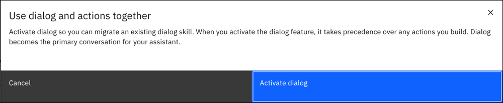

---

copyright:
  years: 2018, 2022
lastupdated: "2022-04-05"

subcollection: watson-assistant

---

{:shortdesc: .shortdesc}
{:new_window: target="_blank"}
{:external: target="_blank" .external}
{:deprecated: .deprecated}
{:important: .important}
{:note: .note}
{:tip: .tip}
{:pre: .pre}
{:codeblock: .codeblock}
{:screen: .screen}
{:javascript: .ph data-hd-programlang='javascript'}
{:java: .ph data-hd-programlang='java'}
{:python: .ph data-hd-programlang='python'}
{:swift: .ph data-hd-programlang='swift'}

# Activating dialog and migrating skills
{: #activate-dialog}

To use an existing dialog skill, you need to activate the dialog feature in your assistant. Then you can upload your existing skill.

## Activating dialog
{: #activate-dialog-activating}

To activate the dialog feature in the new experience:

1.  Create or open an assistant where you want to use a dialog as the primary conversation with users.

1.  Open **Assistant settings** .

1.  Click **Activate dialog**.

    

1.  In the confirmation that displays, click **Activate dialog** again.

    

Once you activate the dialog feature, it takes precedence over actions. You can use actions to supplement a dialog-based conversation, but the dialog drives the conversation with users to match their requests. For more information, see [Calling actions from a dialog](/docs/watson-assistant?topic=watson-assistant-dialog-call-action).

## Migrating existing skills
{: #activate-dialog-upload}

Once the dialog feature is activated, you can start a new dialog conversation from scratch if you want. But, you probably have an existing dialog skill that you want to migrate into the new {{site.data.keyword.conversationshort}}.

To migrate an existing dialog skill:

1.  Use the classic experience to [download your dialog skill](/docs/assistant?topic=assistant-skill-tasks#skill-tasks-download){: external} in JSON format. 

1.  In the new {{site.data.keyword.conversationshort}}, open the **Dialog** page.

1.  In **Options**, choose **Upload / Download**.

    

1.  On the **Upload** tab, upload the JSON file for your dialog skill.
