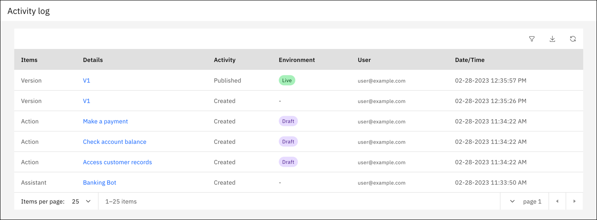

---

copyright:
  years: 2021, 2025
lastupdated: "2025-06-09"

subcollection: watson-assistant

---

{{site.data.keyword.attribute-definition-list}}

# Activity log
{: #activity-log}

[IBM Cloud]{: tag-ibm-cloud}[Plus]{: tag-green}[Enterprise]{: tag-purple} [{{site.data.keyword.icp4dfull_notm}}]{: tag-cp4d} [{{site.data.keyword.IBM_notm}} Software Hub]{: tag-teal}

Use the *activity log* to track changes. It gives you visibility into the modifications that are made to your assistant. It is available for Plus plans and higher.
{: shortdesc}

{: caption="Activity log" caption-side="bottom"}

Available days of activity depend on your plan.

| Plan | Days of activity |
| --- | --- |
| Plus | 30 |
| Enterprise | 90 |
| Premium | 90 |
{: caption="Plan information" caption-side="top"}

## User access to the activity log
{: #activity-log-access}

To access and view the log, users need at least the *Reader* service role for an assistant. Users might not be able to open links for specific events, depending on their access to all the items in an assistant.

For more information, see [Managing access](/docs/watson-assistant?topic=watson-assistant-access-control).

## Using the activity log
{: #activity-log-using}

To open the log, click the **Activity log** icon . 

The activity log includes these columns of data:

| Column | Description |
|---|---|
| Item | Describes what was impacted by the change that was made within the assistant. For more information, see [Items and activity tracked](#activity-items). |
| Details | Shows details about the item that was changed. For example, for an action, this column lists the specific action name and provides a link to open it. |
| Activity | Describes the change that was made. For more information, see [Items and activity tracked](#activity-items). |
| Environment | The environment in which the activity took place or the end destination of an activity. |
| User | Email address of the user that made the change. |
 | Date/Time | Date and time of the activity in the format `DD-MM-YYYY hr:min:sec AM/PM` |
 {: caption="Activity log columns" caption-side="top"}

### Filtering
{: #activity-log-filter}

Click the **Filter** icon  to filter the log. You can filter on:
- Item
- Details
- Activity
- Environment
- Environment ID
- User (requires exact match)
- Date range

### Sorting
{: #activity-log-sort}

To sort the log, click either the **Details** or **Date/Time** columns.

### Downloading
{: #activity-download}

You can download the activity log as a CSV file. You can either download all activity, or filter the activity log by any of [filtering](#activity-log-filter) choices.

To download the activity log, click the **Download** icon .

## Items and activity tracked
{: #activity-items}

For the early access release, here's the current list of items and activity that are tracked. Events are tracked if they complete successfully.

| Item | Activity | Notes |
| --- | --- | --- |
| Assistant | Created, Dialog activated, Dialog deactivated | |
| Assistant Settings | Updated | |
| Action | Created, Updated, Deleted | <ul><li>Each save (auto or manual) is tracked as an update.</li><li>Changes to action settings are tracked as an update.</li></ul> |
| Variable | Created, Updated, Deleted | |
| Saved Response Type | Created, Updated, Deleted | |
| Version | Created, Published, Deleted | |
| Environment | Created, Updated, Deleted | 
| Intent | Created, Updated, Deleted | <ul><li>Each save (auto or manual) is tracked as an update.</li><li>A renamed intent retains the old name in previous entries and won't have a link.</li></ul> |
| Entity | Created, Updated, Deleted | <ul><li>Each save (auto or manual) is tracked as an update.</li><li>A renamed entity retains the old name in previous entries and won't have a link.</li></ul> |
| Dialog Node | Created, Updated, Deleted | Each save (auto or manual) is tracked as an update. |
| Search | Updated | |
| Channel Integrations | Created, Updated, Deleted | <ul><li> All three activities are applicable for the integrations of Phone, Facebook Messenger, Slack, SMS, WhatsApp with Twilio, Microsoft Teams, and Genesys Bot Connector.</li><li>For the Web Chat integration, only the Updated activity is applicable.</li></ul>|
| Custom Extensions | Created, Deleted, Added, Updated, Removed | All the activities are applicable for Custom Extension Name. |
| Segment Extension | Added, Updated, Removed | |
| Dialog&#8212;Entity Value Name | Created, Updated, Deleted | |
| Dialog&#8212;Entity Synonym Name | Created, Updated, Deleted | |
| Dialog&#8212;Intent Example Name | Created, Updated, Deleted | |
| Collections | Created, Updated, Deleted | All the activities are applicable for Name of that collection. |
{: caption="Items and activity" caption-side="top"}

If an item was triggered by the API, the activity log shows the account owner of the API key, even if the key is shared with another person who is triggered the event.
{: note}

### What isn't included in the log
{: #activity-not-included}

These items aren't included in the activity log:

- Copying an action from another assistant 
- Uploading actions, intents, entities aren't included as created
- Changing actions global settings
- Reverting a version to draft
- Adding or deleting entity values and synonyms
- Creating, updating, or deleting channel integrations
- Creating, updating, or deleting custom extensions
