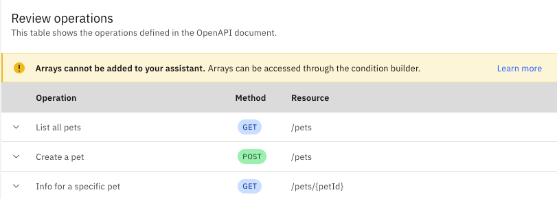

---

copyright:
  years: 2022, 2023
lastupdated: "2023-10-24"

subcollection: watson-assistant

---

{{site.data.keyword.attribute-definition-list}}

# Adding an extension to your assistant
{: #add-custom-extension}

After you build a custom extension, you must add it to the assistant before it can be accessed by actions.
{: shortdesc}

Adding the extension to the assistant configures the extension for use within a particular environment, and it makes the extension available so that it can be called from actions.

You can use different configuration details for each environment. For example, you might want to use the URL for a test server in the draft environment, but a production server in the live environment.

For information about how to create a custom extension, see [Build a custom extension](/docs/watson-assistant?topic=watson-assistant-build-custom-extension).

## Adding the extension to the draft environment
{: #add-custom-extension-draft}

To add a custom extension to the assistant, follow these steps:

1. On the  **Integrations** page, scroll to the **Extensions** section and find the tile for the custom extension you want to add.

1. Click **Add**. Review the overview of the extension and click **Confirm** to configure it for your assistant.

    When you first add an extension to an assistant, the configuration settings you provide are applied only to the draft environment. You must complete configuration for the draft environment before you can add the extension in the live environment.
    {: important}

1. Read the information in the **Get started** step, and then click **Next**.

1. In the **Authentication** step, specify the authentication and server information you want your assistant to use when it calls the service.

    - In the **Authentication type** field, select the type of authentication to use (or **No authentication** if the API is not authenticated). The available authentication types are determined by the security schemes that are defined in the OpenAPI document.

    - Specify the additional information required for the authentication type you selected (such as the username and password, API key, bearer token, or OAuth 2.0 details).

        For more information about configuring OAuth 2.0 authentication, see [OAuth 2.0 authentication](#add-custom-extension-oauth).
        {: tip}

    - In the **Servers** field, select the server URL to use.

        If the selected URL contains any variables, also specify the values to use. Depending on how each variable is defined in the OpenAPI document, you can either select from a list of valid values or type the value to use in the field.

        The **Generated URL** message shows the full URL that the assistant uses, including the variable values.

     Click **Next**.

1. In the **Review extension** step, review the operations that are supported by the extension.

    The **Review operations** table shows the operations that the assistant is able to call from an action step. An _operation_ is a request by using a particular HTTP method, such as `GET` or `POST`, on a particular resource.

    

    For each operation, a row in the table shows the following information:

    - **Operation**: A description of the operation, which is derived from either the `summary` (if present) or `description` in the OpenAPI file.
    - **Method**: The HTTP method used to send the API request for the operation.
    - **Resource**: The path to the resource the operation acts upon.

    To see more information about an operation, click the  icon next to its row in the table. The following details are shown:

    - **Request parameters**: The list of input parameters defined for the operation, along with the type of each parameter and whether the parameter is required or optional.
    - **Response properties**: The properties of the response body that are mapped to variables the assistant can access.

1. Click **Finish**.

1. Click **Close** to return to the Integrations page.

The extension is now connected to your assistant and available for use by actions in the draft environment.

### OAuth 2.0 authentication
{: #add-custom-extension-oauth}

If you are configuring OAuth 2.0 authentication, the information you must provide depends upon the grant type.

For more information about OAuth 2.0, see [OAuth 2.0](https://oauth.net/2/){: external}.
{: tip}

To complete the OAuth authentication setup, follow these steps:

1. If you haven't already, register your application with the external API you want to access. Copy the client ID and client secret that is provided by the external API.

1. In the **Grant type** field, select the grant type that you want to use. Available grant types are determined by flows that are defined in the `securitySchemes` object in the OpenAPI document. Authorization Code, Client Credentials, Password, and custom grant types that start with `x-` are supported.

   The OAuth2 custom grant type `x-`<any custom name> is used by the [IBM IAM authentication mechanism](/docs/account?topic=account-iamoverview) and by [watsonx](https://www.ibm.com/watsonx).
   {: note}

1. Specify the required values that were provided by the external API when you registered your application. The required values depend on the grant type:

    | Grant type         | Required values |
    |--------------------|-----------------|
    | Authorization Code | - **Client ID** \n - **Client secret** |
    | Client Credentials | - **Client ID** \n - **Client secret** |
    | Password           | - **Client ID** \n - **Client secret** \n - **Username** \n - **Password** |
    | x-<any custom name>| - **A list of secret fields mentioned in the openAPI spec file** |

1. If you are using the Authorization Code grant type, follow these steps:

    1. Copy the redirect URL from the {{site.data.keyword.conversationshort}} extension settings page and paste it into the appropriate field on the application registration page for the external API. (The redirect URL is sometimes called the _callback URL_.)
    
    1. Click **Grant Access**. You are redirected to the authorization page on the website for the external service. Verify that the correct access is being granted and click to approve. You are then redirected back to the extension setup page by using the redirect URL.

1. In the **Client authentication** field, specify whether the authentication credentials are sent in an HTTP header or as part of the request body. (Credentials that are sent in the request body use the `x-www-form-urlencoded` content type.) Select the option that is expected by the external service.

1. In the **Header prefix** field, specify the prefix that precedes the access token in the `Authorization` header. (The default prefix is `Bearer`, which is typical for most applications.)

1. If you are using the custom grant type `x-`<any custom name> (for example, x-apikey), follow these steps:

    1. Add the secret values associated with the secret fields.
    1. Add the optional param values, if any. 

If the external service supports the Refresh Token grant type, {{site.data.keyword.conversationshort}}  automatically obtains a new access token when the old one expires. If the OpenAPI document defines the `refreshUrl` attribute, the specified URL is used; otherwise, the `tokenUrl` URL is used.
{: note}

## Configuring the extension for the live environment
{: #add-custom-extension-live}

To configure the extension for the live environment, follow these steps:

1. On the  **Integrations** page, scroll to the **Extensions** section and find the tile for the custom extension you want to add.

1. Click **Open**. The **Open custom extension** window opens.

1. In the **Environment** field, select **Live**. Click **Confirm**.

1. Repeat the configuration process, specifying the values that you want to use for the live environment.

   If you are using multiple environments, follow the same steps to configure the extension for each environment. For more information, see [Adding and using multiple environments](/docs/watson-assistant?topic=watson-assistant-multiple-environments).
   {: note}

The extension is now available in the environments that you configured, and it can be called from the assistant. For more information about how to call an extension from an action, see [Calling a custom extension](/docs/watson-assistant?topic=watson-assistant-call-extension).

## Plan limits
{: #add-custom-extension-limits}

The number of custom extensions you can add to an assistant depends on your plan. If you already added the maximum number of extensions to the assistant, you must remove one before you can add a new one.

| Plan       |   Extensions per assistant |
|------------|---------------------------:|
| Enterprise |                        100 |
| Premium (legacy) |                  100 |
| Plus       |                         10 |
| Trial      |                          5 |
| Lite       |                          3 |
| Standard (legacy) |                   0 |
{: caption="Extension limits by plan" caption-side="top"}

