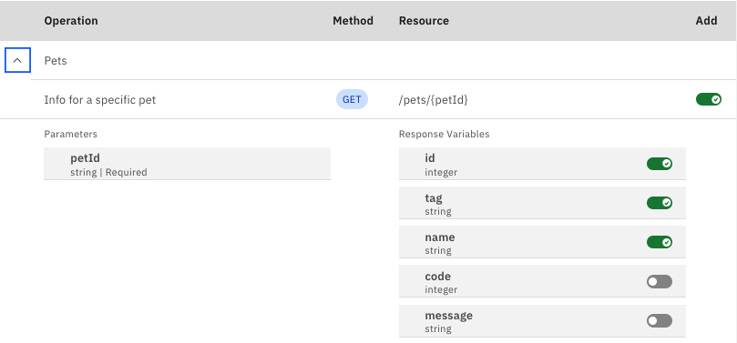
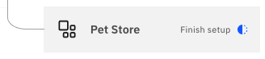

---

copyright:
  years: 2022
lastupdated: "2022-02-15"

subcollection: watson-assistant

---

{:shortdesc: .shortdesc}
{:new_window: target="_blank"}
{:external: target="_blank" .external}
{:deprecated: .deprecated}
{:important: .important}
{:note: .note}
{:tip: .tip}
{:pre: .pre}
{:preview: .preview}
{:codeblock: .codeblock}
{:screen: .screen}
{:javascript: .ph data-hd-programlang='javascript'}
{:java: .ph data-hd-programlang='java'}
{:python: .ph data-hd-programlang='python'}
{:swift: .ph data-hd-programlang='swift'}
{:table: .aria-labeledby="caption"}
{:video: .video}

{{site.data.content.classiclink}}

# Adding an extension to your assistant
{: #add-custom-extension}

After you have built a custom extension, you must add it to the assistant before it can be accessed by actions.
{: shortdesc}

Adding the extension to the assistant configures the extension for use within a particular environment (Draft or Live), and it makes the extension available in the **And next** field in the step editor.

For information about how to create a custom extension, see [Build a custom extension](/docs/watson-assistant?topic=watson-assistant-build-custom-extension).

## Adding the assistant to the Draft environment

To add a custom extension to the assistant, follow these steps:

1. From the **Draft environment** or **Live environment** page, click **Browse catalog**.

    When you first add an extension to an assistant, the configuration settings you provide are applied only to the Draft environment. This is true even if you open the catalog from the **Live environment** page.
    {: important}

1. On the **Integrations** page, scroll to the **Extensions** section and find the tile for the custom extension you want to add.

1. Click **Add**. Review the overview of the extension and click **Confirm** to configure it for your assistant.

1. Read the information in the **Get started** step, and then click **Next**.

1. In the **Authentication** step, specify the authentication credentials and server URL you want your assistant to use when calling the service. Click **Next**.

1. In the **Manage operations** step, review the operations supported by the extension, and decide which operations and response variables you want to be available to the assistant.

The table shows the operations that the assistant will be able to call from an action step. An _operation_ is a request using a particular HTTP method, such as `GET` or `POST`, on a particular resource.

The table is organized by categories derived from the `tags` field in the OpenAPI file. (Any operation for which `tags` is absent is shown in a category called _Default_.) Click the  icon to see the operations in a category.

For each operation, a row in the table shows the following information:

- **Operation**: A description of the operation, which is derived from either the `summary` (if present) or `description` in the OpenAPI file.
- **Method**: The HTTP method used to send the API request for the operation.
- **Resource**: The path to the resource the operation acts upon.

After the main table row for an operation, the following additional details are shownn:

- **Parameters**: The list of input parameters defined for the operation, along with the type of each parameter and whether the parameter is required or optional.
- **Response variables**: The properties of the response body properties that will be mapped to variables the assistant can access.

1. To hide an operation from the assistant, click the  switch icon in the **Add** column and toggle it off.

    To hide an operation from the assistant, click the  switch icon after the variable name and toggle it off.

    By default, the assistant has access to all operations and all response variables returned from successful requests.

1. Click **Finish**.

The extension is now connected to your assistant and available for use by actions in the Draft environment.

## Configuring the extension for the Live environment

To configure the extension for the Live environment, follow these steps:

1. Go to the **Live environment** page.

1. Under **Resolution Methods**, find the tile for the extension. You should see an indication that setup is incomplete:

    

1. Click the tile and repeat the configuration process, specifying the values you want to use for the Live environment.
