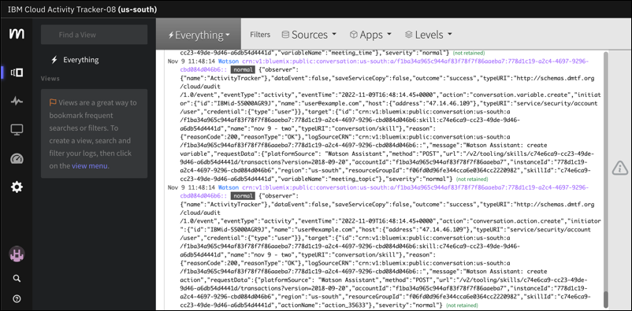

---

copyright:
  years: 2022, 2023
lastupdated: "2023-10-10"

subcollection: watson-assistant

---

{{site.data.keyword.attribute-definition-list}}

# Using {{site.data.keyword.at_full_notm}} to audit user activity
{: #admin-auditing}

[IBM Cloud]{: tag-ibm-cloud}[Enterprise]{: tag-purple}

You can use the {{site.data.keyword.at_full_notm}} service to track how users and applications interact with {{site.data.keyword.conversationfull}} in {{site.data.keyword.cloud}}. This applies to both the classic and new experiences of {{site.data.keyword.conversationshort}}.
{: shortdesc}

{{site.data.keyword.at_full_notm}} records user-initiated activities that change the state of a service in {{site.data.keyword.cloud_notm}}. You can use this service to investigate abnormal activity and critical actions and to comply with regulatory audit requirements. In addition, you can be alerted about actions as they happen. The events that are collected comply with the Cloud Auditing Data Federation (CADF) standard. For more information, see [Getting started with {{site.data.keyword.at_full_notm}}](/docs/activity-tracker?topic=activity-tracker-getting-started){: external}.

## Viewing events
{: #admin-auditing-ui}

Events that are generated by an instance of the {{site.data.keyword.conversationshort}} service are automatically forwarded to the {{site.data.keyword.at_full_notm}} service instance that is available in the same location. However, if your service instance is hosted in the **Washington DC** location, create the {{site.data.keyword.at_full_notm}} service instance in the **Dallas** region.

{{site.data.keyword.at_full_notm}} can have only one instance per location. To view events, you must access the web UI of the {{site.data.keyword.at_full_notm}} service in the same location where your service instance is available. For more information, see [Navigating to the UI](/docs/activity-tracker?topic=activity-tracker-launch){: external}.



## List of events
{: #admin-auditing-events}

The following table lists the {{site.data.keyword.conversationshort}} activities that generate events.

In {{site.data.keyword.at_full_notm}}, each event has the prefix `conversation.`, for example: `conversation.action.create`
{: note}

| Activity | When someone... |
| --- | --- |
| `action.create` | creates an action |
| `action.delete` | deletes an action |
| `action.update` | updates an action |
| `action_handler.create` | creates an action handler |
| `action_handler.delete` | deletes an action handler |
| `action_handler.update` | updates an action handler |
| `action_variable.create` | creates an action variable |
| `action_variable.delete` | deletes an action variable |
| `action_variable.update` | updates an action variable |
| `actions.copy` | copies an action from one assistant to another |
| `assistant.create` | creates an assistant |
| `assistant.delete` | deletes an assistant |
| `assistant.update` | updates an assistant, for example, updates the settings |
| `catalog_integration.create` | creates a custom extension |
| `catalog_integration.delete` | deletes a custom extension |
| `catalog_integration.update` | updates a custom extension |
| `counterexample.create` | marks test user input in "Try it out" as being irrelevant or corrects the categorization of a user input that was incorrectly assigned to an intent by marking it as irrelevant |
| `counterexample.delete` | deletes a counterexample |
| `counterexample.update` | edits a counterexample |
| `data.delete` | deletes multiple training data items, such as multiple entities or intents |
| `data.update` | does a bulk action, such as importing a CSV file of intents or entities to the skill |
| `data_type.create` | creates a saved response |
| `data_type.delete` | deletes a saved response |
| `data_type.update` | updates a saved response |
| `entity.create` | creates an entity |
| `entity.delete` | deletes an entity |
| `entity.update` | edits an entity |
| `environment.create` | adds an environment |
| `environment.delete` | deletes an environment |
| `environment.updates` | updates an environment |
| `example.create` | adds a user input example to an intent |
| `example.delete` | deletes a user example from an intent |
| `example.update` | edits a user example that is associated with an intent |
| `integration_defintion.create` | creates an integration |
| `integration_defintion.delete` | deletes an integration |
| `integration_defintion.update` | updates an integration |
| `intent.create` | creates an intent |
| `intent.delete` | deletes an intent |
| `intent.update` | edits an intent |
| `log.create` | corrects an intent that was inaccurately categorized by the skill from the Analytics>User conversations page |
| `node.create` | creates a dialog node |
| `node.delete` | deletes a dialog node |
| `node.update` | edits a dialog node |
| `notifier.create` | creates a notifier |
| `notifier.delete` | deletes a notifier |
| `notifier.update` | updates a notifier |
| `processor.create` | creates a processor |
| `processor.delete` | deletes a processor |
| `processor.update` | updates a processor |
| `release.create` | create a version from content in the draft environment |
| `release.delete` | delete a version |
| `release.deploy` | publish a version to an environment |
| `skill.create` | creates a skill |
| `skill.delete` | deletes a skill |
| `skill.update` | updates a skill |
| `skill_reference.create` | adds a specific skill to an assistant |
| `skill_reference.delete` | removes a specific skill from an assistant |
| `skill_reference.update` | updates a specific skill that is associated with an assistant |
| `skill_variable.create` | create a skill variable |
| `skill_variable.delete` | delete a skill variable |
| `skill_variable.update` | update a skill variable |
| `skills.export` | export a skill |
| `skills.import` | import a skill |
| `snapshot.create` | creates a version of a dialog skill |
| `snapshot.delete` | deletes a version of a dialog skill |
| `snapshot.update` | updates a version of a dialog skill |
| `step.create` | adds a step to an action |
| `step.delete` | deletes a step from an action |
| `step.update` | updates a step in an action |
| `step_handler.create` | create a step handler |
| `step_handler.delete` | delete a step handler |
| `step_handler.update` | update a step handler |
| `synonym.create` | creates a synonym for an entity value |
| `synonym.delete` | deletes a synonym that is associated with an entity value |
| `synonym.update` | edits a synonym that is associated with an entity value |
| `userdata.delete` | deletes data that was created by a specified customer |
| `value.create` | creates an entity value |
| `value.delete` | deletes an entity value |
| `value.update` | edits an entity value |
| `workspace.create` | creates a workspace |
| `workspace.delete` | deletes a workspace |
| `workspace.update` | edits a workspace |
{: caption="Table 1. Activity that generates events" caption-side="top"}

## Additional information for update events
{: #admin-auditing-updates}

Any of the update events include this additional information in a `requestData.update` object:

- Name changed
- Title changed
- Metadata changed
- Training data changed

This example from an `assistant.update` event shows a name change:

```code
"update":[{"updateType":"Name changed","nameAttribute":"name","newValue”:”Banking Bot 2},{“updateType":"Metadata changed","attributesUpdated":["description","language"]}],{"environment":"draft"},
```
