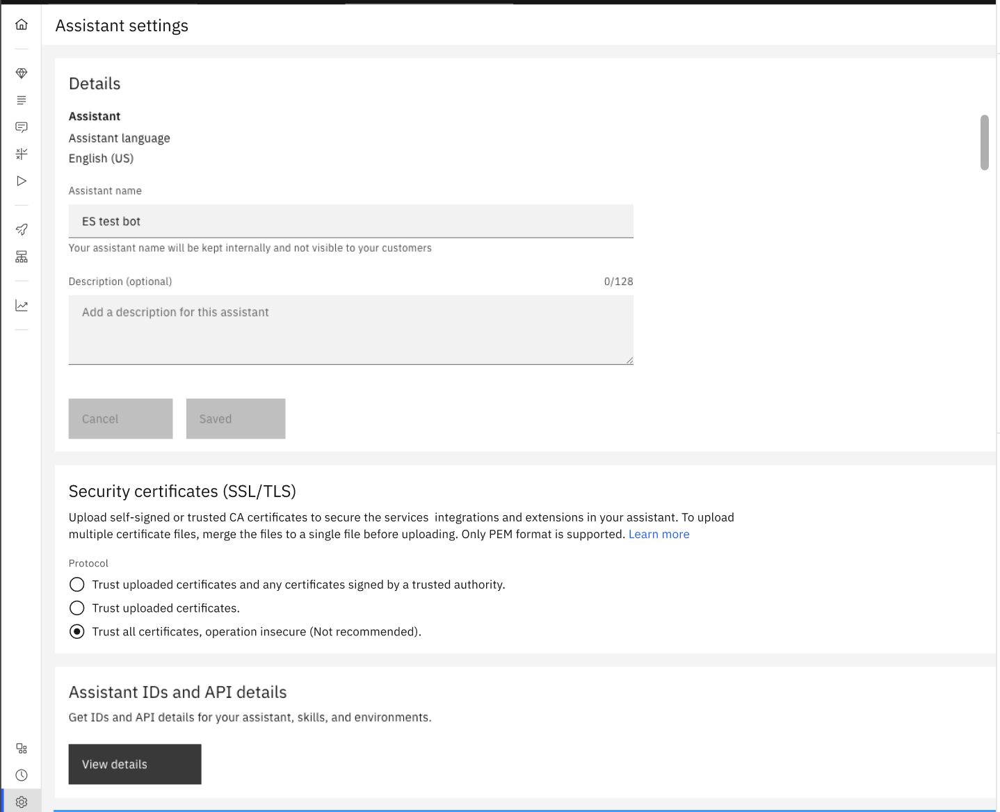
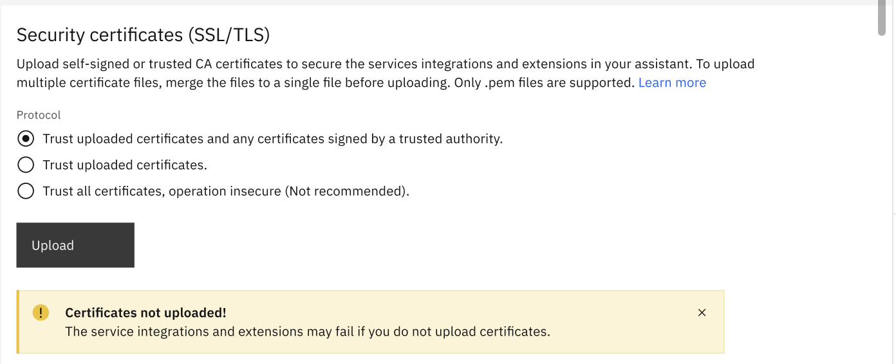
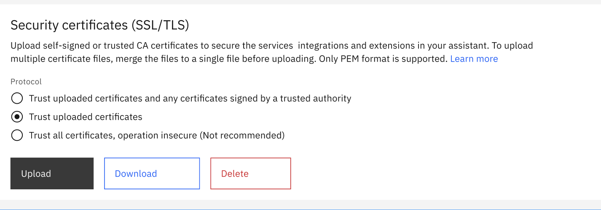

---

copyright:
  years: 2021, 2025
lastupdated: "2025-01-10"

subcollection: watson-assistant

---

{{site.data.keyword.attribute-definition-list}}

# Securing your assistant
{: #admin-securing}

IBM is committed to providing our clients and partners with innovative data privacy, security, and governance solutions.
{: shortdesc}

## Notice
{: #admin-securing-notice}
Clients are responsible for ensuring their own compliance with various laws and regulations, including the European Union General Data Protection Regulation (GDPR).

Clients are solely responsible for obtaining advice from competent legal counsel to identify and interpret relevant laws and regulations that can affect the clients’ business and any actions the clients need to take to comply with such laws and regulations.

The products, services, and other capabilities described herein can have restricted availability and are not suitable for all client situations. IBM does not provide legal, accounting, or auditing advice; or represent or warrant that its services or products can ensure compliance with any law or regulation.

If you need to request GDPR support for {{site.data.keyword.cloud}} {{site.data.keyword.watson}} resources:

- In the European Union, see [Requesting support for IBM Cloud Watson resources created in the European Union](/docs/watson?topic=watson-gdpr-sar#request-EU){: external}.
- Outside the European Union, see [Requesting support for resources outside the European Union](/docs/watson?topic=watson-gdpr-sar#request-non-EU){: external}.

You can keep user assistant data secure when interacting with server-run code by configuring Secure Sockets Layer or Transport Layer Security (SSL/TLS) certificates in your assistant. For more information, see [Configuring Security certificates](#ssl-certificates-config).

## European Union General Data Protection Regulation (GDPR)
{: #securing-gdpr}

IBM is committed to providing our clients and partners with innovative data privacy, security, and governance solutions to assist them on their journey to GDPR compliance.

Learn more about IBM's own GDPR readiness journey and our GDPR capabilities and offerings to support your compliance journey at [IBM Cloud GDPR EU Compliance](https://www.ibm.com/cloud/compliance/gdpr-eu){: external}.

## Health Insurance Portability and Accountability Act (HIPAA)
{: #securing-hipaa}

US Health Insurance Portability and Accountability Act (HIPAA) support is available for Enterprise plans that are hosted in the Washington, DC or Dallas locations. For more information, see [Enabling HIPAA support for your account](/docs/account?topic=account-enabling-hipaa){: external}.

Do not add personal health information (PHI) to the training data (entities and intents, including user examples) that you create. In particular, be sure to remove any PHI from files that contain real user utterances that you upload to mine for intent or intent user example recommendations.

## Configuring Security certificates 
{: #ssl-certificates-config}

You can configure Security certificates in your assistant to ensure secure communication, data protection, and privacy across various applications. By establishing trust and verifying the identity of communicating parties, security certificates help to maintain the confidentiality, integrity, and availability of digital information. You can upload and download certificates, replace old certificates, and delete the certificates in your assistant using the `Security certificates (SSL/TLS)` section. 

The assistant supports TLS 1.2 and TLS 1.3, where TLS 1.3 is the default version. If the service does not support TLS 1.3 or 1.2 versions, ask the administrator of that service to provide support for one of these TLS versions.

When your assistant connects to a user-specified URL through custom extensions, conversational skills, or webhooks, it requires verifying the identity of the services to prevent unauthorized access and eliminate security risks. If the user-specified URL uses the Hypertext Transfer Protocol Secure (HTTPS) protocol, your assistant verifies the identity of the secure service in three ways. {: shortdesc}

`Table 1. Possibilities of identifying secure service` explains the three ways in which the assistant can verify the identity of the secure service when directed to an HTTPS service. 


|Description | Requirements | Certificate verifier | Security level | Notes |
| ---------------------------- | -------------------------| ----------------- | -------------------- |--------------------|
| Your assistant has the SSL certificate for the service that is calling. | You provide the SSL certificate for the service to the assistant. | The assistant verifies the identity directly. | Most secure  | This is secure even if the SSL certificate is self-signed because signature verification is not needed when the assistant already has the certificate. |
| Your assistant has the SSL certificate for a certificate authority that has signed the certificate of the service it is calling. | You provide the SSL certificate for the certifying authority to the assistant, and the SSL certificate for the service must be signed by that certifying authority. | The assistant verifies the authenticity of a service through the certificate authority.  It knows to trust the certificate authority because you provided the certificate for it. | Extremely secure when the certificate authority is extremely secure | This approach works with private certificate authorities such as the ones that enterprises establish for internal use.|
| The service has an SSL certificate that is signed by a public trusted certificate authority.  | You do not need to provide any SSL certificate to the assistant, but the SSL certificate for the service must be signed by a public trusted authority. | The assistant verifies the authenticity of a service using the public trusted certificate authority. | Extremely secure  | Publicly trusted certificate authorities diligently verify the ownership of the private key before signing any certificate.|
{: caption="Possibilities of identifying secure service" caption-side="top"}

Some example Security certificates configuration options are discussed with which you can achieve an optimal balance of security and convenience for an assistant with few connection details. For more information, see [Methods for choosing the Security certificates option](/docs/watson-assistant?topic=watson-assistant-ssl-certificates-configuration-reference).


`Table 2. Security certificates configuration option` provides information about the possible Security certificates configuration option in your assistant and its explanation.


| Security certificates configuration option | Description | Connectivity | Usage | Uploading option support |
| --- | --- | --- | --- | --- |
| `Trust uploaded certificates and any certificates signed by a trusted authority` | Your assistant can connect to any service: \n - with a certificate signed by a trusted authority.\n - with the uploaded certificate (either the certificate for that service or the certificate for its certifying authority).\n  It cannot connect to any other secure service. | - Convenient to use. \n - You can verify the identity of all services that your assistant connects to.  No additional effort is needed for services that have a certificate signed by a publicly trusted authority.  \n - When not signed by a publicly trusted authority, you must upload a certificate file for verifying the identity of the services your assistant connects to. | Commonly used by all assistants. | Yes |
| `Trust uploaded certificates` | Your assistant can connect to any service with an uploaded certificate (either the certificate for that service or the certificate for its certifying authority). \n It cannot connect to any other secure service. | - Less convenient to use.\n - Your assistant can connect only to secure services with uploaded certificates or their signing authority's certificate. | Less usage | Yes |
| `Trust all certificates, operation insecure (Not recommended)` | Your assistant can connect to any service and is not recommended because of lack of protection from imposter services. | Reasonable option \n - for proof-of-concepts or demo assistants where your assistants don’t have any independent users or sensitive data. \n - to keep the assistants operational even when they are connected to services that are not signed by publicly trusted authorities. | A default option for both old and new assistants. | No |
{: caption="Security certificates configuration option" caption-side="bottom"}
  
{: caption="SSL certificates configuration option" caption-side="bottom"}

### Uploading Security certificates
{: #ssl-certificates-upload}

Before you begin
- Ensure that your files are in the *PEM* format with a maximum size of 500 KB.
- If you have multiple files, merge them to a single file.

To upload self-signed certificates or certificates from a trusted authority in your assistant:

1.	Go to **Home** > **Assistant settings**. 
1.	In the **Security certificates (SSL/TLS)** section, select `Trust uploaded certificates and any certificates signed by a trusted authority` or `Trust uploaded certificates` per your requirement.
1.	Click `Upload`.
1.	In the `Upload certificate` dialog, add your certificates.
    You can drag or select the certificate file from your folder.
1.	Click `Upload`.
    You can see the `Secure socket layer connected` message.

     

### Replacing the existing Security certificates
{: #ssl-certificates-replace}

To replace the existing certificates with the new ones in your assistant:

1.	Go to  **Home** > **Assistant settings**.
1.	In the **Security certificates (SSL/TLS)** section, click `Upload`.
1.	In the `Upload certificate` dialog, add your new certificates.
    You can drag or upload the certificate file.

    This option deletes or overwrites the existing certificates.
    {: note}

1.	Click `Upload`.

### Downloading the Security certificates
{: #ssl-certificates-download}

To view the existing certificates in your assistant:
1.	Go to **Home** > **Assistant settings**. 
1.	In the **Security certificates (SSL/TLS)** section, click `Download`.
1.	You can now open the downloaded file and see the existing certificates.

     

### Modifying the existing Security certificates
{: #ssl-certificates-modify}

To modify the existing certificates in your assistant:
1.	Download the Security certificates as described in [Downloading the Security certificates](#ssl-certificates-download).
1.	Add or remove certificates from the existing file.
1.	Replace the existing *PEM* file with the modified file as described in [Replacing the existing Security certificates](#ssl-certificates-replace).

###  Deleting the existing Security certificates 
{: #ssl-certificates-delete}

To delete the existing certificates in your assistant:
1.	Go to  **Home** > **Assistant settings**.
1.	In the **Security certificates (SSL/TLS)** section, click `Delete`.
1.	In the **Delete certificate** dialog, select `I acknowledge that I read and understand this warning`.
1.	Click `Yes`.
 
The selected option automatically points to `Trust all certificates, operation insecure (Not recommended)`.


## Opting out of log data use
{: #securing-log-opt-out}

IBM uses log data (Enterprise plan data is excluded) to continually learn from and improve the {{site.data.keyword.conversationshort}} product. The logged data is not shared or made public.

To prevent IBM from using your log data for general service improvements, complete one of the following tasks.

- If you use a custom application, for each API `/message` request, set the `X-Watson-Learning-Opt-Out` header parameter to `true`.

    For more information, see [Data collection](/apidocs/assistant-v2#data-collection){: external}.

- If you use the web chat integration, add the `learningOptOut` parameter to the script that you embed in your web page, and set it to `true`.

    For more information, see [Configuration](https://web-chat.global.assistant.watson.cloud.ibm.com/docs.html?to=api-configuration#configuration-object){: external}.

## Labeling and deleting data in {{site.data.keyword.conversationshort}}
{: #securing-gdpr-wa}

Do not add personal data to the training data (actions and steps, including user examples) that you create. In particular, be sure to remove any personally identifiable information from files with real user utterances that you upload to mine for user example recommendations.

Experimental and beta features are not intended for use with a production environment and therefore are not guaranteed to function as expected when labeling and deleting data. Experimental and beta features cannot be used to implement a solution that requires the labeling and deletion of data.

If you need to remove a customer's message data from a {{site.data.keyword.conversationshort}} instance, you can use the customer ID of the client if you associate the message with a customer ID when the message is sent to {{site.data.keyword.conversationshort}}.

Removing message data must be an occasional event only for individual customer IDs. To disable analytics logs, you can upgrade to an Enterprise with Data Isolation plan.
{: note}

- The assistant preview and automatic Facebook integration do not support the labeling or deletion of data based on customer ID, and cannot be used in a solution that must support the ability to delete data based on customer ID.
- For Intercom, the `customer_id` is the `user_id` with an `intercom_` prefix. The Intercom `user_id` property is the `id` of the `author` message object in the Conversation Model that is defined by Intercom.

    - To get the ID, open the channel from a web browser. Open the web developer tools to view the console. Look for `author`.

    The full customer ID looks like this: `customer_id=intercom_5c499e5535ddf5c7fa2d72b3`.
- For Slack, the `customer_id` is the `user_id` with a `slack_` prefix. The Slack `user_id` property is a concatenation of the team ID, such as `T09LVDR7Y`, and the member ID of the user, such has `W4F8K9JNF`. For example, `T09LVDR7YW4F8K9JNF`.

    - To get the team ID, open the channel from a web browser. Open the web developer tools to view the console. Look for `[BOOT] Initial team ID`.
    - You can copy the member ID from the user's Slack profile.
    - To get the IDs programmatically, use the Slack API. For more information, see [Overview](https://api.slack.com/apis){: external}.
    The full customer ID looks like this: `customer_id=slack_T09LVDR7YW4F8K9JNF`.

- For the web chat integration, the service takes the `user_id` that is passed in and adds it as the `customer_id` parameter value to the `X-Watson-Metadata` header with each request.

### Before you begin
{: #securing-delete-user-data-prereqs}

To be able to delete message data associated with a specific user, you must first associate all messages with a unique **customer ID** for each user. To specify the **customer ID** for any messages sent with the `/message` API, include the `X-Watson-Metadata: customer_id` property in your header. For example:

```sh
curl -X POST -u "apikey:3Df... ...Y7Pc9"
 --header
   'Content-Type: application/json'
   'X-Watson-Metadata: customer_id=abc'
 --data
   '{"input":{"text":"hello"}}'
  '{url}/v2/assistants/{assistant_id}/sessions/{session_id}/message?version=2019-02-28'
```
{: pre}

where {url} is the appropriate URL for your instance. For more information, see [Service endpoint](/apidocs/assistant-v2#service-endpoint){: external}.

The `customer_id` string cannot include the semicolon (`;`) or equal sign (`=`) characters. You are responsible for ensuring that each `customer ID` property is unique across your customers.
{: note}

Only the first **customer ID** value that is passed in the `X-Watson-Metadata` header is used as the `customer_id` string for the message log. This **customer ID** value can be deleted with `DELETE /user_data` v1 API calls.

If you add search to an assistant, user input that is submitted to the assistant is passed to the {{site.data.keyword.discoveryshort}} service as a search query. If the {{site.data.keyword.conversationshort}} integration provides a customer ID, then the resulting `/message` API request includes the customer ID in the header, and the ID is passed through to the {{site.data.keyword.discoveryshort}} `/query` API request. 

To delete query data associated with a specific customer, you must send a separate delete request directly to the {{site.data.keyword.discoveryshort}} service instance that is linked to your assistant. For more information, see the {{site.data.keyword.discoveryshort}} [information security](/docs/discovery-data?topic=discovery-data-information-security){: external}.

### Querying user data
{: #securing-query-customer-id}

Use the v1 `/logs` method `filter` parameter to search an application log for specific user data. For example, to search for data specific to a `customer_id` that matches `my_best_customer`, the query might be:

``` sh
curl -X GET -u "apikey:3Df... ...Y7Pc9" \
"{url}/v2/assistants/{assistant_id}/logs?version=2020-04-01&filter=customer_id::my_best_customer"
```
{: pre}

where {url} is the appropriate URL for your instance. For more information, see [Service endpoint](/apidocs/assistant-v2#service-endpoint){: external}.

For more information, see the [Filter query reference](/docs/watson-assistant?topic=watson-assistant-filter-reference){: external}.

### Deleting data
{: #securing-delete-data}

To delete any message log data associated with a specific user that your assistant might store, use the `DELETE /user_data` v1 API method. Specify the customer ID of the user by passing a `customer_id` parameter with the request.

Only data that was added by using the `POST /message` API endpoint with an associated customer ID can be deleted with this delete method. Data that was added by other methods cannot be deleted based on customer ID. For example, entities and intents from customer conversations cannot be deleted this way. Personal Data is not supported for those methods.

**IMPORTANT**
Specifying a `customer_id` deletes *all* messages with this `customer_id`, received before the delete request, across your entire {{site.data.keyword.conversationshort}} instance, not just within one skill.

For example, to delete any user message data that is associated with customer ID `abc` from your {{site.data.keyword.conversationshort}} instance, send the following cURL command:

```sh
curl -X DELETE -u "apikey:3Df... ...Y7Pc9" \
"{url}/v2/user_data?customer_id=abc&version=2020-04-01"
```
{: pre}

where {url} is the appropriate URL for your instance. For more information, see [Service endpoint](/apidocs/assistant-v2#service-endpoint){: external}.

An empty JSON object `{}` is returned.

For more information, see the [API reference](/apidocs/assistant-v2#deleteuserdata).

**Note:** Delete requests are processed in batches and can take up to 24 hours to complete.

## Web chat usage data
{: #web-chat-data}

The {{site.data.keyword.conversationshort}} web chat sends limited usage data to the [Amplitude service](https://amplitude.com/){: external}. When a user interacts with the web chat widget, we track features that are being used, and events such as how many times the widget is opened, and how many users start conversations. This information does not include Assistant training data or the content of any chat interactions. 

The information sent to Amplitude is not Content as defined in the Cloud Service Agreement (CSA). It is Account Usage Information as described in Section 9.d of the CSA and is handled as described in the [IBM Privacy Statement](https://www.ibm.com/privacy){: external}. The purpose of this information gathering is limited to establishing statistics on the use and effectiveness of web chat and making improvements.

## Private network endpoints
{: #security-private-endpoints}

[Plus]{: tag-green}

You can set up a private network for {{site.data.keyword.conversationshort}} instances that are part of a Plus or Enterprise service plan. A private network prevents data from being transferred over the public internet and ensures greater data isolation.

Private network endpoints support routing services over the {{site.data.keyword.cloud_notm}} private network instead of the public network. A private network endpoint provides a unique IP address that is accessible to you without a VPN connection.

For more information, see [Public and private network endpoints](/docs/watson?topic=watson-public-private-endpoints){: external}.

Integrations that are provided with the product require endpoints on the public internet. Therefore, any built-in integrations for your assistant have public endpoints.
{: note}

## Related topics
{: #security-related}

- [IBM Cloud compliance programs](https://www.ibm.com/cloud/compliance){: external} describe how to manage regulatory compliance and internal governance requirements with IBM Cloud services.
