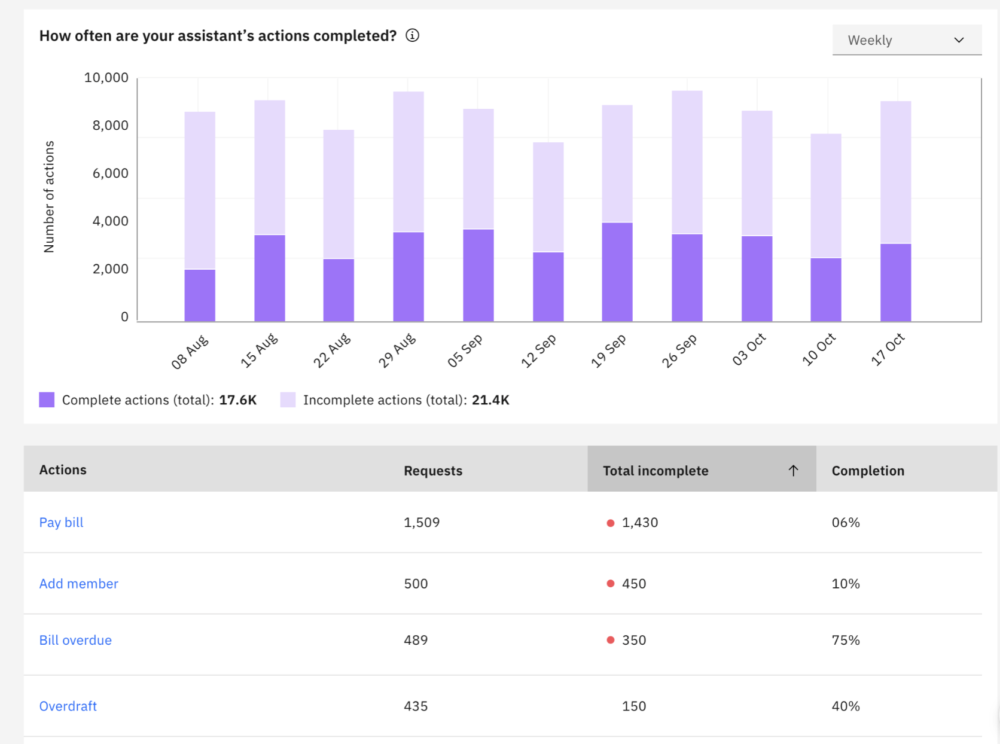
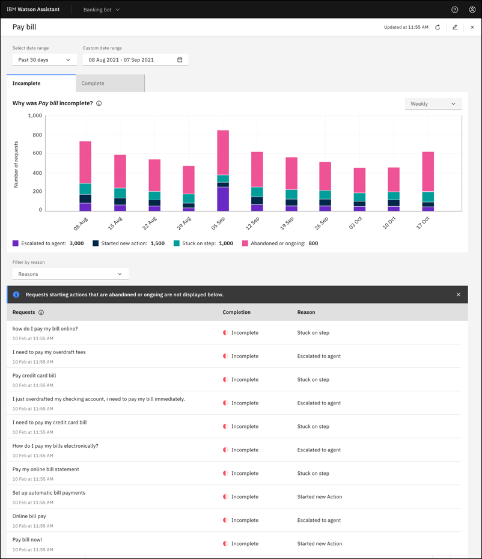
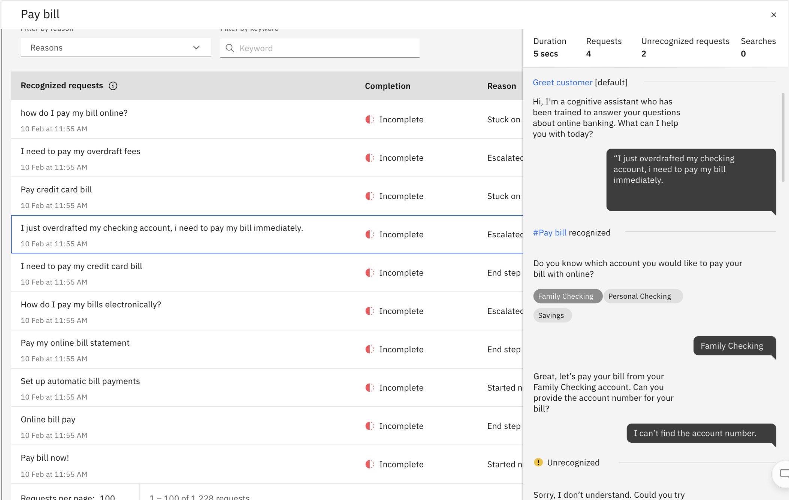

---

copyright:
  years: 2021, 2023
lastupdated: "2023-08-23"

subcollection: watson-assistant

---

{{site.data.keyword.attribute-definition-list}}

# Understand your most and least successful actions
{: #analytics-action-completion}

The **Action completion** page of {{site.data.keyword.conversationshort}} provides an overview of how all your assistant's actions are doing. You can:
- Understand how well users are progressing through the action steps
- Identify problem areas within actions
- Investigate why users are having issues where they might escalate to a live agent, start a new action, get stuck on a step, or stop the conversation

## Definition of completion
{: #completion-definition}

*Completion* measures how often within a time period that a user reaches the end step of an action.

### Reasons for completion
{: #complete-reasons}

An action is considered complete when:
- A final (end) step is reached
- Search reached a final step
- The action called another action with the `End this action after the other action is completed` option, and the other action is finished.
- Connect to agent transfer occurs according to the step response and without involving the [Fallback action](/docs/watson-assistant?topic=watson-assistant-handle-errors#fallback-action)
- The last step of the action is finished and there are no more steps

### Reasons for incompletion
{: #incomplete-reasons}

An action is considered incomplete for these reasons:

| Reason | Description |
| ------ | ---------- |
| Escalated to agent | The user explicitly asks to speak to someone, triggering the [Fallback action](/docs/watson-assistant?topic=watson-assistant-handle-errors#fallback-action). For more information, see [When your customer asks to speak to a live agent](/docs/watson-assistant?topic=watson-assistant-handle-errors#when-your-customer-asks-to-speak-to-a-human-agent). Or, the user chooses human agent escalation from the list of [suggestions in web chat](/docs/watson-assistant?topic=watson-assistant-deploy-web-chat#deploy-web-chat-alternate). |
| Started a new action | The user changes the topic of the conversation, triggering another action, and either doesn't return to the original action or the other action is also incomplete. |
| Stuck on a step |  Triggered during step validation where a user exceeds the maximum retries for the particular step. Default tries is 3, but you can change this setting. For more information, see [Customizing validation for a response](/docs/watson-assistant?topic=watson-assistant-handle-errors#customizing-validation-for-a-response). |
| Abandoned | An action is considered abandoned if it was not completed after 1 hour of inactivity and doesn't meet the criteria for any other incompletion reason. |
| Trigger phrase | During an action, the customer used a keyword or phrase that activated the *Trigger word detected* action, leaving the original action unfinished. For more information, see [Detecting trigger words](/docs/watson-assistant?topic=watson-assistant-trigger-phrases). |
{: caption="Incompletion reasons" caption-side="bottom"}

## Improving completion
{: #analytics-improving-completion}

To help you identify actions that need improvement, the **Action completion** page is organized into a **How often** chart and an **Actions** table. The **How often** chart shows either the percentage of complete actions or the number of complete and incomplete actions during a time frame. You can toggle between a line chart that shows the percentage of complete actions or a bar chart that shows the number of complete and incomplete actions. The **Actions** table provides number of requests, total incomplete, and completion percentage per action.

You can use the **Actions** table to focus on improving the completion of your actions. **Incomplete** results provide a focus area where you can make the biggest impact. The actions with the most incompletions are where most users can't get their questions answered or requests resolved.

To work on a specific action, click the action name in the table. A page opens with completion details for that single action.

The *Incomplete* and *Complete* tabs provide details by time frame. The *Incomplete* tab bar chart shows data for the four incompletion reasons. The *Complete* tab bar chart is organized by conversations that are either completed by the assistant or completed by a planned `connect to agent` response.

As you click each tab, a table shows the list of either incomplete or complete requests. To explore individual requests in detail, you can click each one. A window opens showing the full back and forth between your customer and the assistant, including step interactions. The window also provides a summary of how many requests there were, how many were recognized, whether search was initiated, and the duration of the conversation.

### Editing an action
{: #analytics-edit-action}

When you decide on changes to improve the action, click the edit icon in the header for the single action, which opens your action for further work on its steps.

