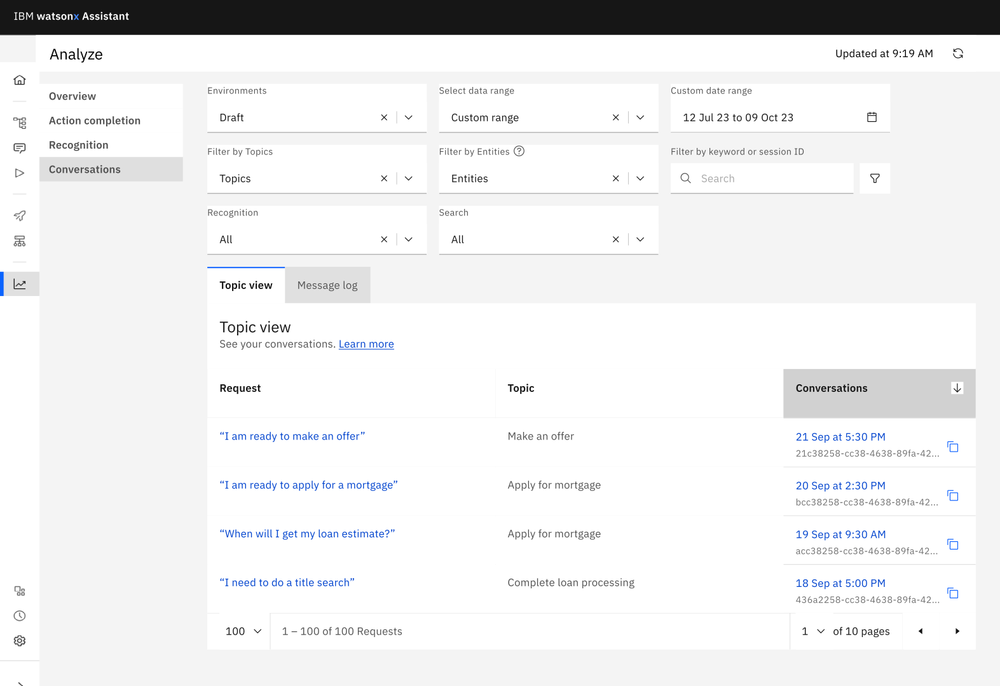
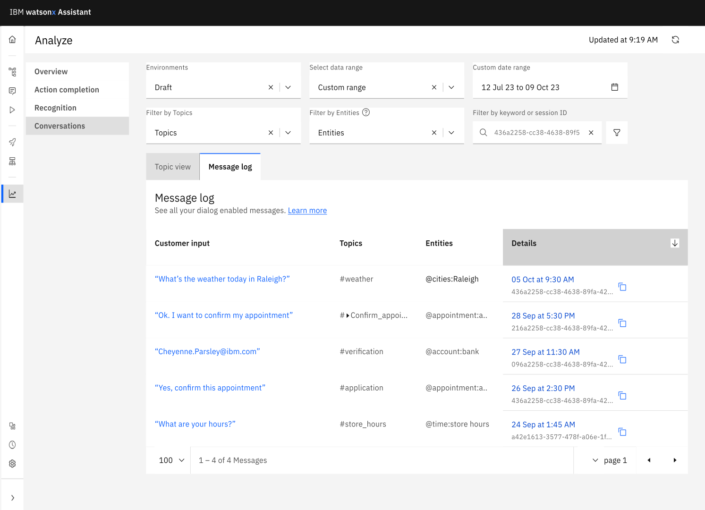
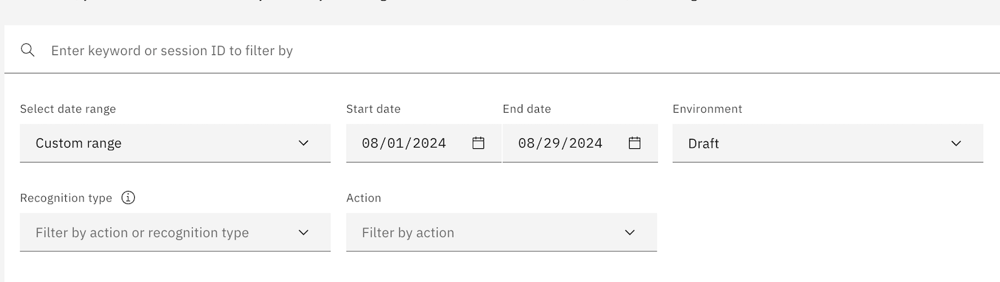
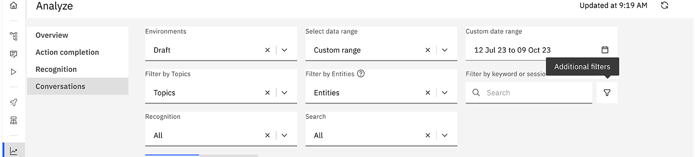
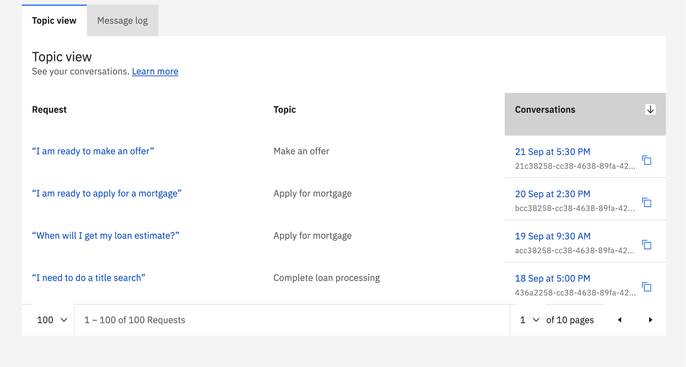
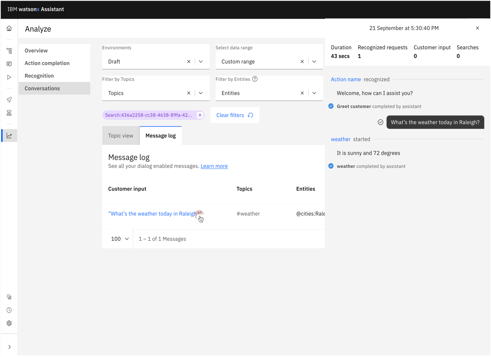

---

copyright:
  years: 2018, 2023
lastupdated: "2023-12-14"

subcollection: watson-assistant

---

{{site.data.keyword.attribute-definition-list}}

# Review customer conversations
{: #analytics-conversations}

This feature is currently not available in IBM watsonx Orchestrate.{: note}

The **Analyze** page of {{site.data.keyword.conversationshort}} provides a history of conversations between users and a deployed assistant. You can use this history to improve how your assistants understand and respond to user requests.
{: shortdesc}

In the **Analyze** page, you can see the summary of the conversations at the topic level in **Topic view** tab. 

In the **Message log** tab, you see the complete history of conversation between user and the assistant by turns. 

If you have activated dialog, you see the Entities column in the **Message log** tab.{: note}

 

## Choosing the environment and time period
{: #analytics-conversations-time-period}

To get started, choose the [environment](/docs/watson-assistant?topic=watson-assistant-publish-overview#environments) and date range you want to analyze. All conversations reflect data based on the environment and the date range you select. When you change the environment or the date range, the conversations on the page update to reflect the new date range. You can also use **Refresh** ensure the latest data is shown.

## Filtering conversations
{: #analytics-conversations-filtering}

You can locate specific conversations by filtering the list of conversations. This lets you explore specific areas where your assistant might need improvement or updates to properly handle what your customers are asking about.

You can filter the conversation by:

- **Topics**: Select specific topics. You can choose one or more topics to review.
- **Entities**: Select specific entities. You can choose one or more entities to review.

    The Entities filter appears in the **Message log** tab only if you have activated dialog in your assistant. {: note}

- **Keyword**: Search by session ID or for specific key terms, phrases, or words in the conversations. For more information about session IDs, see [session_id](/docs/watson-assistant?topic=watson-assistant-admin-managing-plan#admin-managing-plan-no-userid).

- **Recognition**: Choose between recognized or unrecognized user questions or requests.
- **Search**: Choose between requests that initiated a search or requests that produced no search results.

The Topics, Entities, and Keyword filters always appear at the top of the page. To show the Recognition and Search filters, click the **Additional filters** icon.

If you search for a specific session ID, enclose your search in quotation marks to ensure you receive an exact match on the full ID with its numbers and hyphen characters, for example: `"9015ab9a-2e13-4627-ae33-4179b1125cb5"`.
{: note}

## Exploring conversations in detail
{: #analytics-conversations-exploring}

To explore individual conversations in detail, you can go to one of the following tabs in the **Analyze** page based on the level of details you want to analyze:
- **Topic view** 
  Displays the list of conversations with the topic-level details such as request, topic, and conversation timestamp and session ID. In the **Topic view** tab you see the following columns: 
  - The **Topics** column shows you the topics of conversation. 
  - The **Requests** column includes the questions or requests the user entered that initiated an action, started a search query, or weren't recognized. 
  - The **Conversations** column shows the timestamp of a single conversation and its session ID.

  When you click on a request or timestamp, a panel opens showing the summary of requests, recognition status, and the duration of the conversation. 

  

- **Message log**
  Displays the list of conversations between the users and assistant with the details such as consumer input, topic, assigned entity, timestamp, and session ID. In the **Message log** tab you see the following columns: 
  - The **Customer input** column shows you the customer responses or input. 
  - The **Topics** column shows you the topics of conversation. 
  - The **Entities** column shows the entities assigned to each customer input.
     The Entities filter appears in the **Message log** tab only if you have activated dialog in your assistant. {: note}

  When you click on customer input or timestamp, a panel opens showing the conversation between the user and the assistant by turns along with duration and number of recognized input, customer input and searches.

  
