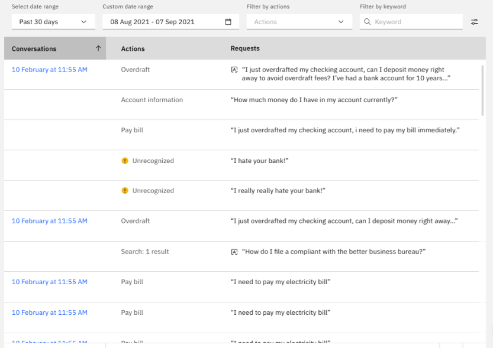
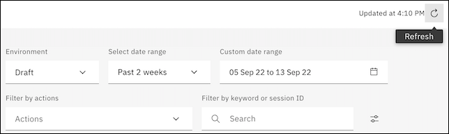
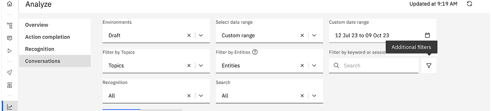
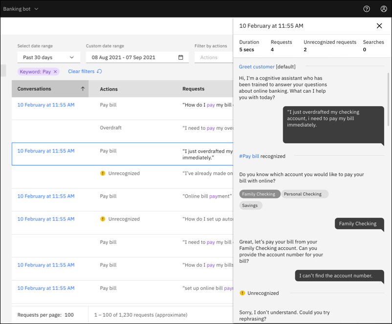

---

copyright:
  years: 2018, 2021
lastupdated: "2021-10-25"

subcollection: watson-assistant

---

{:shortdesc: .shortdesc}
{:new_window: target="_blank"}
{:external: target="_blank" .external}
{:deprecated: .deprecated}
{:important: .important}
{:note: .note}
{:tip: .tip}
{:pre: .pre}
{:codeblock: .codeblock}
{:screen: .screen}
{:javascript: .ph data-hd-programlang='javascript'}
{:java: .ph data-hd-programlang='java'}
{:python: .ph data-hd-programlang='python'}
{:swift: .ph data-hd-programlang='swift'}

{{site.data.content.classiclink}}

# Review customer conversations
{: #analytics-conversations}

The **Conversations** page of {{site.data.keyword.conversationshort}} provides a history of conversations between users and a deployed assistant. You can use this history to improve how your assistants understand and respond to user requests.
{: shortdesc}

Each timestamp represents a single conversation. The **Actions** column hows you how many actions, search queries, or unrecognized requests are included in that conversation. The **Requests** column includes the questions or requests the user entered that initiated an action, started a search query, or weren't recognized.

## Choosing the time period
{: #analytics-conversations-time-period}

To get started, choose the [environment](/docs/watson-assistant?topic=watson-assistant-publish-overview#environments) (draft or live) and date range you want to analyze. All conversations reflect data based on the environment and the date range you select. When you change the enviornment or the date range, the conversations on the page update to reflect the new date range. You can also use **Refresh** ensure the latest data is shown.

## Filtering conversations
{: #analytics-conversations-filtering}

You can locate specific conversations by filtering the list of conversations. This lets you explore specific areas where your assistant might need improvement or updates to properly handle what your customers are asking about.

You can filter by:

- **Actions**: Select specific actions. You can choose one or more actions to review.
- **Keyword**: Search for specific key terms, phrases, or words in the conversations.
- **Recognition**: Choose between recognized or unrecognized user questions or requests.
- **Search**: Choose between requests that initiated a search or requests that produced no search results.

The Actions and Keyword filters always appear at the top of the page. To show the Recognition and Search filters, click the **Additional filters** icon.

## Exploring conversations in detail
{: #analytics-conversations-exploring}

To explore individual conversations in detail, you can click on any of the utterances or conversation time stamps.  A panel opens showing the full back and forth between your customer and the assistant, including step interactions. The panel also provides a summary of how many requests there were, how many were recognized, whether search was initiated, and the duration of the conversation.

