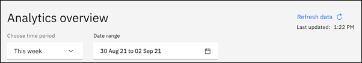
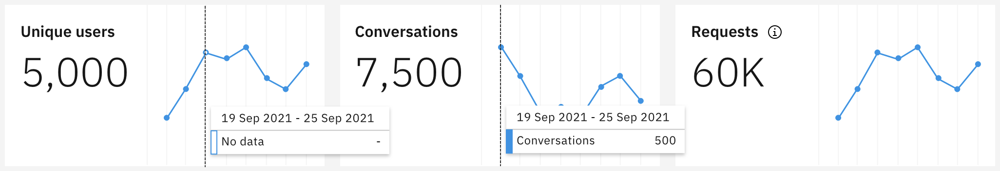
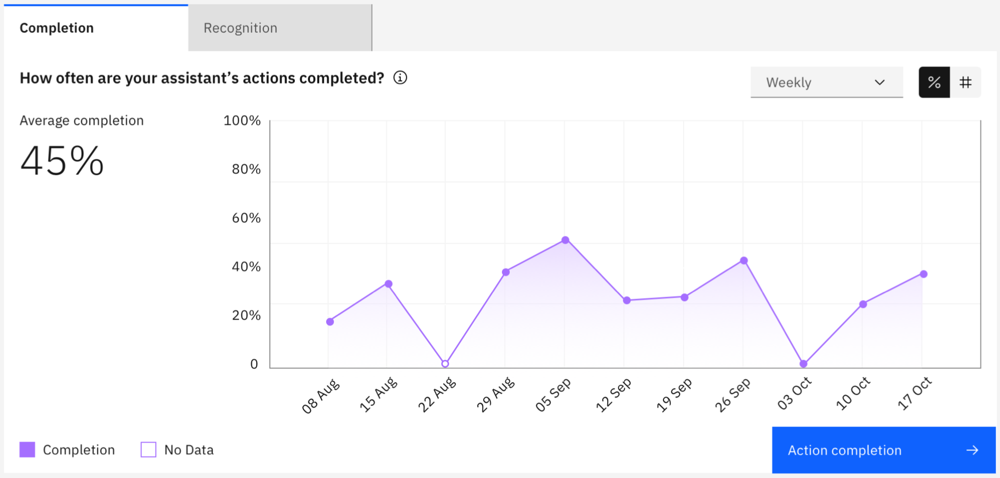
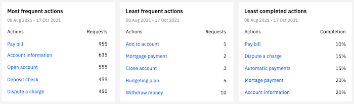

---

copyright:
  years: 2018, 2021
lastupdated: "2021-11-11"

subcollection: watson-assistant

---

{:shortdesc: .shortdesc}
{:new_window: target="_blank"}
{:external: target="_blank" .external}
{:deprecated: .deprecated}
{:important: .important}
{:note: .note}
{:tip: .tip}
{:pre: .pre}
{:codeblock: .codeblock}
{:screen: .screen}
{:javascript: .ph data-hd-programlang='javascript'}
{:java: .ph data-hd-programlang='java'}
{:python: .ph data-hd-programlang='python'}
{:swift: .ph data-hd-programlang='swift'}

{{site.data.content.classiclink}}

# Use analytics to review your entire assistant at a glance
{: #analytics-overview}

The **Analyze** page provides a summary of the interactions between users and your assistant.
{: shortdesc}

Analytics help you to understand the following things:

- *What do customers want help with today?*
- *Is your assistant understanding and addressing customer needs?*
- *How can you make your assistant better?*

To see analytics information, select **Analyze** in the navigation bar.

## Choosing the environment and date range
{: #analytics-overview-time-period}

To get started, choose the [environment](/docs/watson-assistant?topic=watson-assistant-publish-overview#environments) (draft or live) and date range you want to analyze. All charts and cards reflect data based on the environment and the date range you select. When you change the enviornment or the date range, the charts and cards on the page update to reflect the new date range. You can also use **Refresh** ensure the latest data is shown.

## Unique users, conversations, and user requests
{: #analytics-traffic}

These three traffic metrics -- *unique users*, *conversations*, and *user requests* -- provide you with data about the volume of user engagements with your assistant.

*Unique user* is anyone who interacts with your assistant. *User ID* identifies each user, using a unique label to track the level of service usage. A unique user can have multiple conversations, but a conversation never has more than one unique user.

*Conversation* is a set of messages consisting of the messages that an individual user sends to your assistant, and the messages your assistant sends back. Conversations can have multiple requests within a single conversation, but a single request doesn't span more than 1 conversation.

*Request* is a root-level utterance, such as an initial question or request, that signals the start of a specific flow. A user can initiate multiple requests. Requests are meant to represent the core concepts or topics your users are asking about. A request can have multiple steps within it, for example `I want to order a pizza` is a request. `Delivery/takeout`, `Small/Medium/Large`, `Cheese/Pepperoni/Mushrooms/Peppers` are all steps within the request of ordering a pizza.

## Completion and recognition
{: #analytics-completion-recognition}

The *completion* and *recognition* charts provide information about the actions in your assistant.

### Completion
{: analytics-completion-section}

*Completion* is the measurement of how often users are able to successfully get through all steps of an action.

Your assistant measures when someone reaches the final step of an action. The completion chart provides an overview of all the actions you have built and how many of these are being completed or not.

Completion is only applicable when a user question or request matched to an action, and the action starts.

One action can be triggered multiple times, so to better understand individual action performance, click *Action completion* to understand each action in more detail.

### Recognition
{: #analytics-recognition-section}

*Recognition* is the measurement of how many requests are being recognized by the assistant and routed into starting an action.

The recognition chart provides you with a view into how many requests are matched to actions. This helps you to understand where you may have content gaps, where you might want to build new actions, or how existing actions aren't matching properly to user requests.

To get more detail, click on *Unrecognized requests* to review the full conversations associated with requests that are not being recognized by the assistant.

## Most frequent, least frequent, and least completed
{: #analytics-most-least}

These most/least cards help you to quickly identify specific actions that might need your attention. From these lists, you can click a specific action to do more analysis.

*Most frequent actions* shows the actions that have the most recognized requests matched with that action.

*Least frequent actions* is the exact opposite of *most frequent*. It can help you identify actions that possibly have poor training and are not matching well to actual requests from your users.

*Least completed actions* shows a list of actions with the lowest completion rate, by percentage. This measurement doesn't take traffic into account. This can be another good indication of actions where maybe the flow or content can be improved, and you can spend time investigating.
