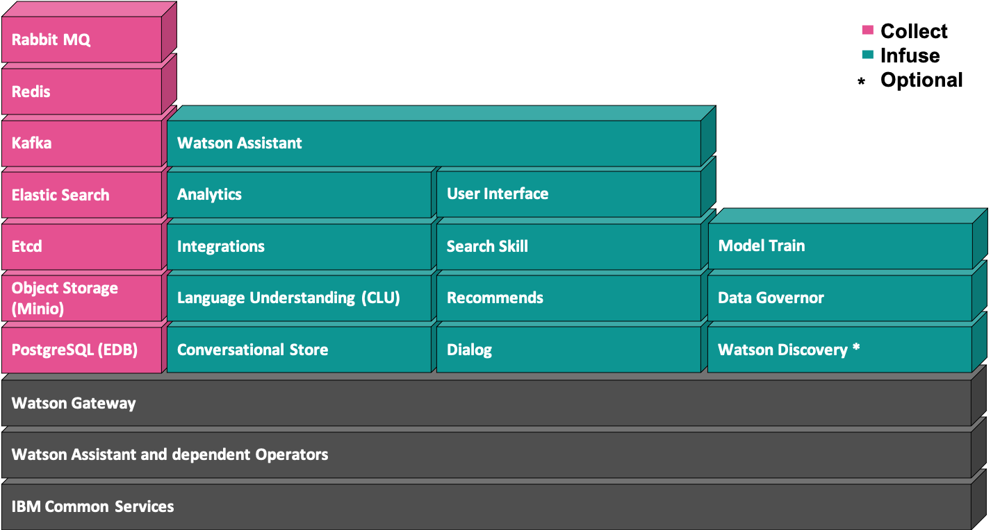

---

copyright:
  years: 2015, 2023
lastupdated: "2023-10-19"

subcollection: watson-assistant

---

{{site.data.keyword.attribute-definition-list}}

# Service architecture
{: #architecture}

Learn about the components that comprise the service on {{site.data.keyword.icp4dfull}} and how data flows through the service.
{: shortdesc}

The service consists of the following types of resources:

- [Microservices](#architecture-microservices)
- [Supporting data stores](#architecture-datasources)
- [Training component](#architecture-slad)

The service uses the following patterns to communicate and pass information among its resources:

- **REST API**: Sends representational state transfer (REST) API calls over secure HTTP.
- **gRPC**: Makes method calls by using an open source remote procedure call framework, which enables the service to call a resource that is running on another system in the cluster as if it were a local object. For more information, see [gRPC](https://grpc.io/){: external}.
- **LiteLinks**: Uses the LiteLinks protocol that was developed by IBM. LiteLinks has a custom service discovery layer that serves as a wrapper for an underlying Apache Thrift-based remote procedure call framework.

The following diagram illustrates the components that are used by the service.

{caption="Service components" caption-side="bottom"}

The following sections provide more detail about each resource that is used by the system. The objective is to give you information that can help you to do initial resource planning and help you to manage changes in data needs over time.

## Microservices
{: #architecture-microservices}

The service consists of the following stateless microservices:

- **Analytics**: Logs conversations that take place between the assistant and your customers. These user conversation logs are available from the Analytics page in the product and from the `/logs` API endpoint. Introduced with the 1.5.0 release. The Analytics feature relies on a microservice that is supported only on Red Hat OpenShift 4.5 and later.

- **CLU**: A Conversational Language Understanding interface, also known as Natural Language Understanding (NLU), that is an entry point to the language understanding pipeline, which is where text is analyzed to find intent and entity mentions. The Store microservice uses the LiteLinks protocol to call this microservice to initiate machine learning training. The NLU microservice controls the lifecycle of the machine learning models. It maps the workspace ID that is used by the Store microservice to the machine language understanding the pipeline's internal ID. The NLU microservice uploads the training data for machine learning models to the MinIO object storage. When a language model needs to be trained, such as after intents are edited, the NLU microservice calls the Master microservice. When the updated model is available, NLU calls the TAS microservice to analyze the user input that is provided by the customer. The workspace ID has a UUID format. The internal IDs of models in the language understanding pipeline typically follow the regular expression pattern, `vn-[0-9a-f]*-[0-9a-f]*`.

- **CLU Embedding**: Provides the word embeddings for other microservices in the language understanding pipeline. The TAS, ED-MM, and training pods call the CLU Embedding microservice by using the gRPC protocol.

- **Dialog**: Processes the dialog tree that is defined in a dialog skill to generate responses to user inputs. Based on the context (variables that are passed from previous conversation turns) and the intents and entities that are recognized in the user input, this service follows the dialog tree in the skill to find an appropriate response. Dialog is also responsible for making programmatic callouts to other services or programs. This microservice, which is sometimes referred to as the Dialog runtime, is a LiteLinks server that is called by the Store microservice. It has an in-memory cache for dialog skills and uses Redis as the cache for dialog skills.

- **ED-MM**: Recognizes contextual entities in user input. This microservice is part of the language understanding pipeline. ED-MM stands for Entities Distro model mesh. The service's implementation of the ED-MM microservice is based on the model-mesh pattern. (For more information, see [Model mesh](#architecture-model-mesh).) The ED-MM microservice is called by the TAS microservice to evaluate user input only if the dialog skill that is being processed has contextual entities in its training data. Contextual entities are bound to a context. The ED-MM microservice loads the models from MinIO. At run time, the models are used to look up the entities and validate the context. The ED-MM microservice also accesses the CLU Embedding service for word embeddings.

- **Gateway**: An adaption layer that interacts with the {{site.data.keyword.icp4dfull_notm}} API and mimics the behavior of the public IBM Cloud. Its pods are named `${release-name}-addon-assistant-gw-deployment`.

   The ${release-name} is `watson-assistant`.
   {: note}

   It serves the following functions:

   - Registers the installation of the service into {{site.data.keyword.icp4dfull_notm}}.
   - For API requests, it adds authentication data that is required by the Store microservice.
   - Notifies the Store microservice when a service instance is created or deleted.
   - When a user requests instance details from the web UI, it mimics the {{site.data.keyword.cloud_notm}} interface so the UI microservice can return the information.

   When an API request comes in, it is processed by the {{site.data.keyword.icp4dfull_notm}} ingress nginx server first. The nginx server is configured to call the Gateway microservice to check authorization and obtain authentication data for the request. The nginx server adds a header to the original request, and then calls the Store microservice. However, the initial steps do not produce any logs. To see the first logs from an incoming API request, check the logs in the Store microservice.
   {: note}

- **Integrations**: Service that supports the built-in integrations, such as web chat and preview link. Introduced with the 1.5.0 release.

- **Master**: Controls the lifecycle of underlying intent and entity models. This microservice is part of the language understanding pipeline. The NLU microservice uses LiteLinks to send a request to the Master microservice for a new model to be trained. This type of request occurs when a dialog skill is created or an existing dialog skill is updated. After a model is successfully trained, the TAS microservice is called to load the model.

- **Numeric system entities**: Manages the numeric value recognition that is used by the system entities (such as `@sys-date` or `@sys-number`). Introduced with the 1.5.0 release.

- **Recommends**: Supports recommendations from Watson, such as dictionary-based entity synonyms and intent conflicts. Used only at authoring time from the web UI. When a user requests synonym recommendations for an entity, for example, the UI microservice calls the Store microservice. The Store microservice forwards the request to the Recommends microservice. The Recommends microservice looks up the synonyms for the current word by using the embeddings that are stored in MongoDB, and stores them in a Redis cache. This microservice sends a response with a list of synonyms to the Store microservice. A similar workflow is used to identify intent conflicts in a dialog skill.

- **Skill-search**: Manages API calls to a {{site.data.keyword.discoveryshort}} service instance that is enabled in the same cluster. When a v2 `/message` API call reaches the Store microservice, the Store retrieves session state information from Redis and start processing skills. When the assistant that is being processed has a search skill, the Store microservice calls this microservice over HTTPS REST. This microservice queries the {{site.data.keyword.discoveryshort}} instance and converts the output that is returned by {{site.data.keyword.discoveryshort}} to the v2 `/message` API schema.

- **Spellchecker**: Corrects spelling mistakes that are made in user input that is submitted with `/message` requests. This autocorrection feature is enabled automatically for English dialog skills, and can be turned on for French skills. This microservice provides basic spell-checking capabilities by using correction techniques such as edit-distance from vocabulary word and generic language models. If enabled, the TAS microservice calls the Spellchecker by using gRPC before it performs recognition of intents and entities in the user input. Spellchecker does not depend on data stores and it does not call any other microservice.

- **Store**: Handles all assistant API calls. This microservice either processes the request itself or calls the other microservices that are needed to process the request. For example, if a customer submits user input with a v1 `/message` API call, the request is sent to and processed by the store. For stateful v2 `/message` API calls, the store retrieves session state information from Redis first. It then calls the NLU microservice to analyze the user input and identify any intent and entity references in the input. Next, the Store calls the Dialog microservice to generate the appropriate response to return to the customer. The Store microservice stores the assistants, skills, and workspace definitions in a PostgreSQL database. The Store microservice saves the state of the session (from the v2 API) in the Redis data store.

- **TAS**: Performs model inferencing, which means it identifies the best-matching intents and entities in the user input. TAS stands for Train and Serve, but it mostly serves up the existing models. The TAS microservice loads the models from MinIO storage into memory and runs the models to find intents. The TAS microservice is called from the NLU microservice by using LiteLinks. TAS and the ED-MM microservices are based on a model-mesh pattern. (For more information, see [Model mesh](#architecture-model-mesh).) If needed, TAS calls other microservices from the language understanding pipeline. Specifically, it calls SireG for tokenization, ED-MM for contextual entities (by using gRPC), and Spellcheck to correct misspellings. For intent recognition, the TAS microservice requires word-embeddings data, which is provided by the CLU Embedding microservice.

- **TF-MM**: The tensor flow model mesh microservice manages the universal sentence encoder and auto-encoder models to improve off-topic and irrelevant intent recognition. Introduced with the 1.5.0 release.

- **UI**: The web application that virtual assistant builders use to create skills and assistants.

## Data sources
{: #architecture-datasources}

The microservices use the following resources:

- **Elastic**: The elastic data store stores customer messages. These user conversation logs that can be reviewed from the Analytics page or searched from the `/logs` API endpoint. Introduced with the 1.5.0 release.

- **Etcd**: A popular distributed key-value storage solution. Ectd is used by Litelinks clients and servers (Store, Dialog, NLU, Master, TAS, ED-MM) for service discovery. It is used by microservices from the language understanding pipeline (NLU, Master, TAS, ED-MM) to store metadata. For more information, see [Etcd store](#architecture-etcd).

- **Kafka**: A queuing system for incoming customer messages. Introduced with the 1.5.0 release.

- **PostgreSQL**: A popular relational database. This database is used only by the Store microservice and it is the primary store for workspaces, skills, and assistants. The deployment and pod names that are related to PostgreSQL are prefixed as `${release-name}-store-postgres`. For more information, see [PostgreSQL data store](#architecture-postgres).

- **Multicloud Object Gateway**: Multicloud Object Gateway is an object storage service that implements the Amazon S3 API. It is used by the language understanding pipeline microservices (clu-controller, clu-serving, clu-training, tf-mm, ed-mm, and dragonfly) to store and load trained models for intent and entity classification. It is used by the authoring and runtime service (store) to store versioned data of the skills and also used as a temporary storage for asynchronous uploads for the authoring experience. In {{site.data.keyword.assistant_classic_short}}, Multicloud Object Gateway is often referred to as Cloud Object Storage. For more information, see [Multicloud Object Gateway](https://www.ibm.com/docs/en/cloud-paks/cp-data/4.7.x?topic=cluster-installing-multicloud-object-gateway).{: external}

- **Redis**: An in-memory data store, often used for caching or sharing session state. Redis is used by the Store microservice for storing current conversation state for assistants. The UI microservice stores session state in Redis. The Recommends and Dialog microservices use a Redis instance as a cache.

**1.5.0**: The following data source is no longer used, starting with the 1.5.0 release:

- **MongoDB**: A document-oriented database. Mongo is used in read-only mode for storing embeddings and other data that is used by the Recommends microservice for synonym recommendations. For more information, see [MongoDB database](#architecture-mongodb).

   MongoDB is a document-based, distributed database. The MongoDB database has three pods. It runs in replicaSet mode, which means that one pod runs in the coordinator role in read/write mode, and the rest of the pods run in the secondary role and are read-only. Changes from the coordinator pod are replicated to the secondary pods. During the service installation, data is loaded into the Mongo database by a Kubernetes job. No data is written to the Mongo database after the service is installed. Only the Recommends microservices read data from Mongo. On creation, Recommends pods check whether Mongo is running, and wait until the Mongo database is loaded with the required data.

   The process of loading data for Recommends into the Mongo database that happens as part of the installation can take 30 minutes (or more).
   {: note}

   - The MongoDB pod names follow the convention `${release-name}-ibm-mongodb-server-[0-9]*`. For longer release names, the name is shorten to `${release-name prefix}-[a-f0-9]{4}-336f-server-*`.
   - The name of the Kubernetes job that runs during the installation of the service is `${release-name}-recommends-load-mongo`.

   The ${release-name} is `watson-assistant`.
   {: note}

**4.7.0**: The following data source is no longer used, starting with the 4.7.0 release:

- **MinIO**: MinIO is an object storage service that implements the Amazon S3 API. It is used by the language understanding pipeline microservices (NLU, Master, TAS, ED-MM, and the training pods) to store and load trained models for intent and entity classification. Data is stored in the `nlclassifier-icp` bucket. In {{site.data.keyword.assistant_classic_short}}, MinIO is often referred to as `COS`, which stands for Cloud Object Storage. For more information, see [MinIO](#architecture-minio).

#### Architecture changes
{: #architecture-changes}

- **1.5.0**: The following changes to the architecture occurred with this release:

   - The *Analytics*, *Integrations*, and *Numeric system entities* microservices were introduced.
   - The *Elastic search* and *Kafka* data sources were introduced. The *MongoDB* data source was removed.
  
- **4.7.0**: The following changes to the architecture occurred with this release:

   - The *Multicloud Object Gateway* was introduced. The *MinIO* data source and *SIREG* microservice were removed.

## Training component
{: #architecture-slad}

Training a new model is a one-time, short-running, resource-heavy activity. Models are trained in pods that are created on demand. The same pods are removed after the training is completed. Because of its transient nature, the training component is not considered to be one of the standard microservices. The component, the training pods, get used only when a model needs to be trained. Training starts each time the intent user examples are added or changed in a dialog skill.

The CLU microservice notifies the Master microservice when a new machine learning model needs to be trained. The Master microservice dynamically creates training pods. It handles the training pod removal and retraining if a training run fails. It is also responsible for removing a model from MinIO if the model is deleted. The system determines whether a training run completed successfully based on a flag that is stored in MinIO storage. The Master microservice must have API access to the Docker registry where the training images are stored. The image metadata that is obtained from the registry is used to correctly start the training pods.

The training pods that are started by this component are sometimes referred to as SLAD pods. SLAD stands for Statistical Learning and Discovery, which is the name of the research group that developed the language classifier that is used by the pods. The training pod names start with `tr[12]?`, followed by the internal `vn-…` ID. The training images are named `nlclassifier-training` or `clu-training`, depending on the chart version. The `${release-name}-master-config` configuration map contains the JSON template for the training pods.

The ${release-name} is `watson-assistant`.
{: note}

## Data store details
{: #architecture-datasource-details}

The following sections provide more detail about how the data stores are used by the service. The objective is to help you troubleshoot issues that might arise during installation or after the service is deployed and running in a data center.

### Etcd store
{: #architecture-etcd}

The service uses Etcd as a key-value store. Etcd is used by LiteLinks for service discovery and by the language understanding pipeline as configuration storage.

Etcd consists of five pods. The Etcd pod names follow the convention `${release-name}-etcd3-[0-9]*`. The service chart requires Etcd version 3 with enabled authorization.

#### LiteLinks service discovery
{: #architecture-etcd-litelinks}

The Dialog, NLU, Master, TAS, and ED-MM microservices act as LiteLinks servers. Each LiteLinks server is registered in Etcd with its own key under the `/bluegoat/litelinks/` path. Each pod stores its metadata, such as its IP address and port, into Etcd. For example, the Dialog microservice pod with IP address 10.131.2.25 might register itself under a key named `/bluegoat/litelinks/voyager-dialog-slot-${release-name}/10.128.0.231_8089_16ea2cde43f`.

The ${release-name} is `watson-assistant`.
{: note}

The Store, NLU, Master, TAS, and ED-MM microservices are LiteLinks clients. (Some microservices function as both a server and client.) Each LiteLinks client reads these Etcd keys and communicates directly with the registered pod IP address and port of the server. In effect, LiteLinks clients do not use the Kubernetes DNS. As a result, Kubernetes service objects are not used for LiteLinks servers. Without the Kubernetes service objects, the readiness probes are ignored even though they are good indicators of pod health.

The following table lists the key names for each LiteLinks server.

| Microservice | LiteLinks server key name |
|--------------|---------------------------|
| Dialog | `voyager-dialog-slot-${release-name}` |
| NLU | `voyager-nlu-slot-${release-name}` |
| Master | `voyager-master-slot-${release-name}` |
| TAS | `tas-runtime-slot-${release-name}` |
| ED-MM | `${release-name}-ed-mm` |
{: caption="LiteLinks server Etcd paths" caption-side="top"}

Microservice pods that are either LiteLinks clients or servers contain an initContainer that, on pod creation, checks, and waits until Etcd is operational and contains configuration entries.

#### Configuration storage
{: #architecture-etcd-config}

The microservices in the language understanding pipeline use Etcd to store some configuration values.

Each microservice has its own path in Etcd. Other metadata about models, such as the instance in which a model is loaded, is stored under different keys under the Etcd path.

| Microservice | Etcd path |
|--------------|-----------|
| NLU | `/bluegoat/voyager-nlu/voyager-nlu-slot-${release-name}` |
| Master |	`/bluegoat/bluegoat-master/voyager-master-slot-${release-name}` |
| TAS | `/bluegoat/tas-runtime/tas-runtime-slot-${release-name}` |
| ED-MM | `/bluegoat/tas-runtime/${release-name}-ed-mm/` |
{: caption="Microservice configuration store Etcd paths" caption-side="top"}

The configuration values per microservice are stored under a `/config` subpath.

### MinIO
{: #architecture-minio}

MinIO is an enterprise-grade object storage service that implements the Amazon S3 API. The service chart runs MinIO in distributed mode with four pods. With this configuration, MinIO functions fully in read/write mode if more than half, meaning three or more, of the pods are available. Its function is degraded to read-only mode if only half (two) of the pods are available.

MinIO pods are named `${release-name}-clu-minio-[0-9]*`. CLU, which stands for Conversational Language Understanding, is included in the pod names to associate the MinIO pods with the language understanding pipeline. It is only the pipeline microservices, such as NLU, Master, TAS, ED-MM, and the training pods that use MinIO.

### PostgreSQL data stores
{: #architecture-postgres}

The Postgres data store is based on *stolon*, which is a cloud-native PostgreSQL manager for PostgreSQL high availability. (For more information, see the [GitHub sorintlab repo](https://github.com/sorintlab/stolon){: external}.) The Postgres store consists of the following kinds of pods:

- keeper: These pods run the PostgreSQL database. There are three keeper pods. One of the three is selected as the coordinator keeper. The coordinator keeper handles all of the SQL queries. The remaining pods are on standby and their state is updated by the coordinator keeper pod.

   The keeper pod names follow the convention of `${release-name}-store-postgres-keeper-*`. If the release name is long, the pod name might be shortened to something like `${release-name prefix}-[a-f0-9]{4}-st-a617-keeper-*`.

   The ${release-name} is `watson-assistant`. The shortened name is `watson-ass`.
   {: note}

- proxy: These pods are the entry points that are used by the Store microservice. The proxy pods route traffic to the coordinator keeper pod.
- sentinel: These pods are the ones that decide which of the keepers is the coordinator.

To manage the PostgreSQL cluster, use `stolonctl` commands inside the keeper pods. The metadata about the PostgreSQL configuration is stored in the configmap named `stolon-cluster-${release-name}`.

Postgres is used by the Store microservice to store assistants, skills, and workspaces. If PostgreSQL and the Store microservice are running, even if nothing else is working, you can export your skills from the product and save them.

During installation, the Postgres database is created. The Store microstore user is also created. You can specify the name of the database, the name of the user, and a corresponding password if you want by overriding configuration settings in the `values.yaml` configuration file.

The following table lists the configuration settings that are used by the Store microservice to connect to the PostgresSQL and for PostgreSQL initialization at installation time.

| Configuration setting name | Description | Default value |
|----------------------------|-------------|---------------|
| global.postgres.store.auth.user | Username that is used by the Store microservice | `store_icp_${release-name}` |
| global.postgres.store.auth.authSecretName | Name of the Kubernetes secret with password for the Store user. The default value is null because a password is randomly generated. | `null` |
| global.postgres.store.database | Name of the database that is used by the Store microservice | `conversation_icp_${release-name}` |
{: caption="Postrgres datasource configuration settings" caption-side="top"}

## Model mesh
{: #architecture-model-mesh}

The TAS and ED-MM microservices use a model-mesh pattern. In model mesh, each pod contains a set of loaded NLP models. Managing where models are loaded is handled by a model-mesh library. During normal operations, the model is loaded in one pod only. If traffic to the model cannot be handled by a single pod, the model is loaded into other pods also. The metadata about where the models are loaded is stored in Etcd.

TAS and ED-MM belong to separate model-mesh groups. Each group has an independent set of pods and loaded models.

Here's how model mesh functions in the ED-MM microservice pod group. For the ED-MM microservice, you might have two pods, A and B. A gRPS request for help with contextual entity recognition is received through Kubernetes DNS. The request goes to pod A, but the contextual entity model that is needed is loaded in pod B. The model mesh on pod A forwards the request to pod B by using LiteLinks. Pod B uses the appropriate model to identify contextual entities in the input, and then sends a response to pod A. Pod A sends the information in a response back to the service that sent the initial gRPC request.

Model mesh functions in the same way for the TAS microservice. The difference is that incoming requests to TAS are sent by using LiteLinks and not gRPC. As a result, the NLU and Master microservices have no way of knowing which models are loaded in which TAS pods.
