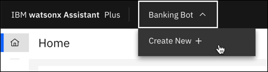

---

copyright:
  years: 2018, 2024
lastupdated: "2024-12-03"

subcollection: watson-assistant

---

{{site.data.keyword.attribute-definition-list}}

# Adding more assistants
{: #assistant-add}

If you're looking for the AI Assistant Builder documentation, see [Building AI Assistants](https://www.ibm.com/docs/watsonx/watson-orchestrate/current?topic=building-ai-assistants-ai-assistant-builder).{: note}

You can create multiple assistants in your instance. The number of assistants you can create depends on your plan.

| Plan | Assistants per instance |
| --- | --- |
| Enterprise | 30 |
| Plus | 10 |
| Trial | 10 |
| Lite |  3 |
{: caption="Service plan details" caption-side="bottom"}

If you need to add more assistants, follow these steps:

1.  In the navigation, click the name of your current assistant, and then choose **Create New**.

    {: caption="Create new assistant" caption-side="bottom"}

1.  Add details about the new assistant.

    - **Assistant name** (Required): Enter a name no more than 100 characters in length. 
    - **Description** (Optional): Enter a description no more than 200 characters in length.
    - **Assistant language**: Select a language for the assistant to use in conversations. For more information, see [language support](/docs/watson-assistant?topic=watson-assistant-admin-language-support).

1.  Click **Create assistant**.

If you're using the classic experience, follow these steps to add an assistant:

1.  Click the **Assistants** icon  to open the Assistants page.

1.  Click **Create assistant**.

1.  Add details about the new assistant:

    - **Name**: A name no more than 100 characters in length. A name is required.
    - **Description**: An optional description no more than 200 characters in length.

1.  Click **Create assistant**.

1.  Add a skill to the assistant.

    **Note**: You can choose to add an existing skill or create a new one.

## Switching between assistants
{: #assistant-add-switch}

To switch to another assistant in your instance:

1.  In the navigation, click the name of your current assistant.

    {: caption="Switch assistants" caption-side="bottom"}

1.  Choose the assistant that you want to open.

If you're using the classic experience, follow these steps to switch assistants:

1. Click the **Assistants** icon  to open the Assistants page.

1. Choose an assistant you want to open. 
