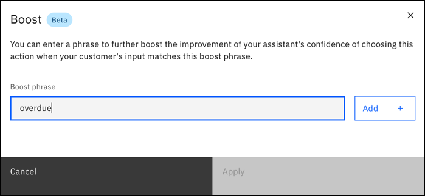
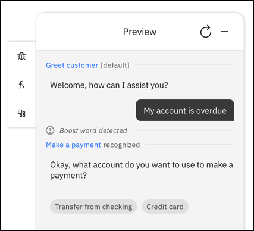

---

copyright:
  years: 2022
lastupdated: "2022-09-28"

subcollection: watson-assistant

---

{:shortdesc: .shortdesc}
{:new_window: target="_blank"}
{:external: target="_blank" .external}
{:deprecated: .deprecated}
{:important: .important}
{:note: .note}
{:tip: .tip}
{:pre: .pre}
{:codeblock: .codeblock}
{:screen: .screen}
{:javascript: .ph data-hd-programlang='javascript'}
{:java: .ph data-hd-programlang='java'}
{:python: .ph data-hd-programlang='python'}
{:swift: .ph data-hd-programlang='swift'}

{{site.data.content.earlyaccess}}

# Boost words
{: #boost-words}

Use *boost words* to enter keywords or phrases to help the assistant recognize what a customer wants. If a customer's input includes matches the boost words or phrases, the assistant can be more confident to use an action. 

Boost words or phrases are used in addition to example phrases. They can only contain letters, underscores, hyphens, spaces, or dots. They must start with an alphanumeric character. Words or phrases can't be entered more than once per action, but you can use the same boost words or phrases across multiple actions.

To add boost words or phrases to an action:

1. Create or open an action. 

1. In **Customer starts with**, ensure the action has at least one example phrase before adding any boost words.

1. Click the **Boost** icon.

   

1. Enter a boost word or phrase, then click **Add**.

   

1. You can keep entering words or phrases one at a time. When you're finished, click **Apply**.

## Testing recognition of boost words
{: #boost-test}

You can use **Preview** to test recognition of boost words. If a boost word or phrases matches, you can see `Boost word detected` in the Preview pane.

