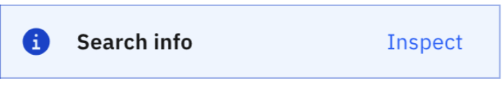

---

copyright:
  years: 2022, 2024
lastupdated: "2024-10-11"

subcollection: watson-assistant

---

{{site.data.keyword.attribute-definition-list}}

# Calling a custom extension
{: #call-extension}

An extension is an integration with an external service. By calling an extension from an action, your assistant can send requests to the external service and receive response data it can use in the conversation.
{: shortdesc}

For example, you might use an extension to interact with a ticketing or customer relationship management (CRM) system, or to retrieve real-time data such as mortgage rates or weather conditions. Response data from the extension is then available as action variables, which your assistant can use in the conversation.

For information about how to build a custom extension, see [Build a custom extension](/docs/watson-assistant?topic=watson-assistant-build-custom-extension).

## Calling the extension from a step
{: #call-extension-from-step}

To call a custom extension from an action:

1. In the action editor, create or open the step from which you want to call the extension.

1. **Optional:** In the **Assistant says** field, type a message to be shown to the customer before the extension is called (for example, `Please wait while I retrieve your account balance...`).

    The output from this step is sent to the channel with the global context variable `skip_user_input` set to `true`. This variable tells the channel to display the message but _not_ to prompt the customer for a reply. Instead, the channel sends an empty message, enabling the assistant to proceed with the call to the extension.

    All built-in channel integrations (such as the web chat) respect the `skip_user_input` context variable. If you are using the API to develop a custom client, it is your responsibility to include logic checking for this variable. For more information, see [Processing user input](/docs/watson-assistant?topic=watson-assistant-api-client#api-client-process-input).
    {: note}

1. In the step editor, click **And then**.

1. Click **Use an extension**.

1. In the **Extension setup** window, specify the following information:

    - In the **Extension** field, select the extension you want to call.

    - In the **Operation** field, select the operation you want to perform. (An _operation_ is a method or function supported by the extension.)

1. Specify values for each of the required input parameters. A _parameter_ is an input value sent to an operation, such as the ID of a customer record you want to retrieve or the location to use for a weather forecast.

    To assign a value to a parameter, click the input field for the value. You can then select from the list of available variables or write an expression to specify the value.

    

    Each parameter has a data type (such as _number_ or _string_). The variable you select must be compatible with the data type of the parameter; for more information, see [Compatible variables for parameters](#parameter-variable-types).

    You must specify values for all required parameters before you can proceed.

1. If you want to specify a value for any optional parameters, click **Optional parameters**. You can then repeat this process for each optional parameter you want to use.

1. Click **Apply**. (If the **Apply** button is not available, check to make sure you have specified values for all required parameters.)

The **And then** section of the step editor now shows an overview of the call to the extension:


If you need to make changes, click **Edit extension** to reopen the **Extension setup** window.

### Compatible variables for parameters
{: #parameter-variable-types}

To pass an input parameter value for an operation, you must select a compatible action variable or session variable.

An action variable contains a value that is based on a customer response in a previous step. A session variable might have a value based on a customer response or a value defined by an expression. (For more information about action variables and session variables, see [Using variables to manage conversation information](/docs/watson-assistant?topic=watson-assistant-manage-info).)

When you assign a value to a parameter, the variable you choose must be compatible with the data type of the parameter. (For example, a _number_ parameter must be assigned a numeric value rather than text.)

The following table shows the possible customer response types and the parameter data type compatible with each.

| Customer response type | Compatible data types           | Notes |
|------------------------|---------------------------------|-------|
| options                | `string`                        | A selected option is always treated as a string, even if it is a numeric value. |
| number                 | `number`\n`integer`             | A floating-point number passed as the value for an `integer` parameter might cause an error, depending on the behavior of the REST API. |
| date                   | `string`                        | Dates are rendered as `YYYY-MM-DD`. |
| time                   | `string`                        | Times are rendered as `HH:MM:SS` in 24-hour format, converted to the user's time zone. |
| Currency               | `number`\n`integer`             |       |
| Percent                | `number`\n`integer`             | A percent value is passed as an integer (so `75%` becomes `75`). |
| Free text              | `string`                        |       |
| Regex                  | `string`                        |       |
{: caption="Compatible response types for parameters" caption-side="top"}

#### Arrays

In addition to the supported customer response types, a variable can also contain an array value. If you need to pass an array parameter to an operation, you must create an array session variable:

1. Create a new session variable, either using **Set variable values** in the step editor or from the **Variables > Created by you** page. (For more information about how to create a session variable, see [Creating a session variable](/docs/watson-assistant?topic=watson-assistant-manage-info#create-session-variable).)

1. In the **Type** field, select **Any**.

1. In the **Initial value** field, click the **Use expression** toggle to enable it. Enter an expression that defines an array value (such as `["New York", "London", "Tokyo"]`, `[123, 456, 789]`, or `[]`).

Because this variable contains an array value, your actions can use expressions with array methods to access or modify the array values. For example, you might want to create a variable that initially contains an empty array (`[]`) and then use the `add()` method to build a list one element at a time. For more information about the array methods you can use in expressions, see [Array methods](/docs/watson-assistant?topic=watson-assistant-expression-methods-actions#expression-methods-actions-arrays).
{: note}

You can now select this variable as the value for a parameter that requires an array.

## Accessing extension response data
{: #extension-access-response}

After you call an extension, values from the response data are stored in special action variables that you can access in subsequent steps.

You can access these variables in the same way you access other action variables. You can reference it in the **Assistant says** text, evaluate it as part of a step condition, or assign it to a session variable so other actions can access it. The response variables are shown in the list of available variables, categorized under the name of the extension and the step from which it was called:


Each call to an extension creates a separate set of response variables. If your action calls the same extension multiple times from different steps, make sure you select the variables from the correct step.
{: #important}

Each variable represents a value from the response body. To make it easy to access these values, data is extracted from complex, nested objects and mapped to individual response variables. The name of each variable reflects its location within the response body (for example, `body.name` or `body.customer.address.zipcode`).

For example, this action step uses an expression to check the `availability` property in an extension response:


If a response variable contains an array, you can write an expression that uses array methods to access the elements of the array. For example, you might use the `contains()` method in a step condition to test whether the array contains a particular value, or the `join()` method to format data from the array as a string you can include in an assistant response. For more information about array methods, see [Array methods](/docs/watson-assistant?topic=watson-assistant-expression-methods-actions#expression-methods-actions-arrays).

## Checking success or failure
{: #extension-check-success}

You might want your assistant to be able to handle errors that occur when calling a custom extension. You can do this by checking the `Ran successfully` response variable that is returned along with the response from the call to the extension. This variable is a boolean (`true` or `false`) value.

If you define step conditions that check the `Ran successfully` variable, you can create steps that enable your assistant to respond differently depending on whether the call to the extension succeeded. (For more information about step conditions, see [Step conditions](/docs/watson-assistant?topic=watson-assistant-step-conditions).)

The following example shows a step condition that checks for a failure from an extension in step 3. By using this condition, you can create a step that tells the customer there was an error, and perhaps offers to connect to an agent for more help.


## Conditioning on HTTP status
{: #extension-condition-status}

In addition to the `Ran successfully` variable, you might also want to create a step condition based on the HTTP status of the response. By doing this, you can create steps that handle the situation differently depending on the cause of the failure. For example, if the call failed because of a timeout error (HTTP status 408), you might want to retry the call.

There are many possible HTTP status codes, and different methods use different status codes to indicate various types of success or failure. To condition on the HTTP status, you need to know what HTTP status codes the external service returns, and under what circumstances. These status codes are typically specified in the OpenAPI document that describes the external API.
{: important}

To create an step condition based on the HTTP status code, follow these steps:

1. For the value you want to test, click **Expression**.

1. In the expression field, type a dollar sign (`$`) to show the list of available variables.

1. Select any variable that is a response value from the extension. (It doesn't matter which variable you select, as long as it is an extension response variable).

    The expression is automatically updated to show a reference to the variable you selected, in the format `${step_xxx_result_y.body.variablename}`. For example, if you selected a response variable called `body.id`, the reference might be `${step_596_result_1.body.id}`.

1. Inside the curly braces, (`{}`), edit this reference to remove `.body.variablename`. You should be left with something like `${step_596_result_1}`.

1. After the closing curly brace (`}`), add `.status`. The resulting reference identifies the status code returned from the call to the extension (for example, `${step_596_result_1}.status`).

    For more information about writing expressions, see [Writing expressions](/docs/watson-assistant?topic=watson-assistant-expressions).

1. Complete the expression by adding an operator and a comparison value, so the expression evaluates to a Boolean (true/false) value. For example, the following expression tests for HTTP status 408, which indicates a timeout error:

    ```text
    ${step_549_result_1}.status==408
    ```

## Debugging failures for custom extension
{: #extension-debug}

If your calls to an extension are failing, you might want to debug the problem by seeing detailed information about what is being sent to and returned from the system API. To do this, you can use the **Inspector** in the Preview pane:

1. Go to the Actions page, or the action editor, and click **Preview** to open the Preview pane.

    You cannot access the **Inspector** from the assistant preview on the **Preview** page, which shows only what a customer would see. Instead, use the preview feature that is part of the Actions page, which gives you access to additional information.
    {: note}

1. Interact with your assistant as a customer would.

1. Each time an extension is called, the preview pane shows a message giving you access to detailed information:

    

    Click **Inspect** to see details about the call to the extension.
    
    You can also click the  icon to show or hide the **Inspector**. However, you must click **Inspect** in the preview pane to show information about a particular call to an extension.
    {: tip}

    The **Overview** tab of the **Inspector** shows the following information about a call to an extension:

    Extension
    :   The name of the extension, as specified in the extension settings.

    Operation
    :   The operation that was called.

    Status
    :   The HTTP status code from the response. This code can help you determine if an error is being returned from the external service.

    Request parameters
    :   The input parameters that were sent to the system API as part of the request.

    Response properties
    :   The values of all properties included in the response from the system API. These are the values that are mapped to action variables after the call to the extension completes.

    In the **Request parameters** and **Response properties** tables, long property names might be truncated to show only the last part of the JSON path. To see the complete path and property name, hover the mouse pointer over the property name in the table.
    {: tip}

1. Click the **Advanced** tab in the extension inspector if you want to see the raw request and response data:
    - The request is shown as a cURL command, which you can run at a command prompt or import into a tool such as [Postman](https://www.postman.com/){: external}. (For security reasons, the content of any `Authorization` header is not included.)
    - The response is shown as the complete JSON data returned from the system API.

## Debugging failures for Conversational search or skill based actions
{: #debug-conversational-search}

If your calls to the Conversational search or skill-based actions fail, you might want to debug the problem by seeing the detailed information about what is being sent to and returned from the system API. 

The conversational search inspector shows up only when conversational search is enabled in your search integration. If you are using Custom service search integration, you must use only server-side search when you configure the search integration. The client-side search is not supported in conversational search inspector.
{: note}

To see the detailed information for analyzing the problem, use the **Inspector** in the Preview pane:

1.	Go to the Actions page, or in the action editor, click **Preview** to open the Preview pane.

    You cannot access the **Inspector** from the assistant preview on the Preview page. Instead, use the preview feature that is part of the Actions page, which gives you access to additional information.
    {: note}
1.	Interact with your assistant as a customer would.
1.	Each time an extension is called, the preview pane shows a message to access the detailed information:
    

    You can also click the  icon to show or hide the extension inspector.  Click **Inspect** in the preview pane to show information about a particular call to the search integration.
1.  Use the **Overview** tab to find the reasons for the failure of your calls to Conversational saerch.

     Understand the two phases of the search extension before knowing about the fields that are displayed in the **Overview** tab.

      - Retrieval phase
        :  Represents the initial search phase where an external document search engine is called to retrieve the initial set of results.
      - Answer generation phase
        :  Represents the phase where the data is retrieved during the retrieval phase and are sent to an LLM to generate a human readable answer for the user.

    The Overview tab of the Inspector shows the following information about the call to the search integration.

    Extension
    :   The name of the extension, as specified in the extension settings.

    Index
    :   The name of the Elasticsearch index used by the search, visible only when search extension is configured to use Elasticsearch.

    Project Id
    :   The ID of the project used by {{site.data.keyword.discoveryfull}} during the retrieval phase of search. This field is visible only when you configure search extension to use {{site.data.keyword.discoveryfull}}.

    Query
    :   The query used by the system to initiate search on the document engine (Elasticsearch, {{site.data.keyword.discoveryfull}}, or Custom service server-side). The value of this field reflects the system’s rewritten query.

    Original Query
    :   The query through which the user initiated the search. This field is visible only when the system rewrites the query when multi-turn conversational search is enabled.

    Custom results filter
    :   Shows the [custom results filter](/docs/watson-assistant?topic=watson-assistant-search-integration-enhancement#search-add-trigger), if provided on the search trigger, that triggered the conversational search. This field might not appear in responses always.

    LLM type
    :   The LLM that was called during the answer generation phase. This value is `watsonx.ai`.

    Model
    :   The model used by the base LLM during the answer generation phase of the search. 

    Stream close reason
    :   Gives the reason why the stream ended or was closed with a corresponding value in the UI. 
    This field is visible only when you enable streaming in the Web Chat. 

    LLM input token count
    :   Gives the number of tokens in the request that was sent to the LLM in the answer generation phase of the search.

    LLM generated token count
    :   Gives the number of tokens in the answer that the LLM responds with, in the answer generation phase of the search.

    IDK response
    :   This field is visible only when the search answer resolves to an IDK (I don't know) response.

    IDK reason
    :   A reason for why a search answer was resolved to an IDK (I don't know) response by the system is shown with the corresponding value.

    IDK trigger opening phrase
    :   The field shows the detected standard opening phrase that triggered an IDK (I don't know) response, visible only when the IDK reason is due to this phrase.

    IDK trigger phrase
    :   The field displays the detected trigger phrase that caused an IDK (I don't know) response, visible only when the IDK reason is due to this phrase.

    Total time to return
    :   The total time the system took to complete the execution of Conversational search.

    Search time
    :   The time taken for the system to call the search engine and retrieve results in the retrieval phase of the search.

    Answer generation time
    :   The time taken for the system to complete the answer generation phase of the search.

    Confidence threshold
    :   A numerical value that represents the search confidence threshold, also known as [Tendency to say “I don’t know"](/docs/watson-assistant?topic=watson-assistant-conversational-search#behavioral-tuning-conversational-search) in the assistant configuration.

    Extractiveness
    :   The score reflects how much of the response is directly quoted from sources. A higher score indicates more direct quoting and a lower score indicates rephrasing of the source or lack of source support.

    Retrieval confidence
    :   The confidence value indicates how sure the system is about the search results. If it’s below the threshold, the system responds with IDK and the reason `Retrieval confidence too low`.

    Response confidence
    :   The confidence value indicates the system's certainty in view of the generated answer. If it’s below the threshold, the system responds with IDK and the reason `Response confidence too low`.

1. The **Advanced** tab shows the following information about the call to the search integration.
    
    Request CURL
    :   The cURL command that is used to replicate the request to the search engine in the retrieval phase of the search. The cURL command does not include any authentication headers or related details. You can include the information into the command.

    Response JSON
    :   The raw JSON response that the system receives from the search engine in the retrieval phase of the search.

## Reconfiguring a missing extension
{: #extension-reconfig}

An extension might become unavailable if someone removes it from the assistant on the **Integrations** page, or if the action is exported and then imported to a different assistant where the required extension is not configured. If this happens, any action step that calls the extension becomes invalid.

To correct the problem, follow these steps:

1. If necessary, recreate the extension using the same OpenAPI specification that was used before. (For more information, see [Building a custom extension](/docs/watson-assistant?topic=watson-assistant-build-custom-extension).)

1. Make sure the extension has been added to the assistant. (For more information, see [Adding an extension to your assistant](/docs/watson-assistant?topic=watson-assistant-add-custom-extension).)

1. In the action editor, edit the action step that calls the extension and check whether the call to the extension is correctly configured. If {{site.data.keyword.conversationshort}} recognizes the required extension, the extension configuration is automatically restored.

    If you see the message `Extension not fully configured`, this means that {{site.data.keyword.conversationshort}} did not find the required extension. Click **Edit extension**.

1. In the **Extension setup** window, select the extension you want to call. 

    If {{site.data.keyword.conversationshort}} recognizes an available extension that was built using the same OpenAPI document, a message appears suggesting that you select this extension. However, you can select any available extension.
    {: note}

1. Verify that the correct values are specified in the **Operation** and **Parameters** fields.

1. Click **Apply**.

1. If you selected an extension that is not identical to the one that was used to build the action, you might need to modify subsequent steps that access the extension response properties. Check any later steps that refer to the response properties and make sure the references are still valid and correct.
