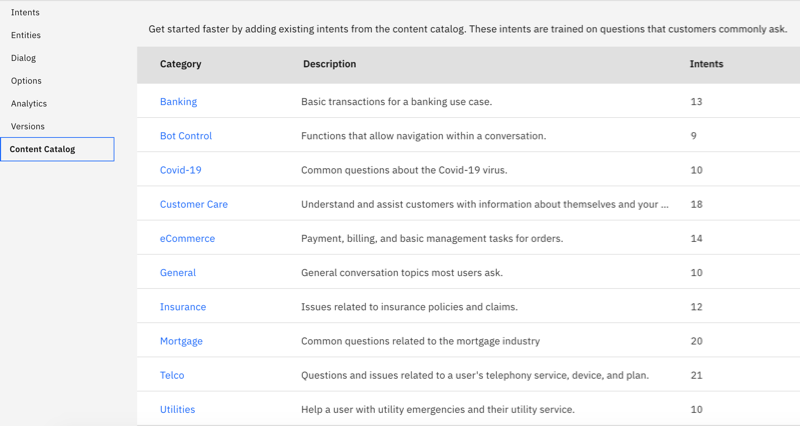
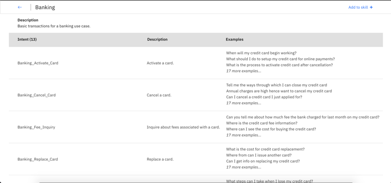

---

copyright:
  years: 2015, 2023
lastupdated: "2023-08-31"

subcollection: watson-assistant

---

{{site.data.keyword.attribute-definition-list}}

# Using built-in intents
{: #catalog}

***Content catalogs*** provide a way to add common intents to your {{site.data.keyword.conversationshort}} dialog skill.
{: shortdesc}

Intents that you add from the catalog are meant to provide a starting point. Add to or edit the catalog intents to tailor them for your use case.

## Adding a content catalog to your dialog skill
{: #catalog-add}

1.  Open the **Content Catalog** page.

    {: caption="Content catalogs" caption-side="bottom"}

1.  Select a content catalog, such as *Banking*, to see the intents that are provided with it.

    {: caption="Intents" caption-side="bottom"}

    Intents that are added from a content catalog are distinguishable from other intents by their names. Each intent name is has a prefix with the content catalog name.

1.  Add a content catalog by clicking **Add content +**.

1.  Go to the **Intents** page to see the intents that you added from the catalog listed.

After you add a catalog, the intents become part of your training data. If IBM makes subsequent updates to a content catalog, the changes are not automatically applied to any intents you added from a catalog.
{: note}

## Editing content catalog intents
{: #catalog-edit-content}

Like any other intent, after you add content catalog intents to your skill, you can make the following changes to them:

- Rename intents
- Delete intents
- Add, edit, or delete intent user examples
- Move an example to a different intent
