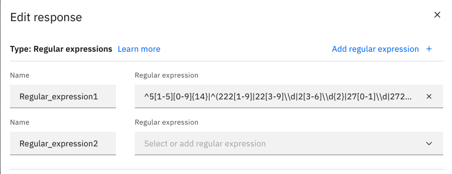
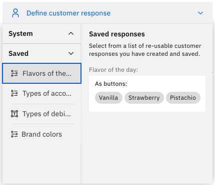

---

copyright:
  years: 2018, 2021
lastupdated: "2021-08-26"

subcollection: watson-assistant

---

{:shortdesc: .shortdesc}
{:new_window: target="_blank"}
{:external: target="_blank" .external}
{:deprecated: .deprecated}
{:important: .important}
{:note: .note}
{:tip: .tip}
{:pre: .pre}
{:codeblock: .codeblock}
{:screen: .screen}
{:javascript: .ph data-hd-programlang='javascript'}
{:java: .ph data-hd-programlang='java'}
{:python: .ph data-hd-programlang='python'}
{:swift: .ph data-hd-programlang='swift'}

{{site.data.content.classiclink}}

# Collecting information from your customer
{: #collect-info}

Many actions require multiple steps in order to collect all of the information required to complete the customer's request. When a step asks the customer for more information, the _customer response type_ defines what type of response is expected.
{: shortdesc }

In the step editor user interface, the middle portion of the step configuration defines the interaction between the assistant and the customer.

The **Assistant says** field specifies the output the assistant sends to the customer. If this output is a question the user is expected to answer, that answer might be a number, a date, a name, or something else. You use the **Define customer response** field to specify what type of response is expected, based on the kind of information the assistant is asking for and how the customer is expected to specify it.

## Choosing a response type

To choose the customer response type for a step, click **Define customer response** to expand the field. You can then select one of the following response types:

| Response type | Description | Example input |
|---------------|-------------|----------|
| [**Options**](#customer-response-type-options)   | A list of predefined choices that customers can select from. At run time, the web chat integration shows an options response as a set of clickable buttons or as a drop-down list, depending on the number of choices. | `Small` `Medium` `Large` |
| [**Number**](#customer-response-type-number)    | A single generic number, specified either as numerals. | `100`, `one hundred` |
| [**Date**](#customer-response-type-date)      | A single specific date or a range of dates. | `31 December 2021`, `12/31/2020`, `tomorrow` |
| [**Time**](#customer-response-type-time)      | A single specific time or a range of time.  | `5:00 PM`, `now` |
| [**Currency**](#customer-response-type-currency)  | An amount of money, including the unit.     | `$25`, `500 yen` |
| [**Percent**](#customer-response-type-percent)   | A fractional numeric value expressed as a percentage. | `10%`, `50 percent` |
| [**Free text**](#customer-response-type-free-text) | Any arbitrary text response. | `123 Main Street`, `John Q. Smith` |
<!-- | [**Regex**](#customer-response-type-regex)     | A text response that matches a specified pattern or format (such as an e-mail address or telephone number). || -->

## Skipping a step
{: #collect-info-skip-step}

Although a customer response is associated with a particular step, the assistant can recognize the required information at any point during the action. For any step that expects a customer response, you can decide whether to explicitly ask for the information or to skip asking and apply information that the assistant has already recognized. For more information about skipping steps, see [Skipping steps](/docs/watson-assistant?topic=watson-assistant-skip-steps).

## Customer response types
{: #customer-response-types}

The configuration information you must provide varies by response type.

### Options
{: #customer-response-type-options}

An _options_ response presents customers with a list of choices to select from. Use this response type when the cutomer's response must be one of a predefined set of known values. When you select an options response, you must then specify the valid options the assistant will display.

The way in which these values are presented at run time depends upon how your customers connect to the assistant. In the web chat integration, the options are shown as clickable buttons (for 4 or fewer options) or as a drop-down list (for more than 5 options).

You can optionally add _synonyms_ for each option by clicking **Add synonyms**. Synonyms are variations of an option value that customers might type. For each option that you add, add synonyms in a comma-separated list.

For example, you might define the following options:

<table>
      <caption>Options example</caption>
      <tr>
        <th>Option value</th>
        <th>Synonyms</th>
      </tr>
      <tr>
        <td>Blue</td>
        <td>aqua, turquoise, navy</td>
      </tr>
      <tr>
        <td>Red</td>
        <td>burgundy, crimson, sangria</td>
      </tr>
      <tr>
        <td>Green</td>
        <td>lime, olive, forest</td>
      </tr>
</table>

To select an option at run time, users can click an option button or list item, such as *Green*. Or they can type `Green` or one of its synonyms, such as `lime`.

Synonyms are particularly useful for a response that might be skipped, because they enable the assistant to recognize an option the customer might have already chosen before seeing the list. For example, if the customer's original input was `I want to order a large coffee`, a synonym would enable the assistant to recognize `large` as equivalent to the actual size `Grande`.

You can save your configured options response for reuse in other steps. To save a customer response, click the **Save response for reuse** icon. For more information, about saved customer responses, see [Saving and reusing customer responses](#saved-customer-responses).
{: tip}

### Number
{: #customer-response-type-number}

A _number_ response collects a single numeric value.

The customer can specify the number value in either numerals (`100`) or words (`one hundred`). Negative and decimal values are recognized.

### Date
{: #customer-response-type-date}

A _date_ response collects a specific calendar date or a range of dates. The assistant can recognize dates expressed in a variety of formats. Valid examples include:

- `Today`
- `Friday`
- `Now`
- `10/30/2020`
- `October 30th, 2020`
- `October 30th`

### Time
{: #customer-response-type-time}

A _time_ response collects a single time or a range of times. The assistant can recognize times expressed in a variety of formats. Valid examples include:

- `12:45PM`
- `10:30`
- `6am`
- `Now`
- `at 10`
- `from 5pm`

### Currency
{: #customer-response-type-currency}

A _currency_ response collects a currency value, including the amount and the unit. The assistant can recognize currency values expressed in a variety of formats. Valid examples include:

- `$10.00`
- `20 cents`
- `five dollars`
- `500 yen`

### Percent
{: #customer-response-type-percent}

A _percent_ response collects a fractional value expressed as a percentage. The assistant can recognize a percentage written using either the percent symbol (`%`) or the word `percent`). Valid examples include:

- `15%`
- `10.5 percent`

### Free text
{: #customer-response-type-free-text}

A _free text_ response collects any arbitrary text string. Use this response for capturing any text, such as a name or address, or special instructions to be passed along. Valid examples include:

- `123 Main St.`
- `John Q. Smith`
- `Please add extra sauce`

<!--
### Regex
{: #customer-response-type-regex}

A _regex_ response collects a text string that matches a pattern expressed as a regular expression. Use this response to capture a value that must conform to a particular pattern or format, such as an e-mail address or telephone number.

To add a regex response:

1. Under **Define customer response** field, click **Regex**.

1. In the **Edit response** window, click **Regular expression**.

1. Select one of the predefined regular expressions, or select **Custom regular expression** to write your own.

To use a predefined regular expression, select one of the following:

- **Email**: An e-mail address (for example, `user@example.com`).
- **US phone number**: A ten-digit phone number (for example, `800-555-1212`).
- **Account number**: ????
- **Credit card number**: ????

1. To write your own custom regular expression, select **Custom regular expression** and then type your regex in the **Regular expression** field. For more information on regular expression syntax, see [Examples of regular expressions](https://support.google.com/a/answer/1371417){: external}.

#### Adding multiple regular expressions

You can specify multiple regular expressions for a single response. For example, you could define multiple regex patterns that match part numbers from different vendors that use different formats.

To add multiple regular expressions for a response, click **Add regular expression** to add another field in which you can select or define an additional regular expression.

Note that when you add more than one regular expression, a **Name** field is also displayed for each regular expression. Use this field to give each regular expression a descriptive name. You can later use this name in step conditions to identify which regular expression matched the customer's input. (For more information about step conditions, see XXXX).

You can save your configured regex response for reuse in other steps. To save a customer response, click the **Save response for reuse** icon. For more information, about saved customer responses, see [Saving and reusing customer responses](#saved-customer-responses).
{: tip}

## Saving and reusing customer responses
{: #saved-customer-responses}

There might be some questions that your assistant needs to ask in multiple different steps and actions. For example, a banking assistant might support many different actions, each of which requires that the customer specify an account number. A customer response might have a complex configuration (for example, it might have options with many synonyms). Instead of having to rebuild such a response over and over, you can save a customer response and reuse it wherever your assistant needs it.

### Creating a saved customer response

To create a saved customer response:

1. From your assistant, navigate to **Saved responses**.

1. Click **New saved response**.

1. In the **Name** field, specify a descriptive name for the saved customer response configuration; this name should reflect the category of the information it collects. For example, you might use the name `Confirmation` for a response that recognizes multiple synonyms for "yes" and "no."

1. In the **Type of response** field, select the customer response type for this customer response.

1. Configure the details of the response as required. For more information, see [Customer response types](#customer-response-types).

1. Click **Save**. The saved customer response now appears on the **Saved responses** page.

From this page, you can also edit or delete any existing saved customer response. Keep in mind that any changes you make will apply to all instances of the customer response in any step that uses it. If you delete a saved customer response, any steps that use that response become invalid and must be corrected to use a different response type.
{: important}

You can also create a saved customer response based on the customer response configuration within a step. If you have already configured a customer response in a step, click the **Save response for reuse** icon and specify a descriptive name for the saved customer response.

### Using saved customer responses in steps
{: #using-saved-customer-response}

After you save a customer response, it becomes available as a response type for any step. To use a previously saved customer response in a step:

1. In the step editor, click **Define customer response**.

1. In the list of customer response types, click **Saved** to see the available saved customer responses.

    

1. Click the saved response you want to use.

To remove a saved response from a step, click the **Delete**  icon. Removing a saved response from a step affects only the step you are editing. It does not delete the saved response or remove it from any other steps.

To edit a saved response from a step, click **Edit response**. Keep in mind that if you edit a saved response, your changes will affect all steps that use the response. If you want to edit the response only for the step you are editing, click the **Unlink from saved response**  icon. After you unlink a response, any edits you make affect only the step you are editing; they do not affect any other steps, nor are they applied to the saved response.

After you unlink a response, you cannot re-link it. If you want to return to the saved response without your edits, delete the response and then re-add the original saved response. If you want to make your edited version of the response available for reuse, save it as a new saved response.
{: tip}

-->

