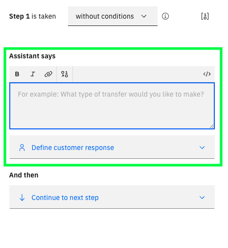
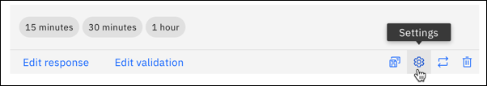
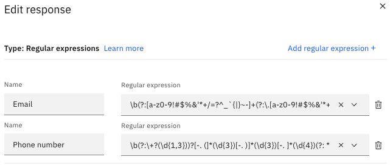
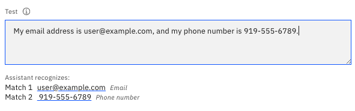
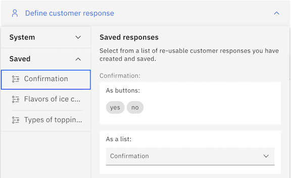
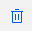
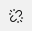

---

copyright:
  years: 2018, 2022
lastupdated: "2022-11-10"

subcollection: watson-assistant

---

{:shortdesc: .shortdesc}
{:new_window: target="_blank"}
{:external: target="_blank" .external}
{:deprecated: .deprecated}
{:important: .important}
{:note: .note}
{:tip: .tip}
{:pre: .pre}
{:codeblock: .codeblock}
{:screen: .screen}
{:javascript: .ph data-hd-programlang='javascript'}
{:java: .ph data-hd-programlang='java'}
{:python: .ph data-hd-programlang='python'}
{:swift: .ph data-hd-programlang='swift'}

{{site.data.content.classiclink}}

# Collecting information from your customers
{: #collect-info}

Many actions require multiple steps in order to collect all of the information required to complete the customer's request. When a step asks the customer for more information, the *customer response type* defines what type of response is expected.
{: shortdesc }

In the step editor user interface, the middle portion of the step configuration defines the interaction between the assistant and the customer.



The **Assistant says** field specifies the output the assistant sends to the customer. If this output is a question the user is expected to answer, that answer might be a number, a date, a name, or something else. You use the **Define customer response** field to specify what type of response is expected, based on the kind of information the assistant is asking for and how the customer is expected to specify it.

## Choosing a response type
{: #choose-type}

To choose the customer response type for a step, click **Define customer response** to expand the field. You can then select one of the following response types:

| Response type | Description | Example input |
|---------------|-------------|----------|
| [**Options**](#customer-response-type-options)   | A list of predefined choices that customers can select from. At run time, the web chat integration shows an options response as a set of clickable buttons or as a drop-down list, depending on the number of choices. | `Small` `Medium` `Large` |
| [**Confirmation**](#customer-response-type-confirmation) | A choice of either `Yes` or `No`. At run time, the web chat integration shows the `Yes` and `No` options as clickable buttons. | `Yes`, `No` |
| [**Regex**](#customer-response-type-regex)     | A text response that matches a specified pattern or format (such as an email address or telephone number). ||
| [**Number**](#customer-response-type-number)    | A single generic number, specified either as numerals (100) or words (one hundred). | `100`, `one hundred` |
| [**Date**](#customer-response-type-date)      | A single specific date or a range of dates. | `31 December 2021`, `12/31/2020`, `tomorrow` |
| [**Time**](#customer-response-type-time)      | A single specific time or a range of time.  | `5:00 PM`, `now` |
| [**Currency**](#customer-response-type-currency)  | An amount of money, including the unit.     | `$25`, `500 yen` |
| [**Percent**](#customer-response-type-percent)   | A fractional numeric value expressed as a percentage. | `10%`, `50 percent` |
| [**Free text**](#customer-response-type-free-text) | Any arbitrary text response. | `123 Main Street`, `John Q. Smith` |
{: caption="Response types" caption-side="bottom"}

## Skipping steps, always asking steps, or never asking steps
{: #collect-info-skip-step}

Although a customer response is associated with a particular step, the assistant can recognize the required information at any point during the action. By default, a step is set to be skipped if its value is already provided in the user's input. If the value is specificed after the step, the new value replaces the value specified in the step itself.

For example, if the customer's initial input was `I want to withdraw money from my checking account`, a step that asks the user to select a bank account will be skipped because the customer already entered that information.

For any step that expects a customer response, you can decide whether to:
- Skip asking if the answer is mentioned in previous messages. This is the default.
- Always ask for this information, regardless of previous messages.
- Never ask. Collect information from previous messages.

### Always ask
{: #collect-info-skip-step-always-ask}

If your action asks for the same type of data in more than one step, use the **Always ask for this information** setting to prevent the assistant from making incorrect assumptions. For example, you might have an action in which one step asks for a hotel check-in date and another step asks for the check-out date. If you skip asking, the assistant can mistake the check-in date for the check-out date.

To require that a step is always used in the conversation with a customer:

1. In the customer response, click the **Settings** icon to open **Customer response settings**. 

   

1. Choose **Always ask for this information, regardless of previous messages**.

1. Click **Apply**.

### Never ask
{: #collect-info-skip-step-never-ask}

There may be some situations where you need a step to never ask a question because you anticipate there might be redundant questions in the conversation.

To set that a step is never asked in the conversation with a customer:

1. In the customer response, click the **Settings** icon to open **Customer response settings**. 

1. Choose **Never ask. Collect information from previous messages.**.

1. Click **Apply**.

#### Example
{: #collect-info-skip-step-never-ask-example}

This example explains when you might set a step to never ask for a response.

You might have an action that responds to requests to file an insurance claim. If you expect customers to typically make a request about a specific type of claim, such as auto, home, or medical, you might not want to ask another question about what type. They might say `I need to file an auto claim` or `I want to make a home claim.`

Although you still need a step that collects the answer about the type of claim, you might not want or need to ask that explicit question, especially if your assistant is used with the phone integration. Instead, you can create a step with the claim options, but set it to never ask.

This table shows how you could set up the steps. The last step is a catch-all in case the customer doesn't mention the claim type initially.

| Step | Conditions | Assistant says | Customer response | Customer response setting | And then |
| -- | -- | -- | -- | -- | -- |
| 1 | None | What kind of claim? | Options: Automobile, Homeowner, Medical | Never ask | Continue to the next step |
| 2 | Step 1 is Automobile | None | Click here to file an automobile claim | Skip (default) | End the action |
| 3 | Step 1 is Homeowner | None | Click here to file a homeowner claim | Skip (default) | End the action |
| 4 | Step 1 is Medical | None | Click here to file a medical claim | Skip (default) | End the action |
| 5 | Step 1 is not defined (no claim type) | None | Click here to file an insurance claim | Skip (default) | End the action |
{: caption="Example using the never ask response setting" caption-side="bottom"}

## Customer response types
{: #customer-response-types}

The configuration information you must provide varies by response type.

### Options
{: #customer-response-type-options}

An *options* response presents customers with a list of choices to select from. The way in which these options are presented depends upon how your customers connect to the assistant. In the web chat integration, the options are shown as clickable buttons (for 4 or fewer options) or as a drop-down list (for more than 4 options).

There are two ways to create the list:
- Enter a list of options and synonyms
- Generate a dynamic list from a variable

#### Entering a list of options and synonyms
{: #customer-response-type-options-static}

Enter each choice in the **Option** fields. You can click **Add synonyms** to enter variations of an option value that customers might type. You can enter multiple synonyms in a comma-separated list.

For example, you might define the following options and synonyms:

| Option value | Synonyms                         |
|--------------|----------------------------------|
| Blue         | aqua, turquoise, navy      |
| Red          | burgundy, crimson, sangria |
| Green        | lime, olive, forest        |
{: caption="Options example" caption-side="top"}

To select an option, customers can click an option button or list item, such as *Green*. Or they can type `Green` or one of its synonyms, such as `lime`.

Synonyms are particularly useful for a response that might be skipped, because they enable the assistant to recognize an option the customer might have already chosen before seeing the list. For example, if the customer's original input was `I want to order a large coffee`, a synonym would enable the assistant to recognize `large` as equivalent to the actual size `Grande`.

You can save this configuration for reuse in other steps. To save a customer response, click the **Save response for reuse** icon. For more information about saved customer responses, see [Saving and reusing customer responses](#saved-customer-responses).
{: tip}

If you have a very long list of options, such as all the states in the U.S., you can choose to not show options in a list. This can be useful to prevent a phone integration from reading a long list of options to the customer.

To disable the list:

1. In the options customer response, click the **Settings** icon.

1. Click the **Present options to the customer in a list** toggle to off.

#### Dynamic list of options
{: #customer-response-type-options-dynamic}

Within the options customer response, you can use the **dynamic** setting to generate the list when you need to ask questions that are potentially different each time and for each customer. You need to set up a variable as the source of the options. For more information, see [Dynamic options](/docs/watson-assistant?topic=watson-assistant-dynamic-options).

### Confirmation
{: #customer-response-type-confirmation}

A *confirmation* response presents customers with the choices of either `Yes` or `No` as clickable buttons. Use this response type when the customer's response must be either Yes or No.

The following customer responses are recognized as `Yes`:
- `yeah`
- `yea`
- `yup`
- `sure`
- `positive`

The following customer responses are recognized as `No`:
- `not`
- `nope`
- `nay`
- `negative`

### Regex
{: #customer-response-type-regex}

A *regex* response collects a text string that matches a pattern expressed as a regular expression. Use this response to capture a value that must conform to a particular pattern or format, such as an email address or telephone number.

You can specify multiple regular expressions for a single response. For example, you might define multiple regex patterns that match part numbers from different vendors that use different formats. Input text for the response will be recognized if it matches any of the regex patterns you specify.

To add a regex response:

1. Under **Define customer response** field, click **Regex**.

1. In the **Edit response** window, click in the **Regular expression** field.

1. Select one of the predefined regular expressions, or select **Define custom regular expression** to write your own.

    To use a predefined regular expression, select one of the following:

    - **Email**: An Internet email address (for example, `user@example.com`).
    - **Phone number**: A ten-digit US phone number (for example, `800-555-1212` or `(800) 555-1212`).
    - **URL**: A correctly formatted URL for an online resource, optionally including the protocol (for example, `example.com` or `https://example.org/index.html`).

    For examples of other common patterns, see [Example regex patterns](#regex-examples).
    {: tip}

    To write your own custom regular expression, select **Define custom regular expression** and then type your regex pattern in the **Regular expression** field. For more information on regular expression syntax, see [Syntax](https://github.com/google/re2/wiki/Syntax){: external}.

    Only English characters can be used in a regular expression. If you need to use other characters in a regular expression, you must represent those characters in Unicode.

    {{site.data.keyword.conversationshort}} uses the Google RE2 regular expression library to match regular expressions at run time. Regular expression syntax can vary between implementations, so make sure any regex patterns you write conform to the [RE2 syntax](https://github.com/google/re2/wiki/Syntax){: external}.
    {: note}

1. If you want to specify multiple regex patterns for the response, click **Add regular expression** to add another field in which you can select or define an additional regular expression.

    When you specify more than one regular expression, a **Name** field is displayed for each one. Use this field to give each regex pattern a unique name. You can use this name in subsequent step conditions to identify which regex pattern was matched.

    

1. Test your regular expression by typing example input in the **Test** field. If any text within your input matches the regex patterns you have specified, the matching text is listed in the **Assistant recognizes:** field.

    

    The **Test** feature in the step editor uses a browser-based regex engine to find matches in your test input. At run time, the assistant uses a different regex engine that might have different results, especially with complex patterns. Before deploying your assistant in production, always use the assistant preview to test any step that uses a regex response.
    {: note}

You can save your configured regex response for reuse in other steps. For more information, about saved customer responses, see [Saving and reusing customer responses](#saved-customer-responses).
{: tip}

#### Example regex patterns
{: #regex-examples}

You can use the following regex patterns to recognize some common types of user input.

| Description               | Patterns    |
|---------------------------|-------------|
| US Social Security number | `^(?!(000&#124;666&#124;9))\d{3}-(?!00)\d{2}-(?!0000)\d{4}$` |
| US passport number        | `/^[A-PR-WY][1-9]\d\s?\d{4}[1-9]$/` |
| US bank routing number    | `\b((0[0-9])&#124;(1[0-2])&#124;(2[1-9])&#124;(3[0-2])&#124;(6[1-9])&#124;(7[0-2])&#124;80)&#124; ([0-9]{7})\b` |
| UPS tracking number       | `/\b(1Z ?[0-9A-Z]{3} ?[0-9A-Z]{3} ?[0-9A-Z]{2} ?[0-9A-Z]{4} ?&#124; [0-9A-Z]{3} ?[0-9A-Z]&#124;[\dT]\d\d\d ?\d\d\d\d ?\d\d\d)\b/` |
| USPS tracking number      | - `/(\b\d{30}\b)&#124;(\b91\d+\b)&#124;(\b\d{20}\b)/`\n- `/^E\D{1}\d{9}\D{2}$&#124;^9\d{15,21}$/`\n- `/^91[0-9]+$/`\n - `/^[A-Za-z]{2}[0-9]+US$/` |
| FedEx tracking number     | - `/(\b96\d{20}\b)&#124;(\b\d{15}\b)&#124;(\b\d{12}\b)/`\n- `/\b((98\d\d\d\d\d?\d\d\d\d&#124;98\d\d) ?\d\d\d\d ?\d\d\d\d( ?\d\d\d)?)\b/`\n - `/^[0-9]{15}$/` |
{: caption="Example regex patterns" caption-side="bottom"}

### Number
{: #customer-response-type-number}

A *number* response collects a single numeric value.

The customer can specify the number value in either numerals (`100`) or words (`one hundred`). Negative and decimal values are recognized.

### Date
{: #customer-response-type-date}

A *date* response collects a specific calendar date or a range of dates. The assistant can recognize dates expressed in a variety of formats. Valid examples include:

- `Today`
- `Friday`
- `Now`
- `10/30/2020`
- `October 30th, 2020`
- `October 30th`

### Time
{: #customer-response-type-time}

A *time* response collects a single time or a range of times. The assistant can recognize times expressed in a variety of formats. Valid examples include:

- `12:45PM`
- `10:30`
- `6am`
- `Now`
- `at 10`
- `from 5pm`

### Currency
{: #customer-response-type-currency}

A *currency* response collects a currency value, including the amount and the unit. The assistant can recognize currency values expressed in a variety of formats. Valid examples include:

- `$10.00`
- `20 cents`
- `five dollars`
- `500 yen`

### Percent
{: #customer-response-type-percent}

A *percent* response collects a fractional value expressed as a percentage. The assistant can recognize a percentage written using either the percent symbol (`%`) or the word `percent`). Valid examples include:

- `15%`
- `10.5 percent`

### Free text
{: #customer-response-type-free-text}

A *free text* response collects any arbitrary text string. Use this response for capturing any text, such as a name or address, or special instructions to be passed along. Valid examples include:

- `123 Main St.`
- `John Q. Smith`
- `Please add extra sauce`

## Saving and reusing customer responses
{: #saved-customer-responses}

There might be some questions that your assistant needs to ask in multiple different steps and actions. For example, a banking assistant might support many different actions, each of which requires that the customer specify an account number. A customer response might have a complex configuration (for example, it might have options with many synonyms). Instead of having to rebuild such a response over and over, you can save a customer response and reuse it wherever your assistant needs it.

### Creating a saved customer response
{: #saved-customer-responses-create}

To create a saved customer response:

1. From your assistant, navigate to **Saved responses**.

1. Click **New saved response**.

1. In the **Name** field, specify a descriptive name for the saved customer response configuration; this name should reflect the category of the information it collects.

1. Configure the details of the response as required. A saved response can be created only as an options response type. For more information about this response type, see [Customer response types](#customer-response-types).

1. Click **Save**. The saved customer response now appears on the **Saved responses** page.

1. In the **Type of response** field, choose Options or Regex.

From this page, you can also edit or delete any existing saved customer response. Keep in mind that any changes you make will apply to all instances of the customer response in any step that uses it. If you delete a saved customer response, any steps that use that response become invalid and must be corrected to use a different response type.
{: important}

For the options and regex customer response types, you can also create a saved customer response based on the customer response configuration within a step. If you have already configured a customer response in a step, click the **Save response for reuse** icon and specify a descriptive name for the saved customer response. (This isn't available if you use the dynamic setting for an options response.)
{: tip}

### Uploading saved customer responses
{: #uploading-saved-customer-response}

If you have a large number of saved customer responses, you might find it easier to upload them from a comma-separated value (CSV) file than to define them one by one. If you are migrating entities from the classic {{site.data.keyword.conversationshort}} experience to saved customer responses in the new {{site.data.keyword.conversationshort}} experience, see [Migrating intents and entities](/docs/watson-assistant?topic=watson-assistant-migrate-intents-entities).

1. Collect the saved customer responses into a CSV file. Save the CSV file with UTF-8 encoding and no byte order mark (BOM).

    The required format for each line in the file is as follows:
    ```text
    <savedResponse>,<value>,<synonyms>
    ```
    where `<savedResponse>` is the name of a saved customer response, `<value>` is a value for the saved customer response, and `<synonyms>` is a comma-separated list of synonyms for that value. For example:
    ```text
    genres,science fiction,sci-fi,SF
    genres,historical fiction,HF
    genres,young adult,YA
    genres,autobiography
    genres,biography
    genres,fantasy
    locations,Adams Street
    locations,Central
    locations,South End
    ```
    Uploading a CSV file also supports patterns. Any string wrapped with `/` is considered a pattern, as opposed to a synonym. For example:
    ```text
    ContactInfo,localPhone,/(\d{3})-(\d{4})/
    ContactInfo,fullUSphone,/(\d{3})-(\d{3})-(\d{4})/
    ContactInfo,internationalPhone,/^(\(?\+?[0-9]*\)?)?[0-9_\- \(\)]*$/
    ContactInfo,email,/\b[A-Za-z0-9._%+-]+@[A-Za-z0-9.-]+\.[A-Za-z]{2,}\b/
    ContactInfo,website,/(https?:\/\/)?([\da-z\.-]+)\.([a-z\.]{2,6})([\/\w \.-]*)*\/?$/
    ```

1. Go to the **Saved responses** page.

1. Click the **Upload** icon .

1. Select a file from your computer. The maximum CSV file size is 10 MB. If your CSV file is larger, consider splitting it into multiple files and uploading them separately.

    The file is validated and uploaded, and the system begins to train itself on the new data.

### Using saved customer responses in steps
{: #using-saved-customer-response}

After you save a customer response, it becomes available as a response type for any step. To use a previously saved customer response in a step:

1. In the step editor, click **Define customer response**.

1. In the list of customer response types, click **Saved** to see the available saved customer responses.

    

1. Click the saved response you want to use.

To remove a saved response from a step, click the **Delete**  icon. Removing a saved response from a step affects only the step you are editing. It does not delete the saved response or remove it from any other steps.

To edit a saved response from a step, click **Edit response**. Keep in mind that if you edit a saved response, your changes will affect all steps that use the response. If you want to edit the response only for the step you are editing, click the **Unlink from saved response**  icon. After you unlink a response, any edits you make affect only the step you are editing; they do not affect any other steps, nor are they applied to the saved response.

After you unlink a response, you cannot re-link it. If you want to return to the saved response without your edits, delete the response and then re-add the original saved response. If you want to make your edited version of the response available for reuse, save it as a new saved response.
{: tip}
