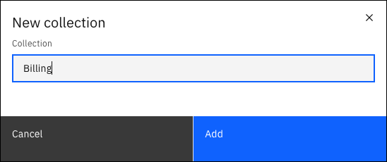
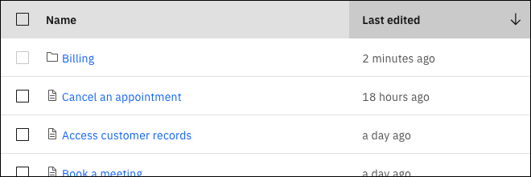

---

copyright:
  years: 2023
lastupdated: "2023-07-21"

subcollection: watson-assistant

---

{{site.data.keyword.attribute-definition-list}}

# Organizing actions in collections
{: #collections}

You can use a *collection* to organize your actions. You can put actions into folder-style groups based on whatever categorization you need at your organization, such as by use case, internal team, or status. 

## Adding a collection
{: #collections-add}

To add a collection:

1. From the **Actions** page of your assistant, click **New collection** .

1. Enter a collection name of up to 64 characters. Each collection name must be unique.

   {: caption="New collection" caption-side="bottom"}

1. Click **Add**. The new collection is listed on the **Actions** page.

   {: caption="Collection" caption-side="bottom"}

You can also add a collection and move actions into it at the same time:

1. Select one or more actions by clicking the checkbox next to each action that you want to include.

1. Click **Add to new collection**.

1. Enter a collection name of up to 64 characters. Names don't need to be unique.

1. Click **Add**. The new collection is listed on the **Actions** page. Open the collection to see the actions you selected.

## Moving actions into a collection
{: #collections-move-actions}

You can move one or more actions into a collection. You can also move actions from one collection to another.

To move an action into an existing collection:

1. Select one or more actions by clicking the checkbox next to each action that you want to include.

1. Click **Move to**.

1. Select a collection, then click **Move**.

To move actions from one collection to another:

1. Open a collection.

1. Select one or more actions by clicking the checkbox next to each action that you want to include.

1. Click **Move to**.

1. Select a collection, then click **Move**.

## Removing actions from a collection
{: #collections-remove-actions}

You can remove an action from a collection:

1. Open a collection.

1. Select one or more actions by clicking the checkbox next to each action that you want to include.

1. Click **Remove from collection**. 

1. Open the **Created by you** list to see the actions you removed.

## Renaming a collection
{: #collections-rename}

To rename a collection:

1. From the **Actions** page of your assistant, click the overflow menu icon .

1. Click **Rename**.

1. Enter a new name of up to 64 characters. Names don't need to be unique.

1. Click **Rename**. The renamed collection is listed on the **Actions** page.

## Deleting a collection
{: #collections-delete}

You can delete a collection. No actions in the collection are deleted. They are moved into the **Created by you** list.

To delete a collection:

1. From the **Actions** page of your assistant, click the overflow menu icon .

1. Click **Delete**.

1. In the confirmation message, click **Delete**.
