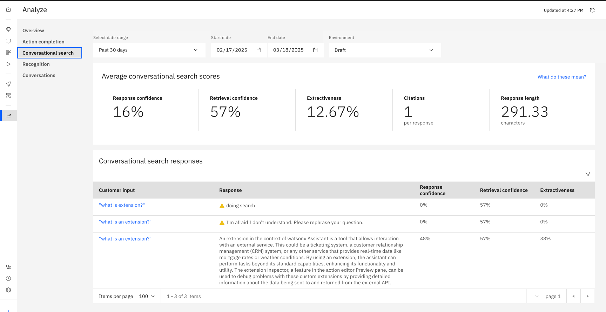

---
copyright:
  years: 2015, 2025
lastupdated: "2025-03-19"

keywords: conversational search

subcollection: watson-assistant

---

{{site.data.keyword.attribute-definition-list}}

# Conversational search analytics
{: #conversational-search-analytics}

[Plus]{: tag-green} [Enterprise]{: tag-purple} [IBM Cloud Pak for Data]{: tag-cp4d} [{{site.data.keyword.IBM_notm}} Software Hub]{: tag-teal}

## Overview
{: #conversational-search-analytics-overview}

You can analyze the performance of your conversational search by using a holistic routing graph of your assistant. In the {{site.data.keyword.conversationshort}} home page, go to **Analyze** > **Conversational search** to open the conversational search statistics as a preview.

## Analyzing data and Conversational search scores
{: #conversational-search-analytics-analyze}

You can see the average scores for citations per response, answer length, answer confidence, and extractiveness in the draft configuration. You can filter conversational search responses that use successful conversational search responses or “I don’t know”. Click any **Customer input** to view the inline citations for that conversational search.

Hover on the information icon () next to the customer input to see the query text inferred from the context.

For a single utterance-response pair, you can view the following metrics:

### Response confidence score
{: #conversational-search-analytics-response-confidence}

The response confidence score is the estimated probability that the assistant’s response is correct, relevant, and useful in addressing the user's query or request for the available content.

### Retrieval confidence score
{: #conversational-search-analytics-retrieval-confidence}

The retrieval confidence score measures how certain the system is that it retrieved the most relevant information from its database to answer a user's query. It is the estimated probability that the retrieved data contains the necessary details to respond accurately to the user's request.

### Extractiveness
{: #conversational-search-analytics-extractiveness-confidence}

Extractiveness is the extent to which the response is directly derived from the input. It is the fraction of the response that consists of sequences of words that are in the search results. A high score indicates that much of the response is directly quoted from the sources. A low score indicates that the response is abstracted or paraphrased from the sources. However, it can also mean that the response is not supported by the sources.

### Citations
{: #conversational-search-analytics-citations-confidence}

Citations refer to the acknowledgment of the sources of data, models, or algorithms that the system uses to generate its outputs or make its predictions. On the analytics page, you can see the number of citations that are associated with the response.

### Response length
{: #conversational-search-analytics-response-length-confidence}

The number of characters in the response.

### Average citations per response
{: #conversational-search-analytics-response-avg-citations}

The average number of citations that are received by each response that is provided by the assistant.

### Average response length
{: #conversational-search-analytics-response-avg-response-length}

The average length of characters required to provide a helpful response.

For all the metrics, the average is the average among all questions for which we generated a response, regardless of whether we provided it or not.
{: note}
