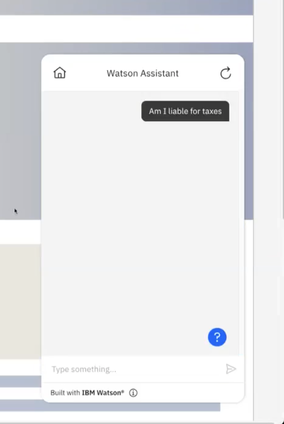
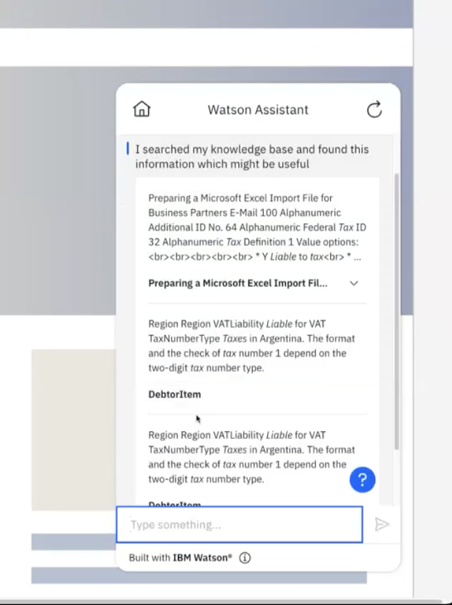
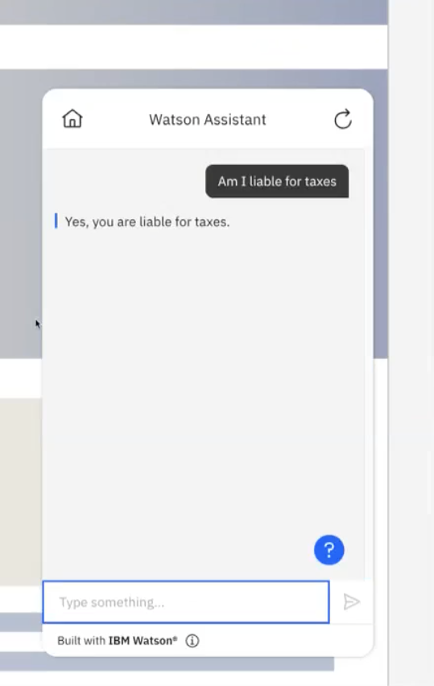

---

copyright:
  years: 2015, 2023
lastupdated: "2023-11-27"

keywords: conversational search

subcollection: watson-assistant

---

{{site.data.keyword.attribute-definition-list}}

# Conversational search
{: #conversational-search}

[Plus]{: tag-green}[Beta]{: tag-cyan}

Use *conversational search* with the {{site.data.keyword.discoveryfull}} search integration setup to help your assistant extract an answer from the highest-ranked query results and return a text response to the user.
{: shortdesc}

When you enable this feature, search results are provided to an IBM watsonx generative AI model that produces a conversational reply to a user's question. 

This beta feature is available in English for evaluation and testing purposes only. The watsonx generative AI model is currently hosted only in the Dallas and Frankfurt regions. To sign up for the beta access, use the [form here](https://form.asana.com/?k=xflsi8sU1akW_LI3ZXdStA&d=8612789739828).
{: beta}

By default, assistants in all regions except `Frankfurt` use the model from the `Dallas` region. {: important}

To use conversational search, you must have a Plus or Enterprise plan and enroll in the early access program with this [signup form](https://form.asana.com/?k=U0gIIpwhM2_LY8r8LC_qDw&d=8612789739828){: external}.

## Before you begin
{: #conversational-search-requirements}

You need to have the {{site.data.keyword.discoveryshort}} search integration to enable the conversational search feature. For more information, see [{{site.data.keyword.discoveryfull}} search integration setup](/docs/watson-assistant?topic=watson-assistant-search-add).

## Conversational search setup
{: #conversational-search-setup}

After you create the search integration or search skill, connect to an existing {{site.data.keyword.discoveryshort}} instance, and create a project, you can enable the conversational search feature when you configure your search. 

1. Follow steps 1-3 in [Configure the search](/docs/watson-assistant?topic=watson-assistant-search-add#search-add-configure).

1. Click the **Conversational search** toggle to turn on.

   

1. Follow steps 4-8 in [Configure the search](/docs/watson-assistant?topic=watson-assistant-search-add#search-add-configure).

1. Add a trigger to call out to search. For more information, see [Search trigger](/docs/watson-assistant?topic=watson-assistant-search-add#search-add-trigger).

## Test Conversational search
{: #conversational-search-test}

You can test conversational search in actions preview, the preview page, or by using the preview link.

In this example, the user asks, "Am I liable for taxes?" 

   

Search results are pulled from your knowledge base when conversational search is off.

   

A text-based reply from the best results in your knowledge base displays when conversational search is on. The answer is, "Yes, you are liable for taxes." 

   

