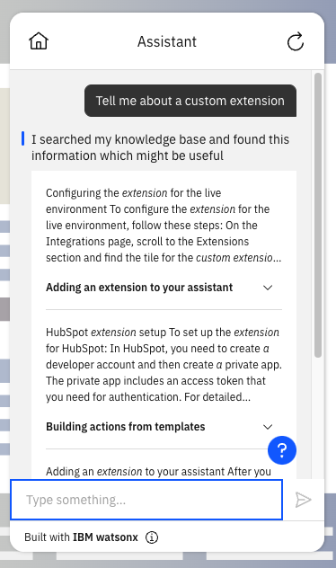
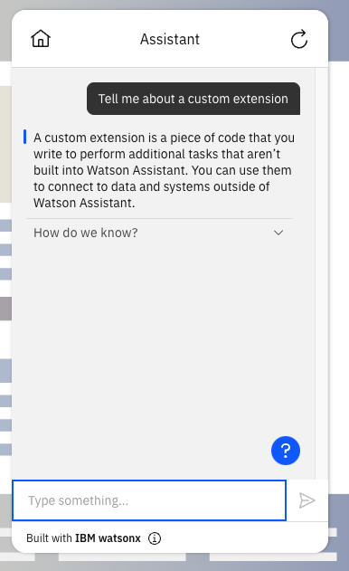

---

copyright:
  years: 2015, 2024
lastupdated: "2024-03-06"

keywords: conversational search

subcollection: watson-assistant

---

{{site.data.keyword.attribute-definition-list}}

# Conversational search
{: #conversational-search}

[Plus]{: tag-green}[Beta]{: tag-cyan}

Use *Conversational search* with the {{site.data.keyword.discoveryfull}} search integration or Elasticsearch search integration to help your assistant extract an answer from the highest-ranked query results and return a text response to the user.
{: shortdesc}

When you enable this feature, search results are provided to an IBM watsonx generative AI model that produces a conversational reply to a user's question. 

This beta feature is available in English for evaluation and testing purposes only. The watsonx generative AI model is currently hosted only in the Dallas and Frankfurt regions. To sign up for the beta access to Conversational Search, use the form [here](https://wkf.ms/4bKDCUh){: external}.{: beta}

By default, assistants in all regions except `Frankfurt` use the model from the `Dallas` region. {: important}

To use conversational search, you must have a Plus or Enterprise plan and enroll in the early access program with this [signup form](https://wkf.ms/4bKDCUh){: external}.

Refer to the following topics to configure Conversational search in your assistant:

- [Before you begin](#conversational-search-requirements)
- [Enable conversational search](#conversational-search-setup) 
- [Configure your assistant to use conversational search](#conversational-search-assistant-configure)
- [Test Conversational search](#conversational-search-test)

## Before you begin
{: #conversational-search-requirements}

You must configure the search integration to enable the conversational search feature. For more information about configuring {{site.data.keyword.discoveryfull}} search integration, see [{{site.data.keyword.discoveryshort}} search integration setup](/docs/watson-assistant?topic=watson-assistant-search-add). For more information about configuring Elasticsearch integration, see [Elasticsearch search integration setup](/docs/watson-assistant?topic=watson-assistant-search-elasticsearch-add).

## Enable conversational search 
{: #conversational-search-setup}

You can enable **Conversational search** in the `Search Integration` window, by switching the conversational search toggle to `On`. After you enable the Conversational search, click `Save`. 

  

 For more information about configuring {{site.data.keyword.discoveryshort}}, see [Discovery configure](/docs/watson-assistant?topic=watson-assistant-search-add#search-add-configure). For more information about configuring Elasticsearch, see [Elasticsearch configure](/docs/watson-assistant?topic=watson-assistant-search-elasticsearch-add#setup-elasticsearch).

## Test Conversational search
{: #conversational-search-test}

You can test Conversational search in actions preview, the preview page, or by using the preview link.

In this example, the user asks, `Tell me about a custom extension`.
Search results are pulled from your knowledge base when the conversational search is `Off`. In this case, the answer is returned as a list of cards that are relevant to custom extensions.

   

When Conversational search is `On`, the same search results are pulled from your knowledge base. This time these results are passed to an IBM watsonx generative AI model. This model produces a conversational reply to the user's question, in the form of a text response about custom extensions.

   
  

