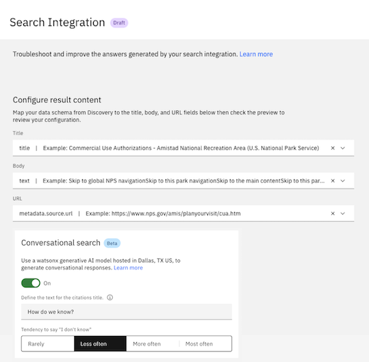

---

copyright:
  years: 2015, 2024
lastupdated: "2024-06-07"

keywords: conversational search

subcollection: watson-assistant

---

{{site.data.keyword.attribute-definition-list}}

# Conversational search
{: #conversational-search}

[Plus]{: tag-green} [Enterprise]{: tag-purple}

Use *conversational search* with the {{site.data.keyword.discoveryfull}} search integration or Elasticsearch search integration to help your assistant extract an answer from the highest-ranked query results and return a text response to the user.

When you enable this feature, search results are provided to an IBM watsonx generative AI model that produces a conversational reply to a user's question. 
{: shortdesc}

The watsonx generative AI model is currently hosted only in the Dallas and Frankfurt regions. By default, assistants in all regions except `Frankfurt` use the model from the `Dallas` region. Assistants in the `Frankfurt` region use the model hosted in the `Frankfurt` region.{: important}

To use conversational search, you must have a Plus or Enterprise plan. 

If you enable the conversational search toggle to on, you agree to the add-on pricing and terms. Conversational search add-on usage charges will apply from 1 June 2024. For more information about pricing plans, see [Pricing plans](https://cloud.ibm.com/catalog/services/watsonx-assistant?catalog_query=aHR0cHM6Ly9jbG91ZC5pYm0uY29tL2NhdGFsb2c%2Fc2VhcmNoPXdhdHNvbnglMjUyMGFzc2lzdGFudCNzZWFyY2hfcmVzdWx0cw%3D%3D&planId=f0a3dd47-b693-4d73-a8df-aa6baf07a933){: external}. For more information about terms, see [Terms](https://www.ibm.com/support/customer/csol/terms/?id=i128-0038&lc=en){: external}.{: important}

Refer to the following topics to configure the conversational search in your assistant:

- [Before you begin](#conversational-search-requirements)
- [Enabling conversational search](#conversational-search-setup) 
- [Tuning conversational search’s tendency to say “I don’t know"](#behavioral-tuning-conversational-search)
- [Configuring your assistant to use the conversational search]()
- [Testing conversational search](#conversational-search-test)
- [Streaming response for conversational search](#conversational-search-streaming-response)

## Before you begin
{: #conversational-search-requirements}

You must configure the search integration to enable the conversational search feature. For more information about configuring {{site.data.keyword.discoveryfull}} search integration, see [{{site.data.keyword.discoveryshort}} search integration setup](/docs/watson-assistant?topic=watson-assistant-search-add). For more information about configuring Elasticsearch integration, see [Elasticsearch search integration setup](/docs/watson-assistant?topic=watson-assistant-search-elasticsearch-add).

## Enabling conversational search 
{: #conversational-search-setup}

You can enable conversational search to give accurate responses to the customer query. In addition, you can enable citations by putting a citation title, which gives the list of references of the source content from where the assistant pulled the responses. You can see the citation title in between the conversational response and the citations.

To enable conversational search, do the following steps:

1. Go to **Search Integration** window.
1. Set the **Conversational search** toggle to `On`. 
1. In the **Define the text for the citation title**, type `How do we know?`. 

   The **Define the text for the citation title** is enabled only when **Conversational search** toggle is switched to `On`.{: tip}

   The web chat integration does not support the citation title feature.{: note}      

1. In the **Tendency to say I don’t know**, select the tendency to use. By default, `Less often` is selected. 
1. Click **Save** to apply your configuration.

    

## Tuning conversational search’s tendency to say “I don’t know"
{: #behavioral-tuning-conversational-search}

By tuning the assistant's tendency, you can help your assistant to reduce large language model(LLM) hallucinations and provide higher fidelity answers for conversational search. The higher you set the tendency, the more cautious the assistant is about answering. {: shortdesc}

You can tune the tendency of your assistant to say “I don’t know” in conversational search by selecting one of the following options in the **Tendency to say I don’t know** section:

* `Rarely`
* `Less often`
* `More often`
* `Most often`

When your assistant generates a conversational search response, it evaluates the response and calculates a response confidence score. The assistant compares the response confidence score against your selection in the **Tendency to say I don’t know** section. If the response confidence score is comparatively high, the assistant responds to the user query with the generated response. If the response confidence score is comparatively low, the assistant does one of the following actions:

* Responds with an “I don’t know” message.
* Falls back to the “No matches” action as per the [Search routing configuration](/docs/watson-assistant?topic=watson-assistant-handle-errors#config-search-routing). in your assistant.
 
In `Table 1, Tendency to say “I don’t know” ` status shows the options available in the Tendency to say “I don’t know” section.

| Tendency to say “I don’t know”       | Response confidence threshold   | Assistant behavior |
|--------------------|---------|-------------|
| `Rarely`                      | Lowest  | The assistant rarely says “I don’t know” because it compares the response confidence score against the lowest threshold. Therefore, your assistant almost always presents a generated response to the end user. In this case, the assistant more likely presents inaccurate or irrelevant responses to the end user. |
| `Less often`           | Lower | The assistant says “I don’t know” less often. |
| `More often`           | Higher | The assistant says “I don’t know” more often.|
| `Most often`           | Highest | The assistant says “I don’t know” most often because it compares the response confidence score against the highest threshold. Therefore, the assistant least likely presents inaccurate or irrelevant responses to the end user. In this case, the assistant presents fewer generated responses to your end users and more often responds with an “I don’t know” message or falls back to the “No matches” action.|
{: caption= "Table 1. Tuning the Tendency to say I don’t know " caption-side="top"}

## Configuring your assistant to use the conversational search

After you enabled **Conversational search** in the **Search integration**, you must configure your assistant to route to conversational search. To configure your assistant to route to conversational search as a fallback to actions (when the user’s input does not match any actions), you can [configure search routing when no action matches](/docs/watson-assistant?topic=watson-assistant-handle-errors#config-search-routing). To configure your assistant to route to conversational search for specific topics or actions, you can [add search as a step in a new or existing action](/docs/watson-assistant?topic=watson-assistant-search-integration-enhancement#search-add-trigger).

When your assistant receives no search results from Elasticsearch or {{site.data.keyword.discoveryshort}} in response to a user’s query or when its connection to Elasticsearch or {{site.data.keyword.discoveryshort}} fails, your assistant responds to the user with a failure message. You can configure the failure messages for no search results and a failed connection in the search integration settings.

## Testing conversational search
{: #conversational-search-test}

You can test the conversational search in actions preview, the preview page, or by using the preview link.

In this example, the user asks, `Tell me about a custom extension`.
Search results are pulled from your knowledge base when the conversational search is `Off`. In this case, the answer is returned as a list of cards that are relevant to custom extensions.

   

When the conversational search is `On`, the same search results are pulled from your knowledge base. The results are passed to an IBM watsonx generative AI model. This model produces a conversational reply to the user's question, in the form of a text response about custom extensions.

   

The web chat integration does not support the citation title feature. Hence, the preceding image does not display the default text in the citation title.

## Streaming response for conversational search
{: #conversational-search-streaming-response}

Streaming response for the conversational search uses watsonx.ai capabilities to provide continuous, real-time responses in your assistant. By default, the streaming response is disabled for the web chat and the assistant preview panels. 

By using the streaming response support feature, you can reduce the wait time for the response. 
{: shortdesc}

To enable streaming response, do the following:

1. Go to **Home** > **Preview** > **Customize web chat**.
1. Click the **Styles** tab.
1. Set the **Streaming** toggle button to `On`.
1. Click **Save and exit**.

