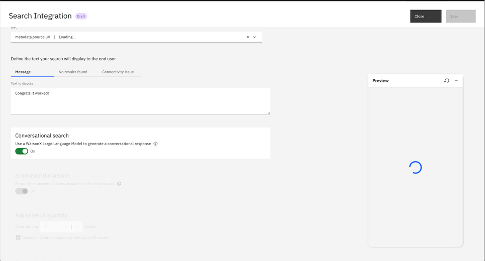

copyright:
  years: 2022, 2023
lastupdated: "2023-10-03"

keywords: conversational search, convo search

subcollection: watson-assistant

---

{{site.data.keyword.attribute-definition-list}}

# Conversational search
{: #conversational-search}

Use *conversational search* with the {{site.data.keyword.discoveryfull}} search integration setup to help your assistant extract an answer from top query results and return a text response to the user.

When you enable this feature, search results are provided to a watsonx-hosted large language model (LLM), and then a conversational reply is given to a user's question. 

This beta feature is available for evaluation and testing purposes; it should not be used in production environments. The watsonx LLM is hosted in the US at this time.
{: important}

To use conversational search, you need to have the {{site.data.keyword.discoveryshort}} search integration. For more information, see [{{site.data.keyword.discoveryfull}} search integration setup](/docs/watson-assistant?topic=search-add))

## Conversational search setup
{: #conversational-search-setup}

After you create the search integration or search skill, connect to an existing {{site.data.keyword.discoveryshort}} instance, and create a project, you can enable the conversational search feature when you configure your search. 

1. Follow steps 1-3 in [Configure the search](https://cloud.ibm.com/docs/watson-assistant?topic=watson-assistant-search-add#search-add-configure).

1. Click the **Conversational search** toggle to turn on. A **Preview** pane opens.

   

1. Follow steps 4-8 in [Configure the search](https://cloud.ibm.com/docs/watson-assistant?topic=watson-assistant-search-add#search-add-configure).

## Test Conversational search
{: #conversational-search-test}

1. Enter a question. In this example, the user asks, "Am I liable for taxes?" 

   

1. Search results are pulled from your knowledge base when conversational search is off.

   

1. A text-based reply from top results in your knowledge base displays when conversational search is on. The answer is, "Yes, you are liable for taxes." 

   

