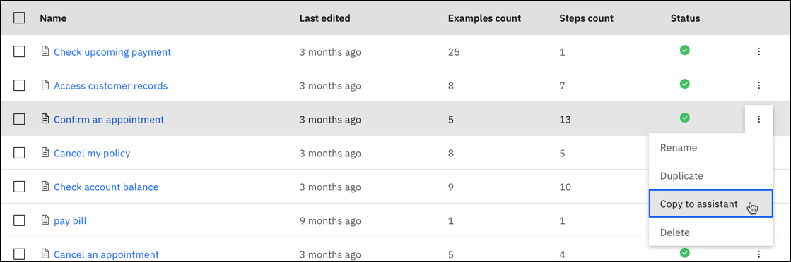
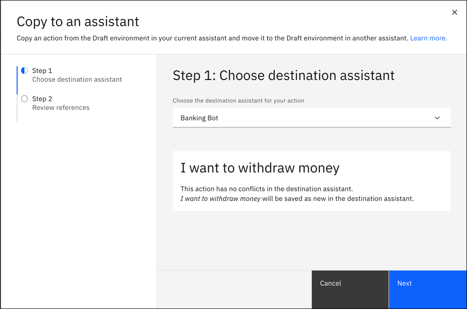
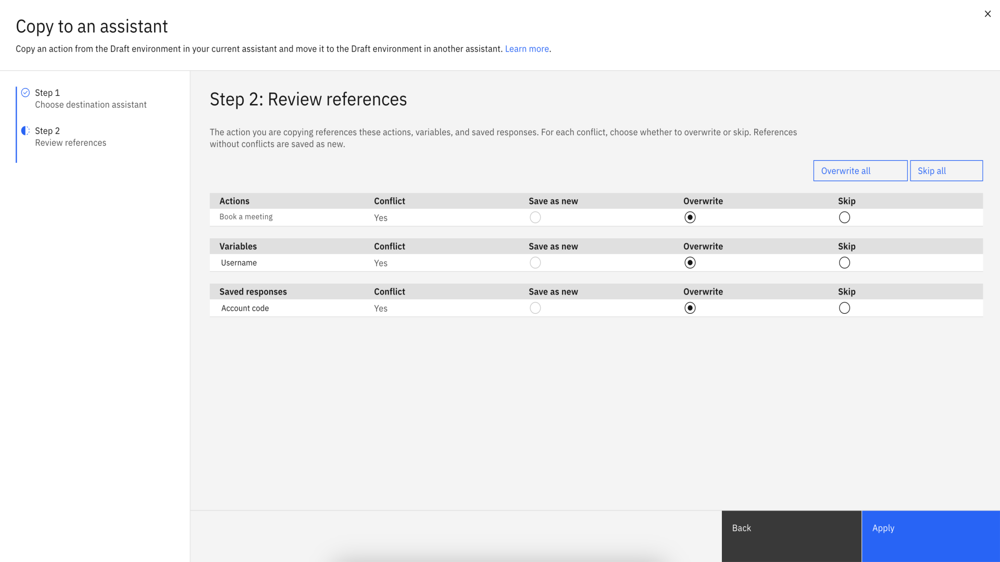

---

copyright:
  years: 2025
lastupdated: "2025-01-10"

subcollection: watson-assistant

---

{{site.data.keyword.attribute-definition-list}}

# Copying an action to another assistant
{: #copy-action}

You can copy an action from one assistant to another when you want to reuse the action content and configuration in the destination assistant.

When you copy the action to the destination assistant, references to actions, saved responses, and variables in the source assistant are copied.

To copy an action from one assistant to another assistant:

1. Click the **Overflow** menu on the action that you want and select **Copy to an assistant**.

   {: caption="Copy to an assistant" caption-side="bottom"}

1. Click the **drop-down** icon to select the destination assistant for the copy.

   {: caption="Copy to an assistant" caption-side="bottom"}

1. In the **Review references** page, review the list of references such as action, variables, and saved responses and their status.

   | Type of references | Conflict status | Outcome |
   | --- | --- | --- |
   | * Actions \n * Variables \n * Saved responses | No | By default, it saves a new reference to the target assistant. |
   | * Actions \n * Variables \n * Saved responses | Yes | You can select one of the following options:  \n * Overwrite:  \n Overwrites the existing action in the destination assistant.  \n * Skip:  \n Skips copying the action to the destination assistant. |
   {: caption="Conflict status for references" caption-side="bottom"}

   If you want to overwrite all the conflicting items in the destination assistant, click the **Overwrite all** button. If you want to skip copying all the conflicting items to the destination assistant, click the **Skip all** button.
   {: tip}

   {: caption="Copy to an assistant" caption-side="bottom"}

1. Click **Apply** to finish copying the action to the other assistant.
