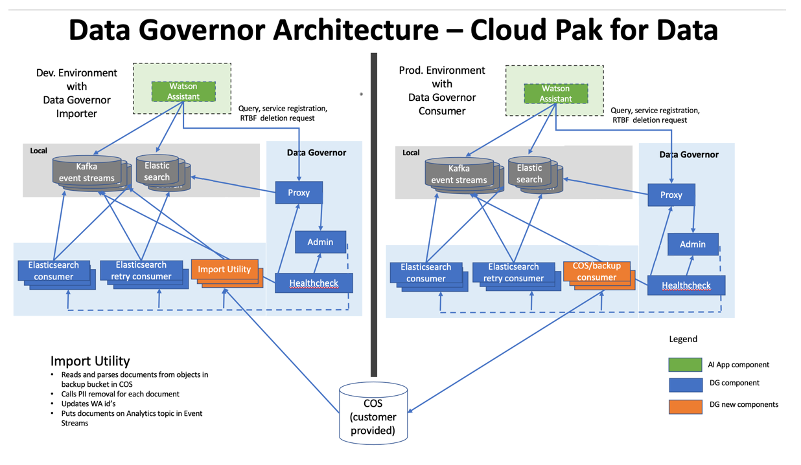
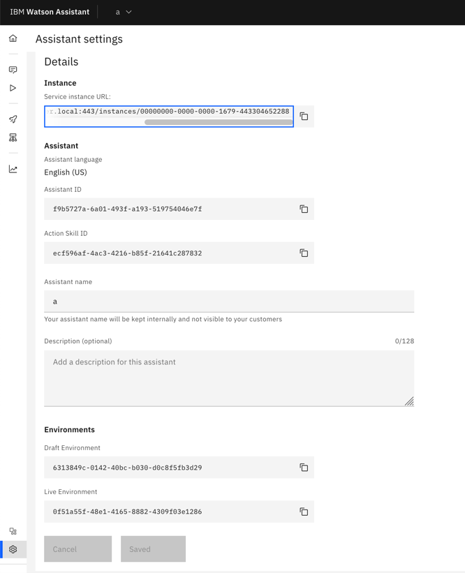

---

copyright:
  years: 2015, 2025
lastupdated: "2025-02-03"

subcollection: watson-assistant

---

{{site.data.keyword.attribute-definition-list}}

# Using the Cloud Object Storage importer to migrate chat logs
{: #cos-importer-data}

[{{site.data.keyword.icp4dfull_notm}}]{: tag-cp4d}

You can use the Cloud Object Storage importer service to migrate your chat logs from one installation to another.

This diagram shows two clusters:

| Cluster | Description |
| --- | --- |
| Cloud Object Storage consumer | Red Hat OpenShift cluster with the installation used to export chat log data to Cloud Object Storage |
| Cloud Object Storage importer | Red Hat OpenShift cluster with the installation that imports chat log data from the copied bucket from the Cloud Object Storage consumer cluster |
{: caption="Diagram clusters" caption-side="bottom"}

{caption="Architecture Diagram" caption-side="bottom"}

## Configuring the data governor Cloud Object Storage consumer service
{: #cos-importer-configure-consumer}

1. Use the script to create a new file on the Cloud Object Storage consumer cluster.

   ```text
   COS_ACCESS_KEY=`echo -n "<enter_COS_key_here>"|base64` 
   COS_SECRET_ACCESS_KEY=`echo -n "<enter_COS_secret_access_key_here>"|base64`
   COS_ENDPOINT="<enter_COS_endpoint here>"
   #For e.g. COS_ENDPOINT="https://s3.us.cloud-object-storage.appdomain.cloud"

   cat <<EOF | oc apply -f -

   apiVersion: v1
   kind: Secret
   metadata:
     name: wa-data-governor-cos-credentials
     namespace: cpd
   data:
     COS_ACCESS_KEY: ${COS_ACCESS_KEY}
     COS_SECRET_KEY: ${COS_SECRET_ACCESS_KEY}
   type: Opaque

   EOF

   cat <<EOF | oc apply -f -
   apiVersion: assistant.watson.ibm.com/v1
   kind: TemporaryPatch
   metadata:
     name: wa-data-governor
     namespace: cpd
   spec:
     apiVersion: assistant.watson.ibm.com/v1
     kind: WatsonAssistant
     name: wa
     patch:
       data-governor:
         dataexhaust:
           spec:
             consumers:
               cosConsumer: true
             cos:
               endpoint: ${COS_ENDPOINT}
               secret:
                 accessKey: COS_ACCESS_KEY
                 name: wa-data-governor-cos-credentials
                 secretKey: COS_SECRET_KEY
     patchType: patchStrategicMerge
   EOF
   ```
   {: codeblock}

1. In the script, replace these placeholders with the actual values:

   - `<enter_COS_key_here>`
   - `<enter_COS_secret_access_key_here>`
   - `<enter_COS_endpoint here>` 
   
1. Run the script. 
   
1. Wait 15 to 20 minutes and then check if the data governor pods are stable. 

1. When the pods are stable, log in to your instance. 

1. Select the correct assistant, then click the `Preview` icon on the left vertical bar and generate chat logs. 

1. Check if the Cloud Object Storage objects are getting created in the `data-exhaust-backup-wa-data-governor-e58d5f4a1344` Cloud Object Storage bucket.

## Configuring the data governor Cloud Object Storage importer service
{: #cos-importer-configure-importer}

Create a file on the Cloud Object Storage Importer cluster and copy the following script into it. Replace the placeholders `<enter_COS_key_here>`, `<enter_COS_secret_access_key_here>`, and `<enter_COS_endpoint here>` with the actual values and save the file. Then, run the script. Wait 15-20 minutes and check if the data governor pods are stable. When the pods are stable, check if the importer cron is running as scheduled. When the `importer` pod completes, check if chat logs data were imported in the correct assistant chat logs by going to Assistant UI and checking the `Analyze` screen for imported data.

1. Use the script to create a new file on the Cloud Object Storage importer cluster.

   ```text
      COS_ACCESS_KEY=`echo -n "<enter_COS_key_here>"|base64` 
      COS_SECRET_ACCESS_KEY=`echo -n "<enter_COS_secret_access_key_here>"|base64`
   
      cat <<EOF | oc apply -f -
   
      apiVersion: v1
      kind: Secret
      metadata:
        name: wa-data-governor-cos-credentials
        namespace: cpd
      data:
        COS_ACCESS_KEY: ${COS_ACCESS_KEY}
        COS_SECRET_KEY: ${COS_SECRET_ACCESS_KEY}
      type: Opaque
   
      EOF
   ```
   {: codeblock}

   ```text
   COS_ENDPOINT="<enter_COS_endpoint here>"  # For e.g. COS_ENDPOINT="https://s3.us.cloud-object-storage.appdomain.cloud"
   # See "How to generate a JSON mapping defintion" below for instructions on how to create the next line
   JSON_ID_MAPPING='{"instances":[{"source_id":"<instance_id_consumer1>","target_id":"<instance_id_importer1>","assistants":[{"source_id":"<draft_or_live_environment_id_consumer1>","target_id":"<draft_or_live_environment_id_importer1>"}],"workspaces":[{"source_id":"<action_skill_id_consumer1>","target_id":"<action_skill_id_importer1>"}]}]}'

   cat <<EOF | oc apply -f -
   apiVersion: assistant.watson.ibm.com/v1
   kind: TemporaryPatch
   metadata:
     name: wa-data-governor
   spec:
     apiVersion: assistant.watson.ibm.com/v1
     kind: WatsonAssistant
     name: wa
     patchType: patchStrategicMerge
     patch:
       data-governor:
         dataexhaust:
           spec:
             cos:
               endpoint: ${COS_ENDPOINT}
               secret:
                 accessKey: COS_ACCESS_KEY
                 name: wa-data-governor-cos-credentials
                 secretKey: COS_SECRET_KEY
             cosImporter:
               fromBucket: data-exhaust-backup-wa-data-governor-e58d5f4a1344
               clearObjectTags: false
               filter:
   # Modify prefix value. 
                 prefix: "20230322"
               fromTenant: "*"
   # Modify schedule to run importer cron less frequently
               schedule: '* * * * *'
   # See "How to generate a JSON mapping defintion" below for instructions on how to create the next line
               schema: ${JSON_ID_MAPPING}
               workers: 3
   ```
   {: codeblock}

1. In the script, replace these placeholders with the actual values:

   - `<enter_COS_key_here>`
   - `<enter_COS_secret_access_key_here>`
   - `<enter_COS_endpoint here>` 

1. Run the script. 
   
1. Wait 15 to 20 minutes and then check if the data governor pods are stable. 

1. When the pods are stable, check that the importer cron is running as scheduled. 

1. When the `importer` pod completes, check that chat logs were imported in the correct assistant by opening your assistant and checking the `Analyze` screen for imported data.

| Parameter | Description |
| --- | --- |
| fromBucket | Cloud Object Storage bucket with the data to be imported |
| schedule | Schedule for Cloud Object Storage cron job to run |
| clearObjectTags | Set to true to allow the importer to rerun on already processed Cloud Object Storage objects |
| workers | Number of worker threads. Increasing the number requires more job resources. |
| filter | Provides control over which objects are imported from the Cloud Object Storage bucket |
| prefix | Allows for objects from a specific date to be imported |
| documentTimestampWindow | Allows for objects during a specific time range to be imported |
| cos | Cloud Object Storage credentials |
| schema | Transformation schema, which allows the importer to modify fields to allow analytic data from pprd instance to be viewed in train. For more information, see [Generating a JSON ID mapping definition for the data governor importer service](#cos-importer-json-mapping). |
| fromTenant | Allows import on specific filter tenant data |
{: caption="Parameters" caption-side="bottom"}

`instance_id_consumer1`, `draft_or_live_environment_id_consumer1`, and `action_skill_id_consumer1` values can be found on the Assistant settings page in on the Cloud Object Storage consumer cluster.
{: tip}

{caption="Assistant settings" caption-side="bottom"}

For example:

- `instance_id_consumer1` can be extracted from the `Service Instance URL`. For example, `00000000-0000-0000-1679-443304652288`.

- `draft_or_live_environment_id_consumer1` values are the `Draft environment` or `Live Environment` IDs.

- `action_skill_id_consumer1` value is the `Action Skill ID`.

Similarly, you can extract Cloud Object Storage importer instances, assistants, and workspaces target_id values from assistant settings for the Cloud Object Storage importer cluster.

## Generating a JSON ID mapping definition for the data governor importer service
{: #cos-importer-json-mapping}

You can use the Analytics reports in your development environment to gain insight into your production chat logs.

You need to move your production chat logs data to your development environment, and then transform the production chat logs data to be used by the Analytics reports in your development assistants.

For the moved chat logs to be used by the Analytics reports in a different instance and assistant in your development environment, the various IDs of the chat log Elastic documents need to be transformed from the source to the target.

Use this code for the ID mapping definition.

- This mapping definition supports transforming the chat logs for multiple instances and assistants.

- The mapping is hierarchical, so each instance level mapping also contains multiple assistant-level mappings for such instance.

- Each mapping contains two ID fields: `source_id` and `target_id`. You need to supply data for each mapping at the instance and assistant levels.

You can look up the ID data in applicable instances and assistants.

```json
{
	"instances": [
		{
			"source_id": "<string>",
			"target_id": "<string>",
			"assistants": [ 
				{
					"source_id": "<string>",
					"target_id": "<string>"
				}
			],
			"workspaces": [ 
				{
					"source_id": "<string>",
					"target_id": "<string>"
				}
			]
		}
	]
}
```
{: codeblock}

### Usage examples
{: #cos-importer-examples}

Map assistants from one source instance to assistants in multiple target instances.

The following example maps 2 assistants in 1 source instance to 2 assistants in 2 target instances.

```json
{
	"instances": [
		{
			"source_id": "07079e0a-a8cd-4dc5-b3a4-7879d7cf0a8f",
			"target_id": "90876f0b-c98d-fcc9-c4b5-0291a3bd4f9a",
			"assistants": [ 
				{
					"source_id": "081513d5-9858-4eb9-9012-5ce0af8182a6",
					"target_id": "f4e5f6d5-3903-486f-8563-416446d8c8a0"
				}
			]
		},
		{
			"source_id": "07079e0a-a8cd-4dc5-b3a4-7879d7cf0a8f",
			"target_id": "79640a7b-45bc-7eea-b4f1-98b55fca6b1c",
			"assistants": [ 
				{
					"source_id": "9645f5d1-f432-4abd-a589-12bc4af5b133",
					"target_id": "a4bb579e-e3b5-34bc-afe5-9afc490e8bac"
				}
			]
		}
	]
}
```
{: codeblock}
