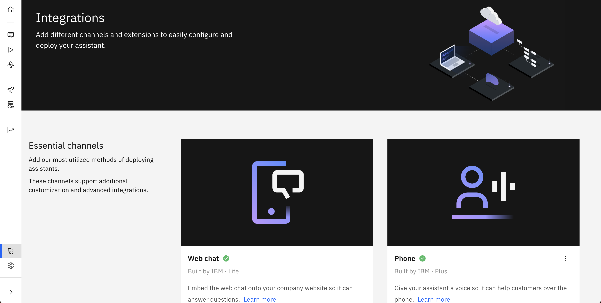

---

copyright:
  years: 2015, 2023
lastupdated: "2023-03-03"

subcollection: watson-assistant

---

{:shortdesc: .shortdesc}
{:new_window: target="_blank"}
{:external: target="_blank" .external}
{:deprecated: .deprecated}
{:important: .important}
{:note: .note}
{:tip: .tip}
{:pre: .pre}
{:codeblock: .codeblock}
{:screen: .screen}
{:javascript: .ph data-hd-programlang='javascript'}
{:java: .ph data-hd-programlang='java'}
{:python: .ph data-hd-programlang='python'}
{:swift: .ph data-hd-programlang='swift'}
{:video: .video}
{:tag-ibm-cloud: .tag data-tag-color="blue"}
{:tag-cp4d: .tag data-tag-color="magenta"}

# Adding integrations
{: #deploy-integration-add}

Add integrations to your assistant so that you can publish your bot to the channels where your customers go for help.
{: shortdesc}

To deploy an assistant to customers, a channel integration must be added. By default, a web chat integration is created, allowing an assistant to be embedded in a website. Other channel integrations are available in the **Integrations** catalog. For more information about deploying to your website, see [Adding the web chat to your website](/docs/watson-assistant?topic=watson-assistant-deploy-web-chat).

When you add an integration, that integration is added to both the draft and live environments, or to all your enviroments if you are using [multiple environments](/docs/watson-assistant?topic=watson-assistant-multiple-environments). Test content and integrations before you deploy your assistant to customers. For more information about adding integrations to your assistant, see [Adding integrations](/docs/watson-assistant?topic=watson-assistant-deploy-integration-add). After a live channel is added and configured, it is ready to deploy your assistant on its corresponding platform.

## Add an integration
{: #deploy-integration-add-task}

Follow these steps to add integrations to your assistant:

1.  Go to the **Integrations** page by clicking the integrations icon () in the left menu.

1.  Scroll to see available integrations.

    **Why do I have the *Web chat* integration?** This integration is provisioned and added automatically to your first assistant only.

    {{site.data.keyword.conversationshort}} comes with the web chat integration, which is an engaging and fully extensible front-end client that can be added to your website in minutes. It is designed to handle advanced conversational scenarios, including rich responses, such as images, video, and iframes, suggestions when the user gets stuck, and live agent escalation.

1.  For any integration that you want to add, click **Add**. The options include:

    - [Web chat](/docs/watson-assistant?topic=watson-assistant-deploy-web-chat)
    - [Phone](/docs/watson-assistant?topic=watson-assistant-deploy-phone)
    - [Facebook Messenger](/docs/watson-assistant?topic=watson-assistant-deploy-facebook)
    - [Microsoft Teams](/docs/watson-assistant?topic=watson-assistant-deploy-microsoft-teams)
    - [Slack](/docs/watson-assistant?topic=watson-assistant-deploy-slack)
    - [SMS](/docs/watson-assistant?topic=watson-assistant-deploy-sms)
    - [WhatsApp with Twilio](/docs/watson-assistant?topic=watson-assistant-deploy-whatsapp)
    - [Search](/docs/watson-assistant?topic=watson-assistant-search-add)

    You can also set up live agent integrations by going to the **Live agent** tab from the **Web chat** tile. The options include:

    **Web chat live agent integrations**
    - [Web chat with Salesforce support](/docs/watson-assistant?topic=watson-assistant-deploy-salesforce)
    - [Web chat with Zendesk support](/docs/watson-assistant?topic=watson-assistant-deploy-zendesk)

    **Web chat live agent reference implementations**
    - [Genesys Cloud](https://github.com/watson-developer-cloud/assistant-web-chat-service-desk-starter/tree/main/src/genesys/webChat){: external}
    - [NICE inContact](https://github.com/watson-developer-cloud/assistant-web-chat-service-desk-starter/tree/main/src/incontact/webChat){: external}
    - [Twilio Flex](https://github.com/watson-developer-cloud/assistant-web-chat-service-desk-starter/tree/main/src/flex/webChat){: external}
    - [Kustomer](https://github.com/watson-developer-cloud/assistant-web-chat-service-desk-starter/tree/main/src/kustomer/webChat){: external}
    - [Bring your own (starter kit)](https://github.com/watson-developer-cloud/assistant-web-chat-service-desk-starter){: external}

    **Phone live agent integrations**
    - [Phone with Genesys Cloud](/docs/watson-assistant?topic=watson-assistant-deploy-phone-genesys)
    - [Phone with NICE CXone](https://cloud.ibm.com/docs/watson-assistant?topic=watson-assistant-deploy-phone-nicecxone)
    - [Phone with Twilio Flex](/docs/watson-assistant?topic=watson-assistant-deploy-phone-flex)
    - [Bring your own live agent integration](/docs/assistant?topic=assistant-deploy-phone#deploy-phone-transfer-service){: external}

1.  Follow instructions provided on the screen to complete the integration process.

 For environments where private endpoints are in use, keep in mind that these integrations send traffic over the internet.
{: note}

## How live agent integrations work
{: #deploy-integration-live-agent-integrations}

Watch a 4-minute video about integrating your assistant with a live agent integration, such as Zendesk:

{: video output="iframe" data-script="none" id="watsonmediaplayer" width="480" height="270" scrolling="no" allowfullscreen webkitallowfullscreen mozAllowFullScreen frameborder="0" style="border: 0 none transparent;"}

To learn about how live agent integrations with your assistant can benefit your business, read [Customer Service Just Got Smarter](https://medium.com/ibm-watson/contact-center-post-394dff427c8){: external}.
