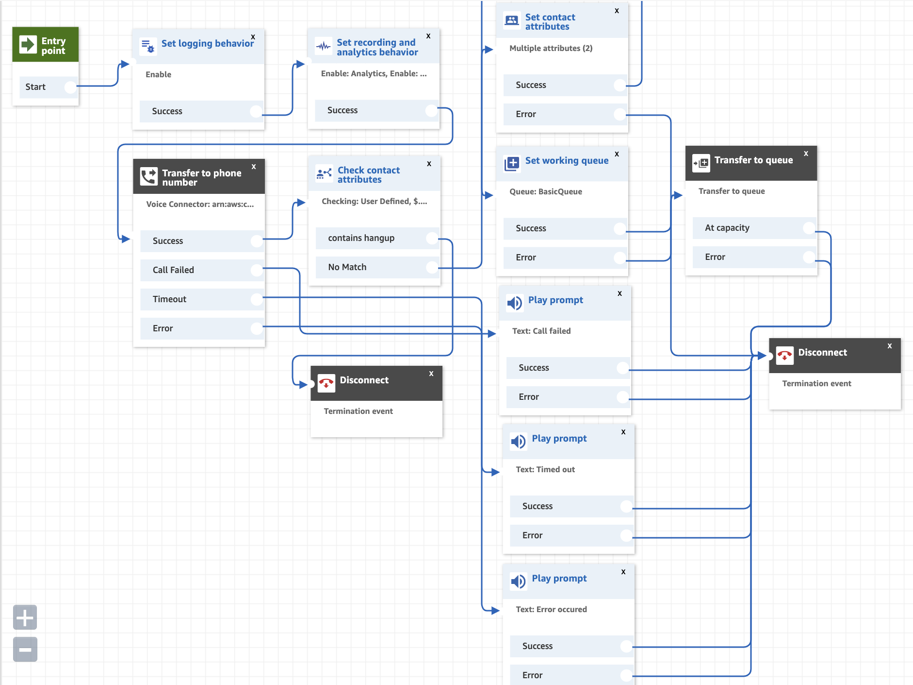
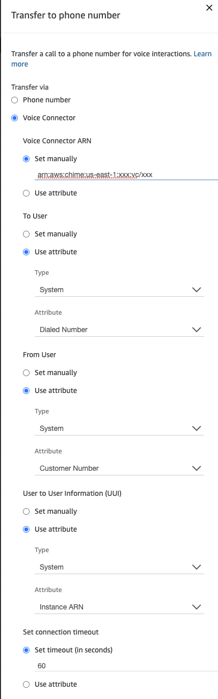
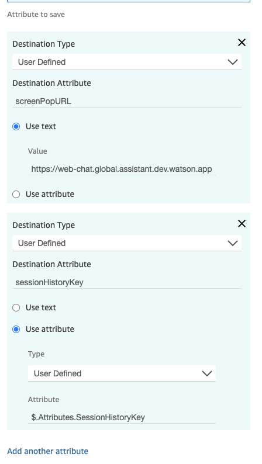

---

copyright:
  years: 2022
lastupdated: "2022-10-06"

subcollection: watson-assistant

---

{:shortdesc: .shortdesc}
{:new_window: target="_blank"}
{:external: target="_blank" .external}
{:deprecated: .deprecated}
{:important: .important}
{:note: .note}
{:tip: .tip}
{:pre: .pre}
{:codeblock: .codeblock}
{:screen: .screen}
{:javascript: .ph data-hd-programlang='javascript'}
{:java: .ph data-hd-programlang='java'}
{:python: .ph data-hd-programlang='python'}
{:swift: .ph data-hd-programlang='swift'}

{{site.data.content.classiclink}}

{{site.data.content.earlyaccess}}

# Integrating with phone and Amazon Connect contact center
{: #deploy-phone-amazon-connect}

Connect your assistant to an Amazon Connect contact center with live agents. 
{: shortdesc}

Transfer customers from a chat with your assistant to live agents who can help them by phone. If customers ask to speak to someone, your assistant can forward them directly to customer support with the conversation history.

This integration creates a connection between your assistant and a contact center using Amazon Connect.

You need a Plus or Enterprise Plan to use this feature.

## Before you begin
{: #deploy-phone-amazon-connect-account}

You must have an Amazon Connect instance and phone numbers allocated for your contact center.


## Generate AWS access keys
{: #deploy-phone-amazon-connect-accesskeys}

Access keys are used for authentication and consist of two parts: an access key ID and a secret access key. 

To generate AWSaccess keys to use with your assistant, see [AWS Account and Access Keys](https://docs.aws.amazon.com/powershell/latest/userguide/pstools-appendix-sign-up.html){: external}.  

You cannot retrieve the secret key again after you complete the next step and **Save**. You must generate a new key if the current one is lost or forgotten.


## Set up the integration
{: #deploy-phone-amazon-connect-setup}

To complete setup, you must have an assistant ready to deploy, your AWSaccess keys, and phone numbers allocated for this integration. 

To integrate your assistant with Amazon Connect:

1. Click **Integrations**.

1. On the **Integrations** page, click "**Add** on the **Phone** tile.

    Select **Integrate with your contact center**.
    Click **Next**.

1. Select **Amazon Connect** on the **Set up a phone connection** page.     
    Click **Next**.
1. On the **Connect to your Amazon Connect account** page, specify the following values:

	- the **Amazon Connect Instance ARN** from Amazon Connect. See [Find your Amazon Connect instance ID/ARN](https://docs.aws.amazon.com/connect/latest/adminguide/find-instance-arn.html) to find your Amazon Connect ARN.
	- the **Access Key ID**
	- the **Access Key secret** 
    
    Click **Test connection** to verify the credentials.
    - If **Invalid**, check your credentials and enter each again.
   
   Click **Next**.

1. Copy the SIP address. You will need it for your Amazon Chime Voice Connector configuration.
    Click **Next**.

1. On the **Speech to Text** page, select the instance of the {{site.data.keyword.speechtotextshort}} service you want to use.

    - If you have an existing {{site.data.keyword.speechtotextshort}} instances, select the instance you want to use from the list.

    - If you do not have any existing {{site.data.keyword.speechtotextshort}} instances, click **Create new instance** to create a new Plus or Enterprise instance.

1. In the **Choose your Speech to Text language model** field, select the language you want to use.

    The list of language models is automatically filtered to use the same language as your assistant. To see all language models, toggle the **Filter models based on assistant language** switch to **Off**.

    If you created specialized custom models that you want your assistant to use, choose the {{site.data.keyword.speechtotextshort}} service instance that hosts the custom models now, and you can configure your assistant to use them later. The {{site.data.keyword.speechtotextshort}} service instance must be hosted in the same location as your {{site.data.keyword.conversationshort}} service instance. For more information, see [Using a custom language model](/docs/watson-assistant?topic=watson-assistant-phone-actions#phone-actions-custom-language).
    {: note}

    For more information about language models, see [Languages and models](/docs/speech-to-text?topic=speech-to-text-models){: external} in the {{site.data.keyword.speechtotextshort}} documentation.

    Click **Next**.

1. On the **Text to Speech** page, select the instance of the {{site.data.keyword.texttospeechshort}} service you want to use.

    - If you have an existing {{site.data.keyword.texttospeechshort}} instances, select the instance you want to use from the list.

    - If you do not have any existing {{site.data.keyword.texttospeechshort}} instances, click **Create new instance** to create a new Standard instance.

  1. Click **Save**.

The connection between your assistant and Amazon Connect is complete. 


### Configure an Amazon Chime Voice Connector 
{: #deploy-phone-amazon-connect-chime}

After you create a {{site.data.keyword.conversationshort}} Phone integration, create an Amazon Chime Voice Connector.

1.  Create an Amazon Chime Voice Connector under your AWS account. For more information, see [Creating an Amazon Chime Voice Connector](https://docs.aws.amazon.com/chime-sdk/latest/ag/create-voicecon.html){: external}.
1.  Enable **Origination** settings to control inbound calling to your {{site.data.keyword.conversationshort}} instance.

    In the **Inbound routes*** section, click **New** to add a new inbound route. 
    In the **Host** field enter the hostname you copied in the previous step when you created the {{site.data.keyword.conversationshort}} and Amazon Connect integration.
    In the **Port** field, enter 5061.
    Choose *TCP* from the **Protocol** drop-down list.
    Enter **1** in the **Priority** field and **5** in the **Weight** field.
    Click **Add**.
    Click **Save**.


### Create an Amazon Connect Flow
{: #deploy-phone-amazon-connect-flow}

A  _flow_  defines the customer experience with your contact center from start to finish. 

You can find here (TBD, provide a link to the Git repository) a sample flow so you can quickly set up and run a contact center. See [Import/export flows](https://docs.aws.amazon.com/connect/latest/adminguide/contact-flow-import-export.html) for importing the sample flow. 

However, you may want to create custom flows for your specific scenario. See [Create Amazon Connect Flows](https://docs.aws.amazon.com/connect/latest/adminguide/connect-contact-flows.html) for creating an Amazon Connect flow. 

The following flow blocks and settings in the contact flow are necessary for integration to work properly. 



#### Connecting a caller to your assistant
{: #deploy-phone-amazon-connect-caller}

Use the [Transfer to phone number](https://docs.aws.amazon.com/connect/latest/adminguide/transfer-to-phone-number.html) flow block to connect a caller to your {{site.data.keyword.conversationshort}} service instance. 

1. In the **Transfer via** property, select `Voice Connector`.  In the **Voice Connector ARN** property, select `Set manually` and enter the ARN of your Amazon Chime Voice Connector.
To find your Voice Connector ARN:
Open the [Amazon Chime console](https://chime.aws.amazon.com/){: external}. 
Click **Voice connectors**.
Select your Voice Connector and copy the value of **Voice Connector ARN**.

1. In the **To User** property, select `Use attribute`. From the **Type** drop-down list, select `System`. In the **Attribute** drop-down list, select `Dialed Number`.

1. In the **From User** property, select **Use attribute**. In the **Type** drop-down list select `System`. In the **Attribute** drop-down list, select `Customer Number`. 

1. In the **User to User Information (UUI)** property, select `Use attribute`. From the **Type** drop-down list, select `System`. From the **Attribute** drop-down list, select `Instance ARN`.

1. Click **Save**.



#### Decide whether to disconnect a call or transfer the caller to a live agent 
{: #deploy-phone-amazon-connect-decide}

Use the [Check contact attributes](https://docs.aws.amazon.com/connect/latest/adminguide/check-contact-attributes.html) flow block to branch the flow based on the `SessionHistoryKey` attribute. 

1. In the **Attribute to check** property:
	From the **Type** drop-down list,  select `User Defined`. In the **Attribute** field, type `$.Attributes.SessionHistoryKey`. 
1. In the **Conditions to check** property:
	Select `Contains` from the drop-down list and type `hangup` in the text field. 
1. Click **Save**.


{{site.data.keyword.conversationshort}} passes to the contact flow the `SessionHistoryKey` attribute which can be used for branching the contact flow based on a comparison to the value of this attribute. When the attribute is set to `hangup`, it's an indication to disconnect the flow. Otherwise, the caller should be transferred to a live agent. 

#### Displaying conversation history to a live agent
{: #deploy-phone-amazon-connect-conversation}


Use the [Set contact attributes](https://docs.aws.amazon.com/connect/latest/adminguide/set-contact-attributes.html) flow block, to make contact attributes accessible by the Contact Control Panel (CCP).

In the **Attribute to save** property, add the following attributes:
1. From the **Destination Type** drop-down list,  select `User Defined`, and type `screenPopURL` in the **Destination Attribute** text field. Select **Use text**, type `https://web-chat.global.assistant.dev.watson.appdomain.cloud/loadAgentAppFrame.html?session_history_key` in the **Value** text box. 
1. From the **Destination Type** drop-down list,  select `User Defined`, and type `sessionHistoryKey` in the **Destination Attribute** text field. From the **Type** drop-down list, select `User Defined`, type `$.Attributes.SessionHistoryKey` in the **Attribute** text box. 
1. Click **Save**.




{{site.data.keyword.conversationshort}} passes to the contact flow the `SessionHistoryKey` contact attribute. The session history key can be used to retrieve conversation history and present it to a live agent.

This block configures your contact flow to provide a transcript of the assistant conversation to a live agent in a pop-out window. It helps the agent better understand and address a customer's needs.


#### Transferring a caller to a live agent
{: #deploy-phone-amazon-connect-caller}

Use the [Set working queue](https://docs.aws.amazon.com/connect/latest/adminguide/set-working-queue.html) flow block to specify the queue to be used when **Transfer to queue** is invoked.
Use the [Transfer to queue](https://docs.aws.amazon.com/connect/latest/adminguide/transfer-to-queue.html) to place the caller in a queue.

#### Transferring to a live agent when an error occurs
{: #deploy-phone-amazon-connect-error}

The phone integration disconnects the call if an error occurs during a conversation by sending a `SIP BYE` request. 
In that case, the `SessionHistoryKey` contact attribute is not passed to the contact flow. 


#### Claim a phone number for your Amazon Connect Contact Flow
{: #deploy-phone-amazon-connect-claim-phone-number}

To receive calls in your instance, you need to claim a phone number. If you did not claim a number when you created your Amazon Connect instance, follow [these steps](https://docs.aws.amazon.com/connect/latest/adminguide/claim-phone-number.html) to claim one now. Attach the phone number to the contact flow you created for this integration.

### Complete your phone integration configuration
{: #deploy-phone-amazon-connect-configuration}

Open the {{site.data.keyword.conversationshort}} user interface and go to the phone integration you created earlier. On the **Phone number** page, enter the phone number you allocated for your Amazon Connect Contact Flow in the **Claim a phone number for your Amazon Connect Contact Flow** step. 


## Adding transfer support to your assistant 
{: #deploy-phone-amazon-connect-transfer}

Configure your assistant to transfer calls to a live agent using the *Connect To Agent* response type. For instructions, see [Transferring a call to a human agent](/docs/watson-assistant?topic=watson-assistant-phone-actions#phone-actions-transfer).

Use the following format:

```json
{
  "generic": [
    {
      "response_type": "connect_to_agent",
      "transfer_info": {
        "target": {
          "amazon_connect": {
            "custom_data": {
              "contact_attribute1": "test"
            }
          }
        }
      },
      "agent_available": {
        "message": "Ok, I'm transferring you to an agent."
      },
      "agent_unavailable": {
        "message": "Agent is unavailable."
      }
    }
  ]
}
```

Parameters listed in the `custom_data` object are sent to the Amazon Connect contact flow using the [API_UpdateContactAttributes](https://docs.aws.amazon.com/connect/latest/APIReference/API_UpdateContactAttributes.html) REST API.  

