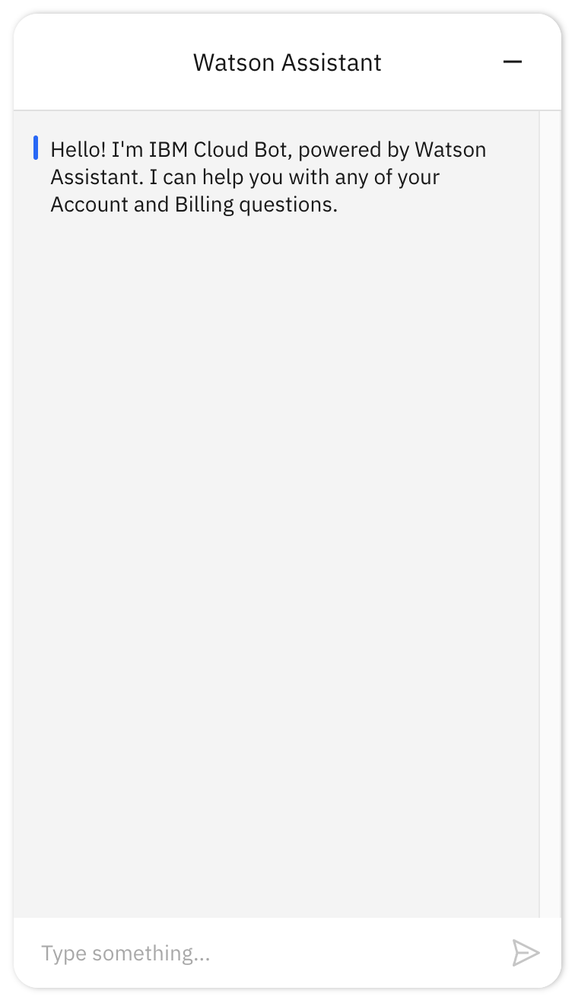

---

copyright:
  years: 2019, 2022
lastupdated: "2022-06-30"

subcollection: watson-assistant

---

{:shortdesc: .shortdesc}
{:new_window: target="_blank"}
{:external: target="_blank" .external}
{:deprecated: .deprecated}
{:important: .important}
{:note: .note}
{:tip: .tip}
{:preview: .preview}
{:pre: .pre}
{:codeblock: .codeblock}
{:screen: .screen}
{:javascript: .ph data-hd-programlang='javascript'}
{:java: .ph data-hd-programlang='java'}
{:python: .ph data-hd-programlang='python'}
{:swift: .ph data-hd-programlang='swift'}
{:video: .video}

{{site.data.content.classiclink}}

# Embedding the web chat on your page
{: #deploy-web-chat}

To add the web chat widget to your website, all you need to do is embed a generated script element in your HTML source.
{: shortdesc}

The web chat integration is automatically included for every assistant, and is configured separately for the draft and live environments.

To add the web chat to your website, follow these steps:

1. On the  **Integrations** page, find the **Web chat** tile and click click **Open**. The **Open web chat** window opens.

1. In the **Environment** field, select **Draft** or **Live**, depending on which environment you want the web chat widget to connect to. Click **Confirm**.

    The **Web chat** page opens, showing the settings for the web chat integration in the selected environment.

    The preview pane shows what the web chat will look like when it is embedded in a web page. If you see a message that starts with, `There is an error`, you probably haven't added any actions to your assistant yet. After you add an action, you can test the conversation from the preview pane.
    {: tip}

1.  Click the **Embed** tab.

    A code snippet is generated based on the web chat configuration. You (or a web developer) will add this code snippet to the web page where you want the web chat to appear.
    
    This code snippet contains an HTML `script` element. The script calls JavaScript code that is hosted on an IBM site and creates an instance of a widget that communicates with the assistant.
    
1.  Click the  **Copy to clipboard** icon to copy the embed script to the clipboard.

1.  Edit the HTML source for the web page where you want the web chat widget to appear. Paste the code snippet into the page. Paste the code as close as possible to the closing `</body>` tag to ensure that your page renders faster.

    Do not modify the `integrationID` or `region` property values in the generated embed script.
    {: important}

    If you aren't ready to add the web chat to a live website, you can quickly test it using a local HTML file. Use this HTML code as the source for a test page:

    ```html
    <html>
    <head></head>
    <body>
        <title>My Test Page</title>
        <p>The body of my page.</p>
        <!-- copied script elements -->
        </body>
    </html>
    ```
    {: codeblock}

    Just copy this code into a file with the `.html` extension, and replace the `script` element with the embed script you copied in the previous step.

1.  If the system that hosts your website has limited Internet access (for example, if you use a proxy or firewall), make sure the following URLs are accessible:

    - `https://web-chat.global.assistant.watson.appdomain.cloud`: Hosts the code for the web chat widget, and is referenced by the script you embed on your website.
    - `https://integrations.{location}.assistant.watson.appdomain.cloud`: Hosts the web chat server, which handles communication with your assistant. Replace `{location}` with the location of the data center where your service instance is located, which is part of the service endpoint URL. For more information, see [Finding and updating the endpoint URL](/docs/watson?topic=watson-endpoint-change#endpoint-find-update){: external}.

1.  Open the web page (or local test file) in your browser. You should see the launcher icon displayed on the page:

     

1.  Click the launcher icon to open the chat window.

    

1.  Paste the same embed script into each web page where you want the assistant to be available to your customers.

    You can paste the same script tag into as many pages on your website as you want. Add it anywhere where you want users to be able to reach your assistant for help. However, be sure to add it only once on each page.
    {: tip}

You can now test your assistant and see its responses just as your customers would.

Before you go to production with the web chat, however, you will probably want to customize it for your site and for the needs of your customers. For more information, see [Web chat development overview](/docs/watson-assistant?topic=watson-assistant-web-chat-develop).
