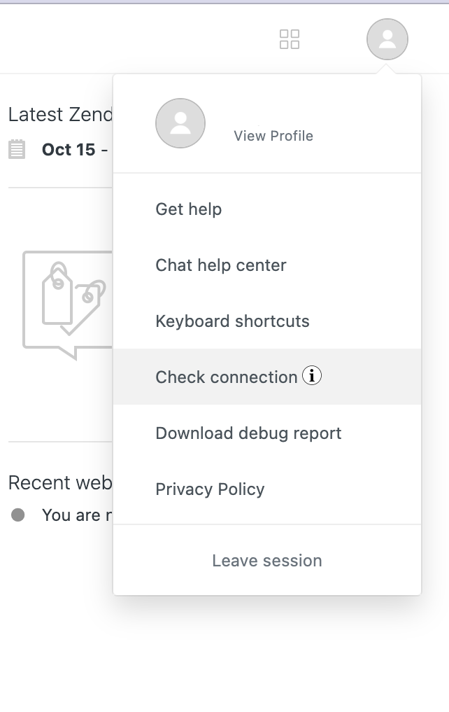

---

copyright:
  years: 2020, 2023
lastupdated: "2023-11-30"

subcollection: watson-assistant

---

{{site.data.keyword.attribute-definition-list}}

# Integrating with Zendesk
{: #deploy-zendesk}

[IBM Cloud]{: tag-ibm-cloud}

Integrate web chat with a Zendesk service desk solution, so your customers always get the help they need.
{: shortdesc}

Connect to Zendesk by deploying your assistant with the web chat integration that serves as the client interface. If, in the course of a chat with your assistant, a customer asks to speak to a person, you can transfer the conversation directly to a live agent.

Zendesk allows you to assist customers in real time, which increases customer satisfaction. And satisfied customers are happier customers. To learn more about this service desk solution, see the [Zendesk website](https://www.zendesk.com/service/){: external}.

## Before you begin
{: #deploy-zendesk-prereqs}

1.  Sign up for or switch to a [Zendesk Service account with an Enterprise plan](https://www.zendesk.com/enterprise/){: external}, which is required.

1. Create a subdomain for your service desk. After you sign up and specify a subdomain, your Zendesk console is available from a URL with the syntax: `<subdomain>.zendesk.com`. For example, `ibm.zendesk.com`.

1.  Log in to your [Zendesk](https://www.zendesk.com/login/){: external} subdomain.

1.  Open the Zendesk **Dashboard**.

1.  Click the **Products** icon (four blocks) in the header, and then select the **Chat** icon.

1.  Click your profile, and then select **Check Connection**.

       

1.  Keep this screen open for the **Connect Zendesk to your assistant** step.

       

You also need to decide whether to enable security for Zendesk after setup. More information at [Securing the transfer to Zendesk](#deploy-zendesk-secure).

## Setting up the Zendesk service desk connection
{: #deploy-zendesk-task}

In your {{site.data.keyword.conversationshort}} installation: 

1.  Go to the **Integrations** page by clicking the integrations icon () in the left menu. For more information, see [Integrating the web chat with your website](/docs/watson-assistant?topic=watson-assistant-deploy-web-chat).

1.  Click **Web chat** and then click **Open**.

1.  Select an environment, and click **Confirm**.

1.  Go to the **Live agent** tab.

1.  Click **Zendesk**.

### Connect Zendesk to your assistant 
{: #deploy-zendesk-assistant}

In the **Live agent** tab of your Zendesk web chat integration:

1.  Toggle **Transfers enabled**. Two tasks should be displayed: **Connect Zendesk** and **Private app Install**.

1.  Copy the **Account key** from your Zendesk account in the tab that you kept open.

       

1.  Paste into the **Account key** field in your assistant.

1.  Click **Connect account**. A checkmark indicates successful completion.

### Install app in Zendesk
{: #deploy-zendesk-add-private-app}

IBM provides an application to install in your Zendesk Service subdomain. When a customer asks to speak to someone, your assistant shares a chat summary for the transferred conversation with the Zendesk agent by using this private app.

1.  Click **Private app Install**. 

2.  Click the arrow next to **Download the {{site.data.keyword.conversationshort}} Zendesk app**. The app appears in the location of your downloads.

      On Safari, application files are extracted from the ZIP file into a folder. To keep the file archived as a .zip file so you can upload it later, edit your Safari preferences. Clear the **Open safe files after downloading** checkbox.
      {: note}

1.  In your Zendesk installation, click the **Products icon** and go to the **Admin Center**. 

1.  Click **Apps and integrations**.

1.  Select **Zendesk Support apps**.

1.  Click **Upload private app**.

1.  Click **Choose File**, select the app that you downloaded from your {{site.data.keyword.conversationshort}} installation, and click **Upload**.

1.  Click **Install**, if you agree to the Marketplace Terms of Use that display in the **Creating a new App** window. 

1.  Enter a name for your app in the **Title** field, and click **Install**. 

The app is now listed at **My Apps** under **Private apps**, and can be enabled, disabled, or deleted. For more information, see [Uploading and installing a private app in Zendesk](https://developer.zendesk.com/documentation/apps/getting-started/uploading-and-installing-a-private-app/){: external}.

When you test the service desk integration, ensure that there is at least one agent with `Online` status. Agent status is set to `Invisible` unless it is explicitly changed.


### Turn on Agent Workspace 
{: #deploy-zendesk-agent-workspace}

Zendesk Agent Workspace brings Zendesk Chat and Zendesk Support together, so all your customer interactions are in one place, and communication is seamless, personal, and efficient. That means more productive agents and happy customers.

In Zendesk:

1.  Click the **Products icon** and go to the **Admin Center**. 

1.  Click **Workspaces**.

1.  Click the **Turn on Agent Workspace** button. The green **On** box displays.

Agent Workspace should now feature on several screens in Zendesk Support, including on the **Dashboard** with tickets, the **Visitors** page, and in the menu as **Conversations** where agents can accept chats from customers waiting for assistance. 


## Securing the transfer to Zendesk
{: #deploy-zendesk-secure}

You must collect the name and email address of each user if enabling security in Zendesk. This information must be passed to the web chat so it can be provided to Zendesk when the conversation is transferred.

When you add security to your Zendesk integration, you ensure that the visitors you are helping are legitimate customers. Enabling visitor authentication also enables support for cross-domain traffic and cross-browser identification. For more information, see the [Enabling authenticated visitors in Zendesk](https://support.zendesk.com/hc/en-us/articles/360022185314-Enabling-authenticated-visitors-in-the-Chat-widget).

Before you can secure the Zendesk connection, complete the following required tasks:

1.  Secure the web chat. For more information, see [Securing the web chat](/docs/watson-assistant?topic=watson-assistant-web-chat-security). {: #deploy-zendesk-secure-prereqs}

1.  Encrypt sensitive information that you pass to the web chat.

    When you enable security in Zendesk, you must provide the name and email address of the current user with each request. Configure the web chat to pass this information in the payload.

    Specify the information by using the following syntax. Use the exact names (`name` and `email`) for the two name and value pairs.

    ```yaml
    {
    user_payload : {  
             name: '#{customerName}',
             email: '#{customerEmail}'
      }
    }     
    ```
    {: codeblock}

    For more information, see [Encrypting sensitive data in web chat](/docs/watson-assistant?topic=watson-assistant-web-chat-security-encrypt).

    Zendesk also expects `iat` and `external_id` name and value pairs. However, you need not provide this information. IBM automatically provides a JWT that contains these values.

    For example:

    ```json
    const userPayload = {
     "name" : "Cade Jones",
     "email" : "cade@example.com",
    }
    ```
    {: codeblock}

    ```javascript
    // Sample NodeJS code on your server.
    const jwt = require('jsonwebtoken');
    const RSA = require('node-rsa');

    const rsaKey = new RSA(process.env.PUBLIC_IBM_RSA_KEY);

    /**
    * Returns a signed JWT. Optionally, adds an encrypted user_payload in stringified JSON.
    */
    function mockLogin(userID, userPayload) {
        const payload = {
          sub: userID, // Required
          iss: 'www.ibm.com', // Required
          acr: 'loa1' // Required
          // A short-lived exp claim is automatically added by the jsonwebtoken library.
        };
        if (userPayload) {
            // If there is a user payload, it is encrypted in base64 format using the IBM public key.
            payload.user_payload = rsaKey.encrypt(userPayload, 'base64');
        }
        const token = jwt.sign(payload, process.env.YOUR_PRIVATE_RSA_KEY, { algorithm: 'RS256', expiresIn: '10000ms' });
        return token;
        }
    ```
    {: codeblock}

1.  From the Zendesk application, enable visitor authentication.

    - From the Chat dashboard navigation pane, expand *Settings*, and then click *Widget*.
    - Open the *Widget security* tab.
    - In the *Visitor Authentication* section, click the *Generate* button.

    For more information, see [Enabling authenticated visitors in the Chat widget](https://support.zendesk.com/hc/en-us/articles/360022185314-Enabling-authenticated-visitors-in-the-Chat-widget){: external}. You do not need to follow the steps to create a JWT. The Assistant service generates a JSON Web Token for you.
1.  Copy the shared secret from Zendesk.

To secure the Zendesk connection, complete the following steps:

1.  In the *Authenticate users* section, set the switch to **On**. {: #deploy-zendesk-secure-task}

1.  Paste the secret that you copied from the Zendesk setup page into the **Zendesk shared secret** field.

1.  Decide whether to allow unidentified users to access Zendesk. {: #deploy-zendesk-secure-anonymous}

    The web chat integration allows anonymous users to initiate chats. However, as soon as you enable visitor authentication, Zendesk requires that the name and email of each user be provided. If you try to connect without passing the required information, a connection is refused.

    If you want to allow anonymous users to connect to Zendesk, you can provide fictitious name and email data. Write a function to populate the two fields with fictitious name and email values.

    For example, your function must check whether you know the name and email of the current user, and if not, add canned values for them:

    ```json
    const userPayload = {
     "name" : "Jane Doe1",
     "email" : "jdoe1@example.com",
    }
    ```
    {: codeblock}

    After you write a function to ensure that name and email values are always provided, set the *Authenticate anonymous user chat transfers* switch to **On**.

For security reasons, the `secret` authentication fields are removed from view after initial setup. 
{: note}

## Adding transfer support to your actions
{: #deploy-zendesk-action-prereq}

Update an action to make sure it understands when users request to speak to a person, and can transfer the conversation properly.

### Routing based on browser information
{: #deploy-zendesk-routing-browser-info}

When a customer interacts with the web chat, information about the current web browser session is collected. For example, the URL of the current page is collected. 

You can use this information to add custom routing rules to your actions. For example, if the customer is on the Products page when a transfer to a human is requested, you can route the chat to agents who are experts in your product portfolio. 

If the customer is on the Returns page, you might want to route the chat transfer to agents who know how to help customers return merchandise.


