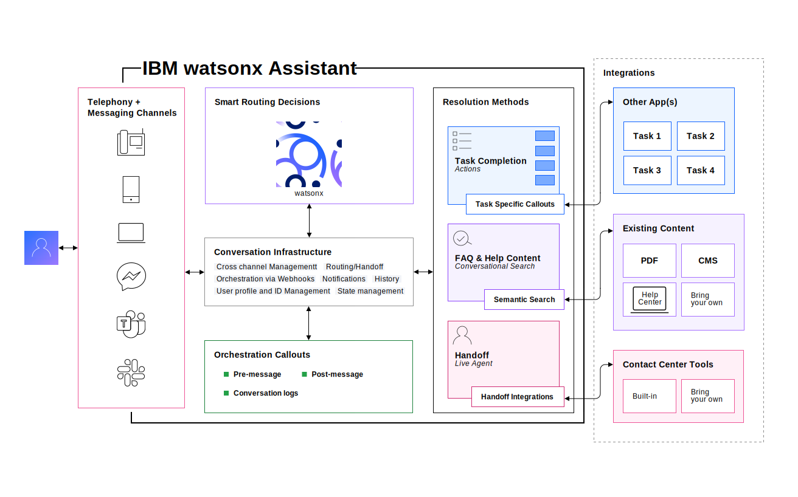

---

copyright:
  years: 2020, 2023
lastupdated: "2023-10-18"

subcollection: watson-assistant

---

{{site.data.keyword.attribute-definition-list}}

# Overview: Customizing and developing
{: #develop-overview}

The {{site.data.keyword.conversationshort}} user interface makes it easy to build an assistant and deploy it to your customers without writing any code. For advanced users and developers, you can further customize and extend the capabilities of your assistant.
{: shortdesc}

A deployed assistant includes numerous components that work together to deliver the help your customers need over the channels they use.

{: caption="Architecture" caption-side="bottom"}

- Customers interact with the assistant by using a **channel** such as the web chat or phone integration.

- Based on natural language understanding, the assistant decides to route the customer's request to the appropriate resolution mechanism, which might be an action or a search of existing content.

- The assistant might also need to communicate with external services or hand off the conversation to a human agent.

There are multiple points at which a developer can customize and extend how the assistant behaves, or how it interacts with external services. These customization points include:

- Customizing actions: By writing expressions and editing JSON data, you can extensively customize how an action evaluates step conditions, how it stores data, how it responds to customer input, and how it interacts with channels.

- [Web chat development overview](/docs/watson-assistant?topic=watson-assistant-web-chat-develop): You can use the web chat API to extensively customize the appearance and behavior of the web chat.

- Customizing the phone integration: You can use commands and context variables to extensively configure how your assistant interacts with customers that use the phone integration. 

- Customizing the SMS integration: You can use commands and context variables to customize how your assistant interacts with customers that use text messages. 

- [Extending your assistant using webhooks](/docs/watson-assistant?topic=watson-assistant-webhook-overview): You use webhooks to call external services that extend the capabilities of your assistant or log activity.

- Developing a custom channel: If none of the built-in channel integrations meet your needs, you can use the {{site.data.keyword.conversationshort}} REST API and SDKs to develop a custom client application that interacts with your assistant.
