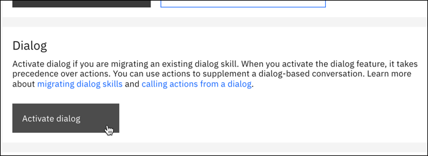

---

copyright:
  years: 2018, 2023
lastupdated: "2023-10-27"

keywords: import workspace, import JSON, export JSON, upload JSON, download JSON, collaborate

subcollection: watson-assistant

---

{{site.data.keyword.attribute-definition-list}}

# Adding dialog
{: #skill-dialog-add}

You can add one dialog skill to an assistant.

- If you are using {{site.data.keyword.conversationshort}}, you need to [activate dialog](#skill-dialog-add-activate-dialog-activating).
- If you are using the classic experience, you [create a dialog skill](#skill-dialog-add-task).

## Activating dialog
{: #skill-dialog-add-activate-dialog-activating}

To activate the dialog feature in {{site.data.keyword.conversationshort}}:

1.  Create or open an assistant where you want to use a dialog as the primary conversation with users.

1.  Open **Assistant settings** .

1.  Click **Activate dialog**.

    {: caption="Activate dialog" caption-side="bottom"}

1.  In the confirmation that displays, click **Activate dialog** again.

    {: caption="Activate dialog" caption-side="bottom"}

Once you activate the dialog feature, it takes precedence over actions. You can use actions to supplement a dialog-based conversation, but the dialog drives the conversation with users to match their requests. For more information, see [Calling actions from a dialog](/docs/watson-assistant?topic=watson-assistant-dialog-call-action).

## Create the dialog skill
{: #skill-dialog-add-task}

To add a skill in the classic experience, complete the following steps:

1.  On the Skills page, click **Create skill**.

1. Choose **Dialog skill**.

1.  Do one of the following:

    - To create a new dialog skill, remain on the *Create skill* tab.
    
    - To add the dialog sample skill that is provided with the product as a starting point for your own skill or as an example to explore before you create one yourself, open the *Use sample skill* tab, and then click the sample labeled **TYPE: Dialog**. You can skip the remaining steps.

    - To add a skill that was downloaded previously, you can upload it as a JSON file. Open the *Upload skill* tab. Drag a file or click **Drag and drop file here or click to select a file** and select the JSON file you want to upload.

      The uploaded JSON file must use UTF-8 encoding, without byte order mark (BOM) encoding. The JSON cannot contain tabs, newlines, or carriage returns.
      {: important}

      The maximum size for a skill JSON file is 10 MB. If you need to upload a larger skill, consider using the REST API. For more information, see the [API Reference](https://{DomainName}/assistant/assistant-v1?curl=#createworkspace){: external}.
      {: tip}

      Click **Upload**.

1.  Specify the details for the skill:

    - **Name**: A name no more than 64 characters in length. A name is required.
    - **Description**: An optional description no more than 128 characters in length.
    - **Language**: The language of the user input the skill will be trained to understand. The default value is English.

1.  For **Skill type**, choose Dialog.

1.  Click **Create skill**.

After you create the dialog skill, it appears as a tile on the Skills page. Now, you can start identifying the user goals that you want the dialog skill to address.

### Adding the skill to an assistant
{: #skill-dialog-add-to-assistant}

You can add one dialog skill to an assistant. You must open the assistant tile and add the skill to the assistant from the assistant configuration page; you cannot choose the assistant that will use the skill from within the skill configuration page. One dialog skill can be used by more than one assistant.

1.  From the Assistants page, click to open the tile for the assistant to which you want to add the skill.

1.  Click **Add an actions or dialog skill**.

1.  Click **Add existing skill**.

    Click the skill that you want to add from the available skills that are displayed.

When you add a dialog skill from here, you get the development version. If you want to add a specific skill version, add it from the skill's *Versions* page instead.

### Actions skill in the classic experience
{: #skill-add-actions-skill}

If you're using the classic experience, you can add an actions skill instead of a dialog skill. Actions represent the tasks you want your assistant to help your customers with.

Each action contains a series of steps that represent individual exchanges with a customer. Building the conversation that your assistant has with your customers is fundamentally about deciding which steps, or which user interactions, are required to complete an action. After you identify the list of steps, you can then focus on writing engaging content to turn each interaction into a positive experience for your customer.

If you're interested in using actions, {{site.data.keyword.conversationshort}} is recommended, rather than using an actions skill in the classic experience. {{site.data.keyword.conversationfull}} provides a simplified user interface, an improved deployment process, and access to the latest features. For more information, see [Overview: Editing actions](/docs/watson-assistant?topic=watson-assistant-build-actions-overview).

### Search skill in the classic experience
{: #skill-add-search-skill}

[Plus]{: tag-green}[Enterprise]{: tag-purple}

When {{site.data.keyword.conversationshort}} doesn't have an explicit solution to a problem, it routes the user question to a search skill to find an answer from across your disparate sources of self-service content. The search skill interacts with the {{site.data.keyword.discoveryfull}} service to extract this information from a configured data collection.

If you already use the {{site.data.keyword.discoveryshort}} service, you can mine your existing data collections for source material that you can share with customers to address their questions.

For more information, see [{{site.data.keyword.discoveryfull}} search integration setup](/docs/watson-assistant?topic=watson-assistant-search-add).

### Skill limits
{: #skill-add-limits}

The number of skills you can create depends on your {{site.data.keyword.conversationshort}} plan type. Any sample dialog skills that are available for you to use do not count toward your limit unless you use them. A skill version does not count as a skill.

| Plan | Maximum number of skills of each type per service instance |
| --- | --- |
| Enterprise | 100 |
| Premium (legacy) | 100 |
| Plus | 50 |
| Trial | 50 |
| Standard (legacy) | 20 |
| Lite | 5 |
{: caption="Plan details" caption-side="bottom"}

After 30 days of inactivity, an unused skill in a Lite plan service instance might be deleted to free up space.
{: note}
