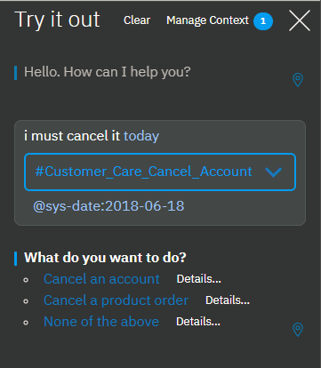
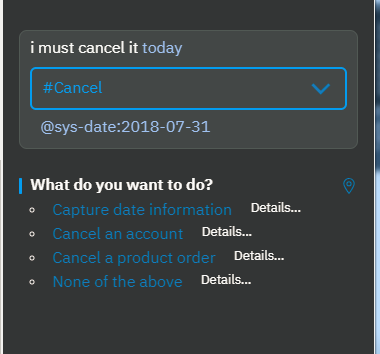
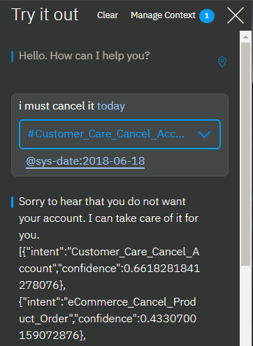

---

copyright:
  years: 2015, 2024
lastupdated: "2024-09-04"

keywords: digression, disambiguation, confidence 

subcollection: watson-assistant

---

{{site.data.keyword.attribute-definition-list}}

# Controlling the conversational flow
{: #dialog-runtime}

Understand how your dialog is processed when a person interacts with your assistant at run time. Learn to use the conversation flow to your advantage and alter the flow if necessary.
{: shortdesc}

You can impact the flow of a conversation with the following features:

- [Disambiguation](#dialog-runtime-disambiguation)
- [Digressions](#dialog-runtime-digressions)

## Disambiguation
{: #dialog-runtime-disambiguation}

Disambiguation instructs your assistant to ask the customer for help when more than one dialog node can respond to a customer's input. Instead of guessing which node to process, your assistant shares a list of the top node options with the user, and asks the user to pick the right one.

{: caption="Assistant asks for clarification" caption-side="bottom"}

Disambiguation is triggered when the following conditions are met:

- The confidence scores of the runner-up intents that are detected in the user input are close in value to the confidence score of the top intent.
- The confidence score of the top intent is above 0.2.

Even when these conditions are met, disambiguation does not occur unless two or more independent nodes in your dialog meet the following criteria:

- The node condition includes one of the intents that triggered disambiguation.
- A description of the node's purpose is provided for the node in the node name field. (Alternatively, a description can be included in the external node name field.)

A node with a Boolean node condition that evaluates to true is likely to be included in the disambiguation list. For example, if the node checks for an entity type, and the entity is mentioned in the user input, it is eligible to be included in the list. Such nodes do not trigger disambiguation, but if disambiguation is triggered, they are likely to be included in the resulting disambiguation list.

Learn more

- [Disambiguation example](#dialog-runtime-disambig-example)
- [Editing the disambiguation configuration](#dialog-runtime-disambig-edit)
- [Choosing nodes to disable](#dialog-runtime-disambig-choose-nodes)
- [Disabling disambiguation](#dialog-runtime-disambig-disable)
- [Handling none of the above](#dialog-runtime-handle-none)
- [Testing disambiguation](#dialog-runtime-disambig-test)

### Disambiguation example
{: #dialog-runtime-disambig-example}

For example, you have a dialog that has two nodes with intent conditions that address cancellation requests. The conditions are:

- eCommerce_Cancel_Product_Order
- Customer_Care_Cancel_Account

If the user says `i must cancel it today`, then the following intents might be detected in the input:

```json
[
  {"intent":"Customer_Care_Cancel_Account","confidence":0.5602024316787719},
  {"intent":"eCommerce_Cancel_Product_Order","confidence":0.46903514862060547},
  {"intent":"Customer_Care_Appointments","confidence":0.29033891558647157},
  {"intent":"General_Greetings","confidence":0.2894785046577454},
```
{: code block}

If you test from the "Try it out" pane, you can hover over the eye icon to see the top three intents that were recognized in the test input.

{: caption="Top intents" caption-side="bottom"}

Your assistant is `0.5618281841278076` (56%) confident that the user goal matches the `#Customer_Care_Cancel_Account` intent. If another intent has a confidence score that is close to the score of this top intent, then disambiguation is triggered. In this example, the `#eCommerce_Cancel_Product_Order` intent has a close confidence score of 46%.

As a result, when the user says `i must cancel it today`, both dialog nodes are likely to be considered viable candidates to respond. To determine which dialog node to process, the assistant asks the user to pick one. And to help the user choose between them, the assistant provides a short summary of what each node does. The summary text is extracted directly from the node's *name* field. If present and if a description is added to it, then the text is taken from the *external node name* field instead.

The description that is displayed in the disambiguation list comes from the name (or external node name) of the last node that is processed in the branch where the intent match occurs. For more information, see [Disable jumped-to utility nodes](#dialog-runtime-disambig-choose-nodes).
{: note}

{: caption="Choose options" caption-side="bottom"}

Notice that your assistant recognizes the term `today` in the user input as a date, a mention of the `@sys-date` entity. If your dialog tree contains a node that conditions on the `@sys-date` entity, then it is also likely to be included in the list of disambiguation choices. This image shows it included in the list as the *Capture date information* option.

{: caption="Capture date information" caption-side="bottom"}

### Editing the disambiguation configuration
{: #dialog-runtime-disambig-edit}

Disambiguation is enabled automatically for all new dialog skills. You can change the settings that are applied automatically to disambiguation from the *Options* page. 

To edit the disambiguation settings, complete the following steps:

1. In **Options**, click **Disambiguation**.
1. In the **Disambiguation message** field, add text to show before the list of dialog node options. For example, *What do you want to do?*
1. In the **Anything else** field, add text to display as an extra option that users can pick if none of the other dialog node options reflect what the user wants to do. For example, *None of the above*.

    Keep the message short, so it displays inline with the other options. The message must be fewer than 512 characters. For information about what your assistant does if a user chooses this option, see [Handling none of the above](#dialog-runtime-handle-none).

1. If you want to limit the number of disambiguation options that can be displayed to a user, then in the **Maximum number of suggestions** field, specify a number between 2 and 5. 

Your changes are automatically saved.

You can use the API to modify more disambiguation settings. These settings include the disambiguation sensitivity, which affects how often disambiguation is triggered and how many choices are included. For more information, see the [API Reference](https://{DomainName}/assistant/assistant-v1?curl=#updateworkspace){: external}.
{: tip}

### Choosing nodes to not show as disambiguation options
{: #dialog-runtime-disambig-choose-nodes}

All nodes are eligible to be included in the disambiguation list. 

- Nodes at any level of the tree hierarchy are included.
- Nodes that condition on intents, entities, special conditions, context variables, or any combination of these values are included.

Consider hiding some nodes from the disambiguation list.

- **Hide root nodes with `welcome` and `anything_else` conditions**

   Unless you added extra functions to these nodes, they are typically not useful options to include in a disambiguation list.

- **Hide jumped-to utility nodes**

   The text in the disambiguation list is populated from the node name (or external node name) of the *last node that is processed* in the branch where the node condition is matched.
   {: important}

   Don't include utility nodes, such as thanking the user, saying goodbye, or asking for answer quality feedback, in the disambiguation list instead of a phrase that describes the purpose of the matched root node.
  
   For example, maybe a root node with the matching intent condition of `#store-location` jumps to a node that asks users if they are satisfied with the response. If the `#check_satisfaction` node has a node name and disambiguation, then the name for the jumped-to node is displayed in the disambiguation list. As a result, `Check satisfaction` is displayed in the disambiguation list to represent the `#store-location` branch instead of the `Get store location` name from the root node.

- **Hide root nodes that condition on an entity or context variable only**

   Only a node with a matched intent can trigger disambiguation. However, when triggered, any node with a condition that matches is included in the disambiguation list. When your dialog includes nodes that condition on entities, for example, the order of nodes in the tree hierarchy can become significant in unexpected ways.

   - The order of nodes impacts whether disambiguation is triggered at all. Look at the [scenario](#dialog-runtime-disambig-example) that is used earlier to introduce disambiguation, for example. If the node that conditions on `@sys-date` was placed higher in the dialog tree than the nodes that condition on the `#Customer_Care_Cancel_Account` and `#eCommerce_Cancel_Product_Order` intents, disambiguation would never be triggered when a user enters `i must cancel it today`. Your assistant would consider the date that is mentioned (`today`) to be more important than the intent references due to the placement of the corresponding nodes in the tree.

   - The order of nodes impacts which nodes are included in the disambiguation options list. Sometimes a node is not listed as a disambiguation option as expected. This can happen if a condition value is also referenced by a node that is *not* eligible for inclusion in the disambiguation list for some reason. For example, an entity might trigger a node that is situated earlier in the dialog tree but is not enabled for disambiguation. If the same entity is the only condition for a node that *is* enabled for disambiguation, but is lower in the tree, then it might not be a disambiguation option because your assistant never reaches it. If it matched against the earlier node and was omitted, your assistant might not process the later node.

### Hiding nodes from disambiguation altogether
{: #dialog-runtime-disambig-disable}

You can prevent every node in a dialog or an individual dialog node from being included in the disambiguation list.

To disable disambiguation entirely: 

1. In **Options**, click **Disambiguation**.

1. Set the switch to **Off**.

To prevent a single dialog node from being included in the disambiguation list: 

1. Click a dialog node to open it in the edit view.

1. Click **Settings**.

1. Set the **Show node name** switch to **Off**.

   [Plus]{: tag-green} If you added a node summary description to the **external node name** field instead of the *name* field, remove it.
  
    The *external node name* field serves two purposes. It provides information about the node to customers when it is included in a disambiguation list. It also describes the node in a chat summary that is shared with service desk agents when a conversation is transferred to a person. The *external node name* field is only visible in skills that are part of a paid plan instance. If the *external node name* field contains text, its text is used, whether or not there is text in the *name* field.

For each node, test scenarios in which you expect the node to be included in the disambiguation options list. Testing gives you a chance to adjust the node order or other factors that might impact how well disambiguation works at run time. See [Testing disambiguation](#dialog-runtime-disambig-test).

#### Prioritizing a node over disambiguation
{: #dialog-runtime-prevent-disambiguation}

Some nodes are important enough to your customer that you want them to be returned on their own, outside of a disambiguation list, when the assistant is confident that the node meets a customer need.

For example, you might have a node that matches the `#stolen_card` intent. Whenever an incoming message suggests that a customer wants to report a stolen credit card, you don't want your assistant's response to be lost in a disambiguation list of options. You want the assistant to respond with a single answer that helps the customer address this urgent matter.

To design your dialog to prioritize a single node over disambiguation, complete the following steps:

1. In the node that conditions on the intent, click **Customize** to enable multiple conditioned responses.

1. Add a conditioned response with the following condition:

   `intent.confidence > n`
   
   where `n` is a confidence score that makes sense for your training data. For example:
   
   `intent.confidence > 0.7`

1. Move the response up to be first in the list of conditioned responses.
1. Click the gear icon to customize the conditioned response.
1. In the Assistant responds section, open the context editor.
1. Add the following context variable:

   | Variable | Value |
   | --- | --- |
   | `system` | `{"prevent_disambiguation":true}`|
   {: caption="Context variable" caption-side="bottom"}

1. Click **Save**.

   Alternatively, you can add a root-level node with a condition such as:
   
   `#stolen_card && intent.confidence > 0.7`
   
   Place this node higher in the tree than the node that conditions on `#stolen_card`, which allows the node to be included in a disambiguation list.

1. Test your dialog. Make sure that the node's response is returned instead of a disambiguation list when the appropriate confidence score threshold is met.

### Handling none of the above
{: #dialog-runtime-handle-none}

When a user clicks the *None of the above* option, your assistant strips the intents that were recognized in the user input from the message and submits it again. This action typically triggers the anything else node in your dialog tree.

To customize the response that is returned in this situation, you can add a root node with a condition that checks for a user input with no recognized intents (the intents are stripped, remember) and contains a `suggestion_id` property. A `suggestion_id` property is added by your assistant when disambiguation is triggered.
{: tip}

Add a root node with the following condition:

```json
intents.size()==0 && input.suggestion_id
```
{: codeblock}

This condition is met only by input that triggers a set of disambiguation options of which the user says none match the goal.

Add a response that tells users that know that you understand that none of the options that were suggested met their needs, and take appropriate action.

Again, the placement of nodes in the tree matters. If a node that conditions on an entity type that is mentioned in the user input is higher in the tree than this node, its response is displayed instead.

### Testing disambiguation
{: #dialog-runtime-disambig-test}

When testing, the order in which the options are listed might change. In fact, the options themselves that are included in the disambiguation list might change from one test to the next.
{: important}

This behavior is intended. As part of development that is in progress to help the assistant learn automatically from user choices, the choices and their order in the disambiguation list is being randomized on purpose. Changing the order helps to avoid the bias that can be introduced by a percentage of people who always pick the first option without carefully reviewing all of their choices beforehand.

To test disambiguation, complete the following steps:

1. From the "Try it out" pane, enter a test utterance that is a good candidate for disambiguation, meaning two or more of your dialog nodes are configured to address utterances like it.

1. If the response doesn't contain a list of dialog node options for you to choose from, check that you added summary information to the node name (or external node name) fields.

1. If disambiguation is still not triggered, it might be that the confidence scores for the nodes are not as close in value as you thought.

    - To see the confidence scores of the top three intents that were detected in the input, hover over the eye icon in the "Try it out" pane.

    - To see the confidence scores of all the intents that are detected in the user input, temporarily add `<? intents ?>` to the end of the node response for a node that you know will be triggered.

      This SpEL expression shows the intents that were detected in the user input as an array. The array includes the intent name and the level of confidence that your assistant has that the intent reflects the user's intended goal.

    - To see which entities, if any, were detected in the user input, you can temporarily replace the current response with a single text response that contains the SpEL expression `<? entities ?>`.

      This SpEL expression shows the entities that were detected in the user input as an array. The array includes the entity name, location of the entity mention, the entity mention string, and the level of confidence that the term is a mention of the entity type specified.

    - To see details for all of the artifacts, including other properties such as context variable value at the time of the call, inspect the entire API response. See [Viewing API call details](/docs/watson-assistant?topic=watson-assistant-message-anatomy#message-anatomy-inspect-api).

1. Temporarily remove the description in the *name* field (or *external node name* field) for at least one of the nodes that you anticipate as a disambiguation option.

1. Enter the test utterance into the "Try it out" pane again.

   If you added the `<? intents ?>` expression to the response, then the text includes a list of the intents that your assistant recognized in the test utterance, and includes the confidence score for each one.

   {: caption="Intents and confidence scores" caption-side="bottom"}

After you finish testing, remove any SpEL expressions that you appended to node responses, or add back any original responses that you replaced with expressions, and repopulate any *name* or *external node name* fields from which you removed text.

## Digressions
{: #dialog-runtime-digressions}

A digression occurs when a user is in a dialog flow that addresses one goal, but switches topics to initiate a dialog flow that addresses a different goal. If none of the nodes in the dialog branch match the goal of the user's last input, the conversation checks the root node conditions for an appropriate match. The digression settings that are available per node give you the ability to tailor this behavior even more.

With digression settings, you can allow the conversation to return to the dialog flow that was interrupted when the digression occurred. For example, the user might be ordering a new phone, but switches topics to ask about tablets. Your dialog can answer the question about tablets, and then bring the user back to where they left off with the phone order. Allowing digressions to occur and return gives your users more control over the flow of the conversation at run time. They can change topics, follow a dialog flow about the unrelated topic to its end, and then return to where they were before. The result is a dialog flow that more closely simulates a human-to-human conversation.

### Before you begin
{: #dialog-runtime-digression-prereqs}

As you test your overall dialog, decide when and where it makes sense to allow digressions and returns from digressions to occur. The following digression controls are applied to the nodes automatically.

- Every root node in your dialog is configured to allow digressions to target them by default. Child nodes cannot be the target of a digression.
- Nodes with slots are configured to prevent digressions away. All other nodes are configured to allow digressions away. However, the conversation cannot digress away from a node under the following circumstances:

   - If any of the child nodes of the current node contain the `anything_else` or `true` condition. These conditions are special in that they always evaluate to be true. Because of their known behavior, they are often used in dialogs to force a parent node to evaluate a specific child node in succession. To prevent breaking existing dialog flow logic, digressions are not allowed in this case. Before you can enable digressions away from such a node, you must change the child node's condition to something else.

   - If the node is configured to jump to another node or skip user input after it is processed. The final step section of a node specifies what happens after the node is processed. When the dialog is configured to jump directly to another node, it is often to make sure that a specific sequence is followed. And when the node is configured to skip user input, it is equivalent to forcing the dialog to process the first child node after the current node in succession. To prevent breaking existing dialog flow logic, digressions are not allowed in either of these cases. Before you can enable digressions away from this node, you must change what is specified in the final step section.

### Customizing digressions
{: #dialog-runtime-enable-digressions}

You do not define the start and end of a digression. The user is entirely in control of the digression flow at run time. You can specify how each node is included in a user-led digression. For each node, you can configure whether a digression:

- Starts from and leaves the node
- That starts elsewhere can target and enter the node
- That starts elsewhere and enters the node must return to the interrupted dialog flow after the current dialog flow is completed

To change the digression behavior for an individual node, complete the following steps:

1. Click the node to open its edit view.

1. Click **Customize**, and then click the **Digressions** tab.

    The configuration options differ depending on whether the node you are editing is a root node, a child node, a node with children, or a node with slots.

    **Digressions away from this node**

    If the circumstances listed earlier do not apply, then you can make the following choices:

    - **All node types**: Choose whether to allow users to digress away from the current node before they reach the end of the current dialog branch.

    - **All nodes that have children**: Choose if you want the conversation to return to the current node if the node's response has been displayed and its child nodes are incidental to the goal. Set the **Allow return from digressions triggered after this node's response** switch to **No** to prevent the dialog from returning to the current node and continuing to process its branch.

      For example, if the user asks, `Do you sell cupcakes?` and the response `We offer cupcakes in a variety of flavors and sizes` is displayed before the user changes subjects, you might not want the dialog to return to where it left off. Especially, if the child nodes address possible follow-up questions from the user and can safely be ignored.

      However, if the node relies on its child nodes to address the question, then you might want to force the conversation to return and continue processing the nodes in the current branch. For example, the initial response might be, `We offer cupcakes in all shapes and sizes. Which menu do you want to see: gluten-free, dairy-free, or regular?`. If the user changes subjects, you might want the dialog to return so the user can pick a menu type and get the information that they wanted.

    - **Nodes with slots**: Choose whether you want to allow users to digress away from the node before all of the slots are filled. Set the **Allow digressions away while slot filling** switch to **Yes** to enable digressions away.

      If enabled, when the conversation returns from the digression, the prompt for the next unfilled slot is displayed to encourage the user to continue providing information. If disabled, then any inputs that the user submits which do not contain a value that can fill a slot are ignored. However, you can address unsolicited questions that you anticipate your users might ask while they interact with the node by defining slot handlers. For more information, see [Adding slots](/docs/watson-assistant?topic=watson-assistant-dialog-slots#dialog-slots-add).

    - **Nodes with slots**: Choose whether the user is allowed to digress away if they return to the current node by selecting the **Only digress from slots to nodes that allow returns** checkbox.

      When selected, as the dialog looks for a node to answer the user's unrelated question, it ignores any root nodes that are not configured to return after the digression. Select this checkbox if you want to prevent users from being able to permanently leave the node before they finish filling the required slots.

    **Digressions into this node**

    You can make the following choices about how digressions into a node behave:

    - Prevent users from being able to digress into the node. See [Disabling digressions into a root node](#dialog-runtime-disable-digressions) for more details.

    - When digressions into the node are enabled, choose whether the dialog must go back to the dialog flow that it digressed away from. After the current node's branch is done being processed, the dialog flow goes back to the interrupted node. To make the dialog return afterward, select **Return after digression**.

1. Click **Apply**.

1. Use the "Try it out" pane to test the digression behavior.

    Again, you cannot define the start and end of a digression. The user controls where and when digressions happen. You can apply settings that determine how a single node participates in one. Because digressions are so unpredictable, it is hard to know how your configuration decisions impact the overall conversation. To truly see the impact of the choices you made, you must test the dialog.

The #reservation and #cuisine nodes represent two dialog branches that can participate in a single user-directed digression. The digression settings that are configured for each individual node are what make this type of digression possible at run time.

### Digression usage tips
{: #dialog-runtime-digress-tips}

**Custom return message**: For any nodes where you enable returns from digressions away, consider adding wording that tells users where they are returning to when they left off in a previous dialog flow. In your text response, use a special syntax to add two versions of the response.

If you don't add a message, the same text response is displayed a second time to tell users that they returned to the node they digressed away from. You can make it clearer to users that they returned to the original conversation thread by specifying a unique message to be displayed when they return.

For example, if the original text response for the node is, `What's the order number?`, then you might want to display a message like, `Now let's get back to where we left off. What is the order number?` when users return to the node.

To do so, use the following syntax to specify the node text response:

`<? (returning_from_digression)? "post-digression message" : "first-time message" ?>`

For example:

```bash
<? (returning_from_digression)? "Now, let's get back to where we left off.
What is the order number?" : "What's the order number?" ?>
```
{: codeblock}

You cannot include SpEL expressions or shorthand syntax in the text responses that you add. In fact, you cannot use shorthand syntax at all. Instead, you must build the message by concatenating the text strings and full SpEL expression syntax together to form the full response.
{: note}
  
For example, use the following syntax to include a context variable in a text response that you would normally specify as `What can I do for you, $username?`:

```bash
<? (returning_from_digression)? "Where were we, " +
context["username"] + "? Oh right, I was asking what can I do
for you today." : "What can I do for you today, " +
context["username"] + "?" ?>
```

For full SpEL expression syntax details, see [Expression for accessing objects](/docs/watson-assistant?topic=watson-assistant-expression-language#expression-language-shorthand-syntax).

**Preventing returns**: In some cases, you might want to prevent a return to the interrupted conversation flow based on a choice the user makes in the current dialog flow. You can use special syntax to prevent a return from a specific node.

For example, you might have a node that conditions on `#General_Connect_To_Agent` or a similar intent. When triggered, if you want to get the user's confirmation before you transfer them to an external service, you might add a response such as `Do you want me to transfer you to an agent now?`. You might add two child nodes that condition on `#yes` and `#no`.
  
The best way to manage digressions for this type of branch is to set the root node to allow digression returns. However, on the `#yes` node, include the SpEL expression `<? clearDialogStack() ?>` in the response. For example:
   
```bash
OK. I will transfer you now. <? clearDialogStack() ?>
```
{: codeblock}
   
This SpEL expression prevents the digression return from happening from this node. When a confirmation is requested, if the user says yes, the proper response is displayed, and the dialog flow that was interrupted is not resumed. If the user says no, then the user is returned to the flow that was interrupted.

### Disabling digressions into a root node
{: #dialog-runtime-disable-digressions}

When a flow digresses into a root node, it follows the course of the dialog that is configured for that node. The flow might process a series of child nodes before the end of the node branch, and then go back to the dialog flow that was interrupted. By testing, you might find that a root node is triggered too often, at unexpected times, or the dialog is too complex and sends the user too far off course. If you determine that you would rather not allow users to digress into it, you can configure the root node to not allow digressions in.

To disable digressions into a root node altogether, complete the following steps:

1. Click to open the root node that you want to edit.
1. Click **Customize**, and then click the **Digressions** tab.
1. Set the **Allow digressions into this node** to **Off**.
1. Click **Apply**.

If you decide that you want to prevent digressions into several root nodes, but do not want to edit each one individually, you can add the nodes to a folder. From the *Customize* page of the folder, you can set the **Allow digressions into this node** switch to **Off** to apply the configuration to all of the nodes. For more information, see [Organizing the dialog with folders](/docs/watson-assistant?topic=watson-assistant-dialog-tasks#dialog-tasks-folders).

### Design considerations
{: #dialog-runtime-digression-design-considerations}

**Avoid fallback node proliferation**: Many dialog designers include a node with a `true` or `anything_else` condition at the end of every dialog branch as a way to prevent users from getting stuck in the branch. This design returns a generic message if the user input does not match anything that you anticipated and included a specific dialog node to address. However, users cannot digress away from dialog flows that use this approach.

Evaluate any branches that use this approach to determine whether it would be better to allow digressions away from the branch. If the user's input does not match anything that you anticipated, it might find a match against an entirely different dialog flow in your tree. Rather than responding with a generic message, you can effectively put the rest of the dialog to work to try to address the user's input. And the root-level `Anything else` node can always respond to input that none of the other root nodes can address.

**Reconsider jumps to a closing node**: Many dialogs are designed to ask a standard closing question, such as, `Did I answer your question today?` Users cannot digress away from nodes that are configured to jump to another node. So, if you configure all of your final branch nodes to jump to a common closing node, digressions cannot occur. Consider tracking user satisfaction through metrics or some other means.

**Test possible digression chains**: If a user digresses from the current node to another node that allows digressions, the user might digress away from that other node, and repeat this pattern. If the starting node in the digression chain is configured to return after the digression, then the user will eventually be brought back to the current dialog node. In fact, any subsequent nodes in the chain that are configured not to return are excluded from being considered as digression targets. Test scenarios that digress multiple times to determine whether individual nodes function as expected.

**Step conditions are not reevaluated on digression returns**: Because the step condition is already evaluated before the digression, it is not evaluated again upon the return of the digression. If your conversational flow requires the step condition to be evaluated again, then add reprompting at the same step where the digression started. If you do not want to reprompt at the same step and to prevent digression returns, do the following steps:

1. Go to **Home** > **Actions** > **Created by you**.
1. Select the action in which you want to prevent digression returns.
1. Click **Action settings**.
1. Switch the toggle to **On** in **Change conversation topic**.
1. Select **Never return to original action after completing this action**.
1. Click **Save**.

**The current node gets priority**: Nodes outside the current flow are only considered as digression targets if the current flow cannot address the user input. In a node with slots that allows digressions away, make it clear to users what information is needed, and to add confirmation statements that are displayed after the user provides a value.

Any slot can be filled during the slot-filling process. So, a slot might capture user input unexpectedly. For example, you might have a node with slots that collects the information necessary to make a dinner reservation. One of the slots collects date information. The user might ask `What's the weather meant to be tomorrow?`. You might have a root node that conditions on #forecast that might answer the user. However, because the user's input includes the word `tomorrow` and the reservation node with slots is being processed, your assistant assumes that the user is providing or updating the reservation date instead. *The current node always gets priority.* If you define a clear confirmation statement, such as, `Ok, setting the reservation date to tomorrow,` the user is more likely to realize there was a miscommunication and correct it.

If the user provides a value that is not expected by any of the slots, it might match an unrelated root node that the user never intended to digress to.

Be sure to do lots of testing as you configure the digression behavior.

**When to use digressions instead of slot handlers**: For general questions that users might ask, use a root node that allows digressions into it, processes the input, and then goes back to the flow that was in progress. For nodes with slots, try to anticipate the types of related questions users might want to ask when filling slots, and address them by adding handlers to the node.

For example, if the node with slots collects the information that is required to complete an insurance claim, then you might want to add handlers that address common questions about insurance. However, for questions about how to get help, or your store locations, or the history of your company, use a root level node.
