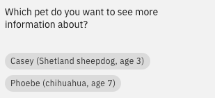

---

copyright:
  years: 2022, 2023
lastupdated: "2023-08-31"

subcollection: watson-assistant

---

{{site.data.keyword.attribute-definition-list}}

# Dynamic options
{: #dynamic-options}

An *options* response presents customers with a list of choices to select from. You can use the **dynamic** setting to generate the list from options that might be different each time.
{: shortdesc}

Dynamic options are generated based on the data stored in a variable, which must be available to the step asking the question. The source variable must contain an array of values, each of which represents one of the options that will be presented to the customer. The items in the array can be simple values such as strings or numbers (for example, `[ "Raleigh", "Boston", "New York" ]`) or compound JSON objects.

A common scenario for dynamic options is when an array is returned from an external API that you call using a custom extension. For example, you might use a custom extension to retrieve a list of credit cards associated with a customer's account. You can then use dynamic options to ask the customer which card to use during the conversation. (For more information about custom extensions, see [Calling a custom extension](/docs/watson-assistant?topic=watson-assistant-call-extension).)

Your actions might also populate the source variable using expressions. For example, you might use a session variable to build a shopping cart containing items the customer has decided to purchase. An action for removing an item from the cart could then use dynamic options to show the items in the cart so the customer can select which one to remove. (For more information about using expressions for variable values, see [Using an expression to assign a value to a session variable](/docs/watson-assistant?topic=watson-assistant-expressions#expression-variable).)

## Defining dynamic options
{: #dynamic-options-define}

To define a dynamic options customer response:

1. In a step, click **Define customer response**.

1. Choose the **Options** response type.

1. Click the **Dynamic** toggle.

1. In the **Source variable** field, choose the variable that contains the array that defines the dynamic options (for example, the variable containing the response from a custom extension that you called in a previous step).

1. **Optional:** In the **Option** field, write an expression that maps the items in the source array to the options that will be listed. This expression serves as a template that converts each item in the array to a meaningful value that will be displayed to the customer. In this expression, use the dynamic variable `${item}` to represent the item.

    In some situations, you do not need to specify an expression:

    - If the items in the array are simple values such as strings or integers, the value of each item is automatically shown as an option. However, you might still want to define a mapping if you want to manipulate or reformat the items to make them more meaningful. For example, you might use the expression `"Part #" + ${item}` to show part numbers using the format `Part #12345`.

    - If the items in the array are JSON objects, the default mapping looks for a property called `label` and uses its value (if present) as the option. If the item does not include a `label` property, or you do not want to use the value of the `label` property as the option, you must write an expression to specify a mapping. You can use dot notation to refer to a property in the object using its JSON path (for example, `${item}.name`).

1. **Optional:** Click **Add fallback option** to include a static choice, such as `None of the above`, if the options aren't what the customer wants. You can then add a step that is conditioned on this static option to provide further assistance. To add the condition, write a expression such as `${step_id}.value == "None of the above"`.

## Mapping examples
{: #dynamic-options-examples}

Suppose you want to build an action that shows a list of pets available for adoption and prompts the customer to select a pet to see more information about. The source variable contains an array from a custom extension in the following format:

```text
[
  {
    "id": "123",
    "name": "Casey",
    "breed": "Shetland sheepdog",
    "age": 3
  },
  {
    "id": "987",
    "name": "Phoebe",
    "breed": "chihuahua",
    "age": 7
  }
]
```

The schema for the items does not include a `label` property, so the default mapping is not available. Instead, you might use an expression to build a complex label that includes data taken from several different properties. For example, you might use the expression `${item}.name + " (" + ${item}.breed + ", age " + ${item}.age + ")"` to define the option labels:



Remember that you can use expression methods to manipulate values from the source variable in various ways. For example, you might have an action customers use to select a credit card for payment, but for security reasons you don't want to show the entire card number. You could write an expression that uses the `substring()` method to include only the last four digits of each card number (for example, `"Card ending in " + ${item}.card_number.substring(16, 20)`).

## Referencing the selected item
{: #dynamic-options-referencing-selected}

After the customer has selected one of the dynamically generated options, you will probably need to reference the selected item in a subsequent step.

If you reference the action variable representing the customer response, the default is to use the value of the selected option. However, in some situations, you might not want to use the same value that was used to display the option to the customer. Instead, you might need to use a unique identifier or other property that unambiguously identifies the selected option.

For example, if the customer selects a pet to show more information about, you probably need to use a unique identifier (the `id` property in our example) to query the database, since the pet's name, age, and breed might not be unique. Or if the customer is selecting a credit card from options that show only the last four digits, you will need to use the full credit card number to access the account details or complete a transaction.

In this situation, you can write an expression to access the original properties of the selected item:

1. Create or edit a step that comes after the step in which the customer selects from the dynamic options.

1. In the **Variable values** section, write an expression to assign a value to a session variable. (For more information, see [Using an expression to assign a value to a session variable](/docs/watson-assistant?topic=watson-assistant-expressions#expression-variable).)

1. In the expression editor, type a dollar sign (`$`) and then select the step in which the customer selected the dynamic option.

1. Use the property name `item` to represent the selected item, and dot notation to access its properties. For example, the following expression accesses the `id` property of the item selected in a previous step:

    ```text
    ${step_331}.item.id
    ```

    You can use a complex expression to construct a value using multiple properties of the selected item. For example, you might use an expression such as `${step_123}.item.firstname + " " + ${step_123}.item.lastname` to construct a person's full name. Use the expression to define the value in whatever format you need to complete any required action.
