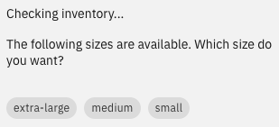

---

copyright:
  years: 2022
lastupdated: "2022-11-10"

subcollection: watson-assistant

---

{:shortdesc: .shortdesc}
{:new_window: target="_blank"}
{:external: target="_blank" .external}
{:deprecated: .deprecated}
{:important: .important}
{:note: .note}
{:tip: .tip}
{:pre: .pre}
{:codeblock: .codeblock}
{:screen: .screen}
{:javascript: .ph data-hd-programlang='javascript'}
{:java: .ph data-hd-programlang='java'}
{:python: .ph data-hd-programlang='python'}
{:swift: .ph data-hd-programlang='swift'}

{{site.data.content.classiclink}}

# Dynamic options
{: #dynamic-options}

An *options* response presents customers with a list of choices to select from. You can use the **dynamic** setting to generate the list from options that might be different each time.
{: shortdesc}

Dynamic options are generated based on the data stored in a variable, which must be available to the step asking the question. The source variable must contain an array of values, each of which represents one of the options that will be presented to the customer. The items in the array can be simple values such as strings or numbers (for example, `[ "Raleigh", "Boston", "New York" ]`) or compound JSON objects.

A common scenario for dynamic options is when an array is returned from an external API that you call using a custom extension. For example, you might use a custom extension to retrieve a list of credit cards associated with a customer's account. You can then use dynamic options to ask the customer which card to use during the conversation. (For more information about custom extensions, see [Calling a custom extension](/docs/watson-assistant?topic=watson-assistant-call-extension).)

Your actions might also populate the source variable using expressions. For example, you might use a session variable to build a shopping cart containing items the customer has decided to purchase. An action for removing an item from the cart could then use dynamic options to show the items in the cart so the customer can select which one to remove. (For more information about using expressions for variable values, see [Using an expression to assign a value to a session variable](/docs/watson-assistant?topic=watson-assistant-expressions#expression-variable).)

## Defining dynamic options
{: #dynamic-options-define}

To define a dynamic options customer response:

1. In a step, click **Define customer response**.

1. Choose the **Options** response type.

1. Click the **Dynamic** toggle.

1. Specify how to map the items in the source array to the dynamically generated options:

    - In the **Source variable** field, choose the variable that contains the array that defines the dynamic options (for example, the variable containing the response from a custom extension that you called in a previous step).

    - In the **Option** field, write an expression that defines a template for the labels that customers will see. Each option is generated based on an item in the source array; use the dynamic variable `${item}` to represent the item.

        If the item is a compound JSON object, use dot notation to refer to a field in the object using its JSON path (for example, `${item}.name`).

    - In the **Value** field, write an expression that defines the value that is sent to the assistant if the customer chooses the corresponding option. As with the label, use `${item}` to represent the item in the source array, and dot notation to refer to a field of a JSON object (for example, `${item}.id`).

## Mapping examples
{: #dynamic-options-examples}

If the source array contains simple items such as strings or numbers, you might use the simple expression `${item}` for both the option label and the value.

For example, in an action for ordering T-shirts, the source variable might contain an array of strings indicating the sizes that are in stock:

```text
[ "extra-large", "medium", "small" ]
```

If you specify the expression `${item}` in both the **Option** and **Value** fields, the strings in the array are used directly as the options the customer can choose:



In this example, when the customer chooses an option, the same string (such as `extra-large` or `medium`) is also sent as the customer response.

However, consider a more complex example. Suppose you want to build an action that shows a list of pets available for adoption and prompts the customer to select a pet to see more information about. The source variable contains an array from a custom extension in the following format:

```text
[
  {
    "id": "123",
    "name": "Casey",
    "breed": "Shetland sheepdog",
    "age": 3
  },
  {
    "id": "987",
    "name": "Phoebe",
    "breed": "chihuahua",
    "age": 7
  }
]
```

In the **Option** field, you might use the expression `${item}.name + " (" + ${item}.breed + ", age " + ${item}.age + ")"` to define the option labels:


For the value, however, you would probably want to use the `id` field, which the action can use to call the extension and request details about a specific pet. In the **Value** field, you would use the expression `${item}.id`.

Remember that you can use expression methods to manipulate values from the source variable in various ways. For example, you might have an action customers use to select a credit card for payment, but for security reasons you don't want to show the entire card number. You could write an expression that uses the `substring()` method to include only the last four digits of each card number (for example, `"Card ending in " + ${item}.card_number.substring(16, 20)`).

In the web chat integration, when the customer selects an option, the option label appears in the chat (because this is meaningful to the customer). However, the actual customer input sent to the assistant is always the value you define in the **Value** field.
{: note}

