---

copyright:
  years: 2015, 2023
lastupdated: "2023-10-26"

keywords: entity, entity value, contextual entity, dictionary entity, pattern entity, entity synonym, annotate mentions

subcollection: watson-assistant

---

{{site.data.keyword.attribute-definition-list}}

# Defining information to look for in customer input
{: #entities}

*Entities* represent information in the user input that is relevant to the user's purpose.

If intents represent verbs (the task a user wants to do), entities represent nouns (the object of, or the context for, that task). For example, when the *intent* is to get a weather forecast, the relevant location and date *entities* are required before the application can return an accurate forecast.

Recognizing entities in the user's input helps you to craft more useful, targeted responses. For example, you might have a `#buy_something` intent. When a user makes a request that triggers the `#buy_something` intent, the assistant's response should reflect an understanding of what the *something* is that the customer wants to buy. You can add a `@product` entity, and then use it to extract information from the user input about the product that the customer is interested in. (The `@` prefix helps to clearly identify it as an entity.)

You can add multiple responses to your dialog tree with wording that differs based on the `@product` value that is detected in the user's request.

## Entity evaluation overview
{: #entities-described}

Your assistant detects entities in the user input by using one of the following evaluation methods:

- [Dictionary-based method](#entities-dictionary-overview)
- [Annotation-based method](#entities-annotations-overview)

### Dictionary-based method
{: #entities-dictionary-overview}

Your assistant looks for terms in the user input that match the values, synonyms, or patterns you define for the entity.

- **Synonym entity**: You define a category of terms as an entity (`color`), and then one or more values in that category (`blue`). For each value you specify a bunch of synonyms (`aqua`, `navy`).

    At run time, your assistant recognizes terms in the user input that exactly match the values or synonyms that you defined for the entity as mentions of that entity.
- **Pattern entity**: You define a category of terms as an entity (`contact_info`), and then one or more values in that category (`email`). For each value, you specify a regular expression that defines the textual pattern of mentions of that value type. For an `email` entity value, you might want to specify a regular expression that defines a `text@text.com` pattern.

    At run time, your assistant looks for patterns that match your regular expression in the user input, and identifies any matches as mentions of that entity.
- **System entity**: Synonym entities that are prebuilt for you by IBM. They cover commonly used categories, such as numbers, dates, and times. You simply enable a system entity to start using it.

### Annotation-based method
{: #entities-annotations-overview}

When you define an annotation-based entity, which is also referred to as a contextual entity, a model is trained on both the *annotated term* and the *context* in which the term is used in the sentence you annotate. This contextual entity model enables your assistant to calculate a confidence score that identifies how likely a word or phrase is to be an instance of an entity, based on how it is used in the user input.

- **Contextual entity**: First, you define a category of terms as an entity (`product`). Next, you go to the *Intents* page and mine your existing intent user examples to find any mentions of the entity, and label them as such. For example, you might go to the `#buy_something` intent, and find a user example that says, `I want to buy a Coach bag`. You can label `Coach bag` as a mention of the `@product` entity.

    For training purposes, the term `Coach bag` is added as a value of the `@product` entity.

    At run time, your assistant evaluates terms based on the context in which they are used in the sentence only. If the structure of a user request that mentions the term matches the structure of an intent user example in which a mention is labeled, then your assistant interprets the term to be a mention of that entity type. For example, the user input might include the utterance `I want to buy a Gucci bag`. Due to the similarity of the structure of this sentence to the user example that you annotated (`I want to buy a Coach bag`), your assistant recognizes `Gucci bag` as a `@product` entity mention.

    When a contextual entity model is used for an entity, your assistant does *not* look for exact text or pattern matches for the entity in the user input, but focuses instead on the context of the sentence in which the entity is mentioned.

    If you choose to define entity values by using annotations, add at least 10 annotations per entity to give the contextual entity model enough data to be reliable.

## Creating entities
{: #entities-creating-task}

1.  Click **Entities**.

1.  Click **Create entity**.

    You can also click **System entities** to select from a list of common entities, provided by {{site.data.keyword.IBM_notm}}, that can be applied to any use case. See [Enabling system entities](#entities-enable-system-entities) for more detail.

1.  In the **Entity name** field, type a descriptive name for the entity.

    The entity name can contain letters (in Unicode), numbers, underscores, and hyphens. For example:
    - `@location`
    - `@menu_item`
    - `@product`

    Do not include spaces in the name. The name cannot be longer than 64 characters. Do not begin the name with the string `sys-` because it is reserved for system entities.

    The at sign prefix `@` is added to the entity name automatically to identify the term as an entity. You do not need to add it.
    {: tip}

1.  Click **Create entity**.

    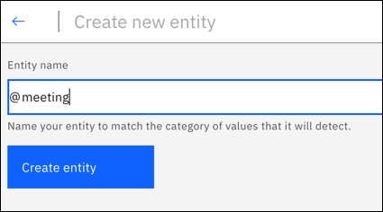{: caption="Create entity" caption-side="bottom"}

1.  For this entity, choose whether you want your assistant to use a dictionary-based or annotation-based approach to find mentions of it, and then follow the appropriate procedure.

    **For each entity that you create, choose one entity type to use only.** As soon as you add an annotation for an entity, the contextual model is initialized and becomes the primary approach for analyzing user input to find mentions of that entity. The context in which the mention is used in the user input takes precedence over any exact matches that might be present. For more information, see [Entity evaluation overview](#entities-described).

## Adding dictionary-based entities
{: #entities-create-dictionary-based}

Dictionary-based entities are used to define specific terms, synonyms, or patterns. At run time, your assistant finds entity mentions only when a term in the user input exactly matches (or closely matches if fuzzy matching is enabled) the value or one of its synonyms.

1.  In the **Value name** field, type a value. For example, for the `@city` entity, you might type `New York City`.

    An entity value can be any string up to 64 characters in length.

    **Important:** Don't include sensitive or personal information in entity names or values. The names and values can be included in URLs in an app.

1.  Add synonyms for the value. For example, you might add `NYC` and `The Big Apple` as synonyms for `New York City`. {: #entities-synonyms}

    A synonym can be any string up to 64 characters in length.

    If you want to define a pattern for your assistant to look for in user input, such as a product order number or email address, define a pattern value instead. See [Adding entities that recognize patterns](#entities-patterns) for more details.

    **Note:** You can add *either* synonyms or patterns for a single entity value, not both.

1.  If you want your assistant to recognize terms with syntax that is similar to the entity value and synonyms you specify, but without requiring an exact match, set the **Fuzzy Matching** switch to **On**.

    For example, if you add `apple` as a value for a `@fruit` entity, and a user enters `apples` or `appel`, if fuzzy matching is enabled, your assistant recognizes the word as a `@fruit` mention. For more information, see [How fuzzy matching works](#entities-fuzzy-matching).

1.  Click **Add value** and repeat the process to add more entity values.

    If you are adding many values, one after another, press **Shift+Enter** to finish adding the current value, and keep focus in the value field so you can add the next value.
    {: tip}

1.  After you add the entity values, click  to finish creating the entity.

The entity that you created is added, and the system trains itself on the new data.

### Adding entities that recognize patterns
{: #entities-patterns}

You can create an entity that looks for patterns in user input. For example, you can look for mentions of an email address by looking for occurrences of the pattern `{word}+@+{word}+.com`. Or, you might have product order numbers that follow a specific format, such as `TWEX3433JKL`. You can create a pattern to look for strings with that syntax in the user utterance.

To add an entity that recognizes a pattern:

1.  Follow the standard procedure to create a dictionary-based entity, but select **Patterns** from the *Type* menu instead of *Synonyms*.

    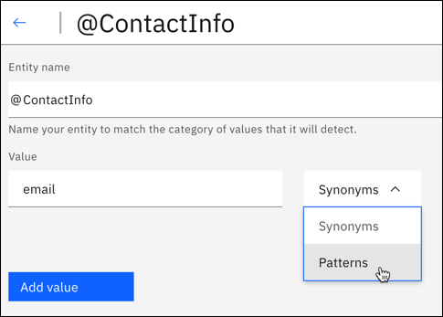{: caption="Choose Patterns type" caption-side="bottom"}

1.  Add a regular expression that defines the pattern you want to look for.

    - For each entity value, there is a maximum of up to 5 patterns.
    - Each pattern (regular expression) is limited to 512 characters.

    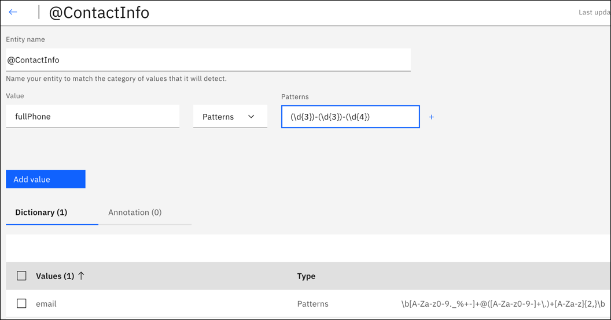{: caption="Patterns entity" caption-side="bottom"}
    {: #entities-pattern-entities}

    Follow these syntax rules:

    - Entity patterns can’t contain:
      - Positive repetitions (for example `x*+`)
      - Backreferences (for example `\g1`)
      - Conditional branches (for example `(?(cond)true)`)
    - When a pattern entity starts or ends with a Unicode character, and includes word boundaries, for example `\bš\b`, the pattern match does not match the word boundary correctly. In this example, for input `š zkouška`, the match returns `Group 0: 6-7 š` (`š zkou`**`š`**`ka`), instead of the correct `Group 0: 0-1 š` (**`š`** `zkouška`).

      The regular expression engine is loosely based on the Java regular expression engine. You see an error if you try to upload an unsupported pattern, either by using the API or from within the {{site.data.keyword.assistant_classic_short}} user interface.

    For example, for entity *ContactInfo*, the patterns for phone, email, and website values can be defined as follows:

    - Phone
      - `localPhone`: `(\d{3})-(\d{4})`, for example, 426-4968
      - `fullUSphone`: `(\d{3})-(\d{3})-(\d{4})`, for example, 800-426-4968
      - `internationalPhone`: `^(\(?\+?[0-9]*\)?)?[0-9_\- \(\)]*$`, for example, +44 1962 815000
    - Email
       - `email`: `\b[A-Za-z0-9._%+-]+@([A-Za-z0-9-]+\.)+[A-Za-z]{2,}\b`, for example, name@ibm.com
    - Website
       - `website`: `(https?:\/\/)?([\da-z\.-]+)\.([a-z\.]{2,6})([\/\w \.-]*)*\/?$`, for example, https://www.ibm.com

1.  Click **Add value** and repeat the process to add more entity values.

When you use pattern entities to find patterns in user input, you often need a way to store the part of the user input text that matches the pattern. To do so, you can use a context variable. For more information, see [Defining a context variable](/docs/watson-assistant?topic=watson-assistant-dialog-runtime-context#dialog-runtime-context-var-define).

For example, your dialog might ask users for their email address. The dialog node condition contains a condition similar to `@contactInfo:email`. You can use the following syntax in the dialog node's response section to define a context variable that captures and stores the user's email address text:

| Variable | Value |
| --- | --- |
| email | `<? @contactInfo.literal ?>` |
{: caption="Saving a pattern" caption-side="bottom"}

This syntax indicates that you want to find the part of the user input that matches the email pattern and save that subset of text into a context variable named `email`.

#### Capture groups
{: #entities-capture-group}

For regular expressions, any part of a pattern inside a pair of normal parentheses is captured as a group. For example, the entity `@ContactInfo` has the pattern `fullUSphone` that contains three captured groups:

- `(\d{3})` - US area code
- `(\d{3})` - Prefix
- `(\d{4})` - Line number

Grouping can be helpful if, for example, you want your assistant to ask for a phone number, and then use only the area code in a response.

To assign the user-entered area code as a context variable, use the following syntax in the dialog node's response section to capture the group match:

| Variable | Value |
| --- | --- |
| area_code | `<? @ContactInfo.groups[1] ?>` |
{: caption="Saving a capture group" caption-side="bottom"}

For more information about using capture groups in your dialog, see [Storing and recognizing entity pattern groups in input](/docs/watson-assistant?topic=watson-assistant-dialog-tips#dialog-tips-get-pattern-groups).

### How fuzzy matching works
{: #entities-fuzzy-matching}

Fuzzy matching is available for specific languages. For more information, see [Supported languages](/docs/watson-assistant?topic=watson-assistant-admin-language-support#admin-language-support-codes).

Fuzzy matching has these components:

- *Stemming* - The feature recognizes the stem form of entity values that have several grammatical forms. For example, the stem of 'bananas' would be 'banana', while the stem of 'running' would be 'run'.
- *Misspelling* - The feature is able to map user input to the appropriate corresponding entity despite the presence of misspellings or slight syntactical differences. For example, if you define `giraffe` as a synonym for an animal entity, and the user input contains the terms `giraffes` or `girafe`, the fuzzy match can map the term.
- *Partial match* - With partial matching, the feature automatically suggests substring-based synonyms present in the user-defined entities, and assigns a lower confidence score as compared to the exact entity match.

   The partial match component is supported only in English-language dialog skills.
   {: note}

For English, fuzzy matching prevents the capturing of some common, valid English words as fuzzy matches for an entity. This feature uses standard English dictionary words. You can also define an English entity value and synonym, and fuzzy matching matches only your defined entity value or synonym. For example, fuzzy matching might match the term `unsure` with `insurance`; but if you define `unsure` as a value or synonym for an entity like `@option`, then `unsure` always matches to `@option`, and not to `insurance`.

Interactions between the stemming and misspelling fuzzy matching features are not allowed. Specifically, if either an entity or the input is stemmed, misspelling fuzzy matching does not work. For example, assume that the entity is `@lending` and the input word is `pending`. During entity stemming, `@lending` produces `lend`. During input stemming, `pending` produces `pend`. In this case, `lend` does not match to `pend` because the entity and input were stemmed. This change applies to only the English language.
{: important}

## Adding contextual entities
{: #entities-create-annotation-based}

Use annotation-based entities to annotate occurrences of the entity in sample sentences to teach your assistant about the context in which the entity is typically used.

To train a contextual entity model, you can take advantage of your intent examples, which provide sentences to annotate.

This feature is generally available in English-language dialog skills and is available as a beta feature in French-langage dialog skills. For more information, see [Supported languages](/docs/watson-assistant?topic=watson-assistant-admin-language-support#admin-language-support-codes).
{: note}

Using an intent's user examples to define contextual entities does not affect the classification of that intent. However, entity mentions that you label are also added to that entity as synonyms. And intent classification does use synonym mentions in intent user examples to establish a weak reference between an intent and an entity.
{: note}

1.  Click **Intents**.

1.  Click an intent to open it.

1.  Click **Annotate entities**, and then review the intent examples for potential entity mentions.

1.  Click any word, words, or punctuation that is part of a single entity mention from the intent examples.

    In this example, `mobile phones` is the entity mention.

    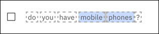{: caption="Review intent examples" caption-side="bottom"}

    A Search box opens that you can use to search for the entity that the highlighted word or phrase is a mention of.

    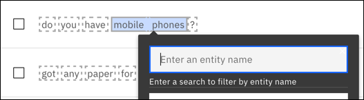{: caption="Search box" caption-side="bottom"}

1.  Enter the entity name to search for. You do not need to include the starting `@` symbol.

    Do one of the following things:

    - If the entity has any existing entity values, they are displayed for informational purposes only. You are adding the annotation to the entity, not to any specific entity value.

    - If you want to teach the model that the mention is synonymous with an existing entity value, add a colon (`:`) after the entity name to show a list of entity values. Choose an entity value from the list that is displayed. For example, `@product:device`.

      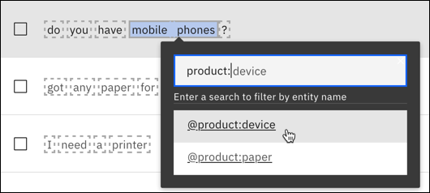{: caption="Show list of entity values" caption-side="bottom"}

1.  Select the entity or entity and value to which you want to add the annotation.

    In this example, `mobile phones` is being added as an annotation for the `@product` entity value and as a synonym for the `@product:device` entity value.

    Create *at least* 10 annotations for each contextual entity. More annotations are recommended for production use.
    {: important}

1.  If none of the entities are appropriate, you can create a new entity by adding its name. Then, choose the **{entity_name}(create new entity)** option from the list.

    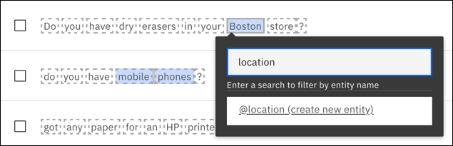{: caption="Create new entity" caption-side="bottom"}

1.  Repeat this process for each entity mention that you want to annotate.

    Be sure to annotate every mention of an entity type that occurs in any user examples that you edit. See [What you don't annotate matters](#entities-counter-examples) for more details.
    {: important}

1.  Click one of the annotations that you created. A box is displayed that says, `Go to: {entity-name}`. Clicking that link takes you directly to the entity.

    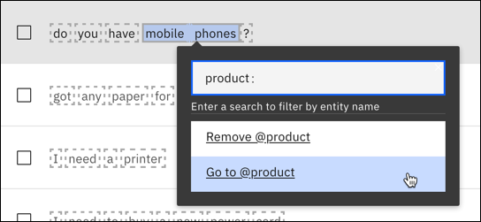{: caption="Go to entity" caption-side="bottom"}

    The annotation is added to the entity you associated it with, and the system trains itself on the new data.

    The term that you annotated is added to the entity as a new dictionary value. If you associated the annotated term with an existing entity value, then the term is added as a synonym of that entity value instead of as an independent entity value.
    {: important}

    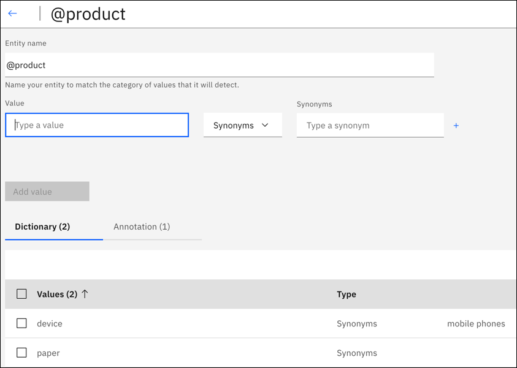{: caption="Mobile phones added as synonym" caption-side="bottom"}

1.  To see all of the mentions you annotated for a particular entity, from the entity's configuration page, click the **Annotation** tab.

    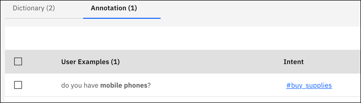{: caption="See all annotations" caption-side="bottom"}

    Contextual entities understand values that you didn't explicitly define. The system makes predictions about more entity values based on how your user examples are annotated, and uses those values to train other entities. Any similar user examples are added to the *Annotation* view, so you can see how this option impacts training.
    {: note}

    If you do not want your contextual entities to use this expanded understanding of entity values, select all the user examples in the *Annotation* view for that entity, and then click **Delete**.

**Tutorial**: To walk through a tutorial that shows you how to define contextual entities before you add your own, go to [Tutorial: Defining contextual entities](https://www.ibm.com/cloud/architecture/demo/try-watson-assistant-contextual-entities){: external}.

### What you don't annotate matters
{: #entities-counter-examples}

If you have an intent example with an annotation, and another word in that example matches the value or a synonym of the same entity, but the value is *not* annotated, that omission has impact. The model also learns from the context of the term that you did not annotate. Therefore, if you label one term as a mention of an entity in a user example, be sure to label any other applicable mentions also.

1.  The `#Customer_Care_Appointments` intent includes two intent examples with the word `visit`.

    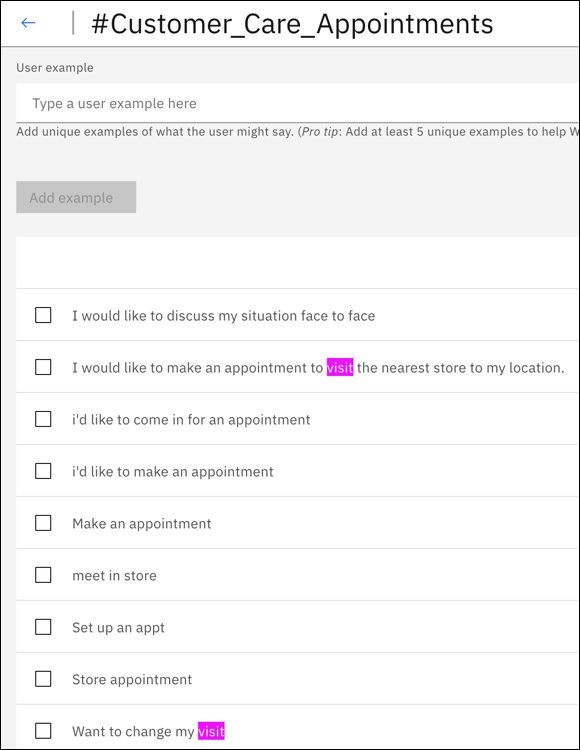{: caption="Examples with visit" caption-side="bottom"}

1.  In the second occurrence of the word, you want to annotate the word `visit` as an entity value of the `@meeting` entity. This annotation makes `visit` equivalent to other `@meeting` entity values such as `appointment`, as in *I'd like to make an appointment* or *I'd like to schedule a visit*.

    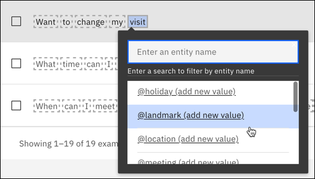{: caption="Annotate visit with @meeting entity" caption-side="bottom"}

1.  In the first occurrence, the word `visit` is being used as a verb. It has a different meaning from a meeting. In this case, you can select the word `appointment` from the intent example, and annotate it as an entity value of the `@meeting` entity. The model learns from the fact that the word `visit` in the same example is not annotated.

    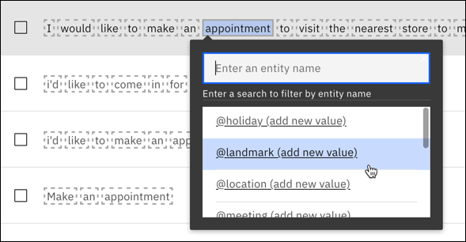{: caption="Select appoinment" caption-side="bottom"}

## Enabling system entities
{: #entities-enable-system-entities}

{{site.data.keyword.assistant_classic_short}} provides a number of *system entities*, which are common entities that you can use for any application. Enabling a system entity makes it possible to quickly populate your skill with training data that is common to many use cases.

System entities can be used to recognize a broad range of values for the object types they represent. For example, the `@sys-number` system entity matches any numerical value, including whole numbers, decimal fractions, or even numbers written out as words.

System entities are centrally maintained, so any updates are available automatically. You cannot modify system entities.

1.  On the Entities page, click **System entities**.

1.  Browse through the list of system entities to choose the ones that are useful for your application.
    - To see more information about a system entity, including examples of matching input, click the entity in the list.
    - For details about the available system entities, see [System entities](/docs/watson-assistant?topic=watson-assistant-system-entities).

1.  Set the switch for each system entity that you want to use to **On**.

After you enable system entities, {{site.data.keyword.assistant_classic_short}} retrains. After training is complete, you can use the entities.

## Entity limits
{: #entities-limits}

The number of entities, entity values, and synonyms that you can create depends on your {{site.data.keyword.assistant_classic_short}} service plan:

| Plan | Entities per skill | Entity values per skill | Entity synonyms per skill |
| --- | --- | --- | --- |
| Enterprise | 1,000 | 100,000 | 100,000 |
| Premium (legacy) | 1,000 | 100,000 | 100,000 |
| Plus | 1,000 | 100,000 | 100,000 |
| Lite, Trial | 100 | 100,000 | 100,000 |
{: caption="Plan details" caption-side="top"}

System entities that you enable for use count toward your plan usage totals.

| Plan | Contextual entities and annotations |
| --- | --- |
| Enterprise | 150 contextual entities with 3000 annotations |
| Premium (legacy) | 150 contextual entities with 3000 annotations |
| Plus | 100 contextual entities with 2000 annotations |
| Lite, Trial | 10 contextual entities with 1000 annotations |
{: caption="Plan details continued" caption-side="top"}

## Editing entities
{: #entities-edit}

You can click any entity in the list to open it for editing. You can rename or delete entities, and you can add, edit, or delete values, synonyms, or patterns.

If you change the entity type from `synonym` to `pattern`, or vice versa, the existing values are converted, but might not be useful as-is.
{: note}

## Searching entities
{: #entities-search}

Use the Search feature to find entity names, values, and synonyms. System entities are not searchable.

1.  From the **Entities** page, click the Search icon .

1.  Enter a search term or phrase. You can also select **Include partial match**.

    The first time that you search for something, you might get a message that says the content is being indexed. If so, wait a minute, and then resubmit the search term.

1. Entities containing your search term, with corresponding examples, are shown.

   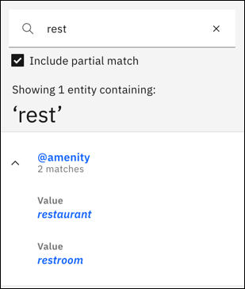{: caption="Search results" caption-side="bottom"}

## Downloading entities
{: #entities-export}

You can download a number of entities to a CSV file, so you can then upload and reuse them in another assistant.

- Pattern information is included in the downloaded CSV file. Any string that is wrapped with `/` is considered a pattern (as opposed to a synonym).
- Annotations that are associated with contextual entities are not downloaded. You must download the entire dialog to capture both the entity value and any associated annotations.

1.  Go to the **Entities** page

    - To download all entities, do not select any individual entities. Instead, click the **Download all entities** icon .

    - To download the entities that are listed on the current page only, select the checkbox in the header. This action selects all of the entities on the current page. Then, click the **Download** button.

    - To download one or more specific entities, select the entities that you want to download, and then click the **Download** button.

1.  Specify the name and location in which to store the CSV file that is generated, and then click **Save**.

## Uploading entities
{: #entities-import}

If you have many entities, you might find it easier to upload them from a comma-separated value (CSV) file than to define them one by one.

Entity annotations are not included in the upload of an entity CSV file. You must upload the entire dialog to retain the associated annotations for a contextual entity. If you download and upload entities only, then any contextual entities that you downloaded are treated as dictionary-based entities after you upload them.
{: note}

1.  Collect the entities into a CSV file, or export them from a spreadsheet to a CSV file. The required format for each line in the file is as follows:

    ```text
    <entity>,<value>,<synonyms>
    ```
    {: screen}

    where &lt;entity&gt; is the name of an entity, &lt;value&gt; is a value for the entity, and &lt;synonyms&gt; is a comma-separated list of synonyms for that value.

    ```text
    weekday,Monday,Mon
    weekday,Tuesday,Tue,Tues
    weekday,Wednesday,Wed
    weekday,Thursday,Thur,Thu,Thurs
    weekday,Friday,Fri
    weekday,Saturday,Sat
    weekday,Sunday,Sun
    month,January,Jan
    month,February,Feb
    month,March,Mar
    month,April,Apr
    month,May
    ```
    {: screen}

    Uploading a CSV file also supports patterns. Any string that is wrapped with `/` is considered a pattern (as opposed to a synonym).

    ```text
    ContactInfo,localPhone,/(\d{3})-(\d{4})/
    ContactInfo,fullUSphone,/(\d{3})-(\d{3})-(\d{4})/
    ContactInfo,internationalPhone,/^(\(?\+?[0-9]*\)?)?[0-9_\- \(\)]*$/
    ContactInfo,email,/\b[A-Za-z0-9._%+-]+@[A-Za-z0-9.-]+\.[A-Za-z]{2,}\b/
    ContactInfo,website,/(https?:\/\/)?([\da-z\.-]+)\.([a-z\.]{2,6})([\/\w \.-]*)*\/?$/
    ```
    {: screen}

    Save the CSV file with UTF-8 encoding and no byte order mark (BOM). The maximum CSV file size is 10 MB. If your CSV file is larger, consider splitting it into multiple files and uploading them separately. Open your dialog skill and then click the **Entities** tab.
    {: tip}

1.  Click the **Upload** icon .

1.  Drag a file, or browse to select a file from your computer, and then click **Upload entities**. 

    The file is validated and uploaded, and the system trains itself on the new data. You can view the uploaded entities on the Entities page.

## Deleting entities
{: #entities-delete}

You can select a number of entities for deletion.

When you delete an entity, you remove any values, synonyms, patterns, or annotations that are associated with the entity. This data cannot be retrieved later. All dialog nodes that reference these entities or values must be updated manually to no longer reference the deleted content.
{: important}

1.  Go to the **Entities** page.

    - To delete all entities, do not select any individual entities. Instead, click the **Delete all entities** icon .

    - To delete the entities that are listed on the current page only, select the checkbox in the header. This action selects all of the entities that are listed on the current page. Then, click the **Delete** button.

    - To delete one or more specific entities, select the entities that you want to delete, and then click the **Delete** button.

