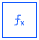
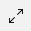

---

copyright:
  years: 2018, 2022
lastupdated: "2022-00-01"

subcollection: watson-assistant

---

{:shortdesc: .shortdesc}
{:new_window: target="_blank"}
{:external: target="_blank" .external}
{:deprecated: .deprecated}
{:important: .important}
{:note: .note}
{:tip: .tip}
{:pre: .pre}
{:codeblock: .codeblock}
{:screen: .screen}
{:javascript: .ph data-hd-programlang='javascript'}
{:java: .ph data-hd-programlang='java'}
{:python: .ph data-hd-programlang='python'}
{:swift: .ph data-hd-programlang='swift'}

# Writing expressions
{: #expressions}

You can write _expressions_ to specify values that are independent of, or derived from, values that are collected in steps or stored in session variables. You can use an expression to define a step condition or to define the value of a session variable.
{: shortdesc}

The Watson Assistant expression language is based on the Spring Expression Language (SpEL), but with some important differences in syntax. For detailed background information about SpEL, see [Spring Expression Language (SpEL)](https://docs.spring.io/spring-framework/docs/5.2.13.RELEASE/spring-framework-reference/core.html#expressions){: external}.
{: note}

For details about the methods you can use in expressions, see [Expression language methods for actions](/docs/watson-assistant?topic=watson-assistant-expression-methods-actions).

## Using an expression in a step condition
{: #expression-step-condition}

You can use an expression in a step condition if you want to condition a step on the result of a calculation based on information you have gathered during the conversation.

For example, suppose a customer has $200 in a savings account and wants to transfer $150 from it to a new checking account. The funds transfer fee is $3, and the bank charges a fee when a savings account contains less than $50. You could create a step with a step condition that checks for this situation. The step condition would use an expression like this:

```text
${savings} - (${Step_232} + ${transfer_fee}) < 50
```
{: codeblock}

where:

- `${savings}` represents a session variable that stores the customer's savings account total.
- `${Step_232}` represents the step that asks for the amount the customer wants to transfer.
- `${transfer_fee}` represents a session variable that specifies the fee for a funds transfer.

If the step condition is met, the step warns the user that the requested transfer will bring the savings account balance below the $50 minimum and incur a fee, and ask to confirm before proceeding.

To use an expression in a step condition, follow these steps:

1.  From the step, click **Add condition**.

    A condition is generated automatically with the most likely choice, which is typically any variables that were set in the previous step.

1.  Click the first segment of the generated condition, and then scroll down and click **Expression**.

1.  Add the expression that you want to use.

## Using an expression to assign a value to a session variable
{: #expression-variable}

You can use an expression when assigning a value to a session variable if you want the variable's value to be calculated based on other variables.

For example, suppose you want to tell your customer the total cost of a purchase, including 6% sales tax and a flat $3.00 processing fee. To calculate the total cost, you could create a session variable and assign the value using an expression:

```text
(${price} * 1.06) + 3
```

You can then reference this variable in the **Assistant says** field.

To use an expression when assigning a value to a session variable, follow these steps:

1. From within a step, choose the **Set variable values**  icon.

1. Click **Set new value**.

1. From the drop-down list, select the session variable you want to store the value in.

1. After **to**, select **Expression**.

1. **Optional:** Click the  **Expand** icon to open the expression editor window. (You can also type the expression directly in the field without opening the window, but the editor makes it easier to edit a longer or more complex expression.)

1. To reference a variable in the expression, type a dollar sign (`$`) and then select a variable from the list.

    When you select a variable, the reference is inserted into your expression in the correct notation, referencing the variable using its variable ID rather than its display name (for example, `${step_773}` or `${customer_id}`). Do not edit this reference unless you want to refer to a different variable and you are sure of its variable ID.

1. If you are using the expression editor, click **Apply** to save your changes and close the editor window.

You can also use an expression to assign an initial value to a session variable. In the **Session variable** window, go to the **Initial value** field and click **Use expression**.
{: note}

