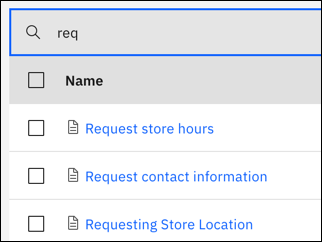

---

copyright:
  years: 2018, 2023
lastupdated: "2023-10-26"

subcollection: watson-assistant

---

{{site.data.keyword.attribute-definition-list}}

# Filtering actions
{: #filter-actions}

[IBM Cloud]{: tag-ibm-cloud}

You can locate specific actions by filtering the list.
{: shortdesc}

You can filter by:

| Filter | Description |
| --- | --- |
| Name | All or part of the action name |
| Subaction | You can filter by subaction by: <ul><li>Choosing a subaction from the dropdown list. The list shows other actions that trigger, or call, that subaction in *Go to a subaction* at the end of a step.</li><li>Clicking the **Show all subactions** checkbox. The list shows actions that are triggered, or called, by other actions in *Go to a subaction* at the end of a step. |
| Extension | Choose a custom extension to see all the actions that use it. Or, choose **Any** to see all the actions that use at least one custom extension. |
| Variable |  Choose a variable to see all the actions that use it. |
{: caption="Filters" caption-side="bottom"}

To filter by all or part of a name, make an entry in the **Filter by name** field. The list is filtered as you type.

To filter by action, extension, or variable:

1. Click the **Filters** icon  to see the filter fields.

1. Use the **Subaction**, **Extension**, or **Variable** dropdown lists, and then click **Apply**. 

1. Or, click the **Show all subactions** checkbox, and then click **Apply**.
