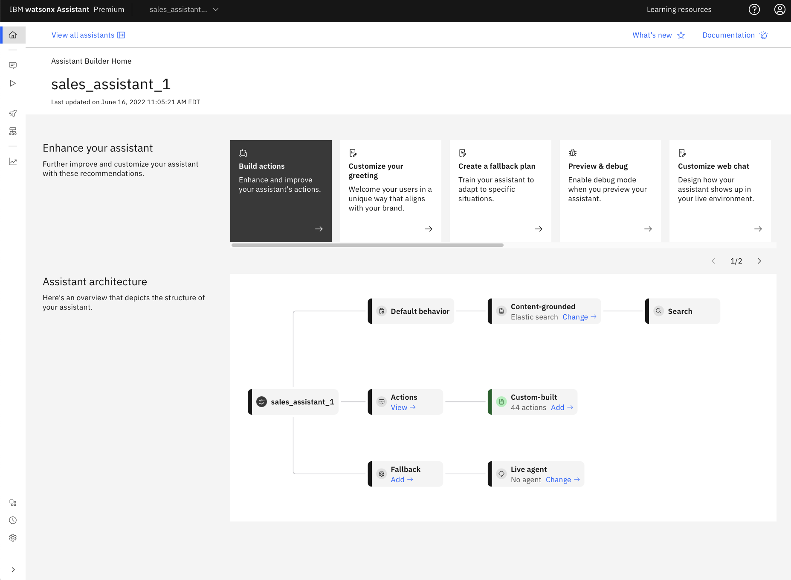
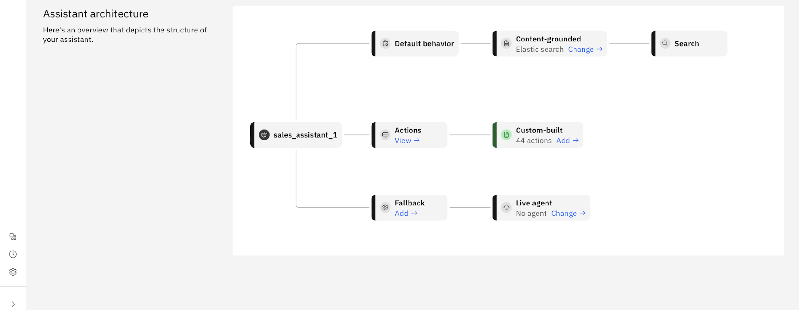

---

copyright:
  years: 2015, 2024
lastupdated: "2024-07-04"

subcollection: watson-assistant

---

{{site.data.keyword.attribute-definition-list}}

# Getting started with {{site.data.keyword.conversationshort}}
{: #getting-started}

{{site.data.keyword.conversationfull}}, which focuses on **actions** to build customer conversations, is simple enough for *anyone* to build a virtual assistant. Building, testing, publishing, and analyzing your assistant are all done in one simple and intuitive interface.

- The new assistant **architecture** enables simple navigation to specific parts of your assistant.

- The **navigation** provides a workflow for building, previewing, publishing, and analyzing your assistant. 

- The assistant has its own **home page** with a task list to help you get started.

- Build conversations with **actions** that represent the tasks you want your assistant to help your customers with. Each action contains a series of steps that represent individual exchanges with a customer.

- **Publish** reviews and debugs your work in a draft environment before your assistant goes live to your customers.

- Use **analytics** to improve your assistant. Review which actions are being completed, determine whether your assistant understands and addresses customer needs, and identify ways to enhance your assistant's performance.

## Home page
{: #getting-started-home-page}

The **Home page** of watsonx Assistant provides you a complete overview of your assistant, settings, and configuration. In addition, you can quickly navigate to the following useful links from the **Home page**:

- [Build actions](/docs/watson-assistant?topic=watson-assistant-build-actions-overview)
- [Customize your greeting](/docs/watson-assistant?topic=watson-assistant-start-conversation)
- [Set up search](/docs/watson-assistant?topic=watson-assistant-conversational-search)
- [Preview & debug](/docs/watson-assistant?topic=watson-assistant-call-extension)
- [Customize web chat](/docs/watson-assistant?topic=watson-assistant-web-chat-config)
- [Set up a channel](/docs/watson-assistant?topic=watson-assistant-deploy-integration-add)
- [Set up live agent](/docs/watson-assistant?topic=watson-assistant-human-agent)
- [Publish your AI assistant](/docs/watson-assistant?topic=watson-assistant-publish-deploy-overview)
- [Check analytics](/docs/watson-assistant?topic=watson-assistant-analytics-overview)
- [Create a fallback plan](/docs/watson-assistant?topic=watson-assistant-dynamic-options)

{: caption="enchanced-homepage" caption-side="top"}

In the **Assistant architecture** section, you can view the complete structure of your assistant with links to actions that are created by you. In addition, you get a quick summary of your configuration that includes the number of actions that are created, the configured search integration, the integrated live agent, and the fallback configuration. You can directly access the relevant screens by clicking the links in the boxes.

{: caption="assistant-architecture" caption-side="top"}

For more information on FAQs, see [FAQs about {{site.data.keyword.conversationshort}}](/docs/watson-assistant?topic=watson-assistant-watson-assistant-faqs#faqs-new-experience).

## Tutorial
{: #getting-started-tutorial}

The following series of blog articles provide a tutorial to help you get started:

- [Plan it](https://www.ibm.com/blog/getting-started-with-the-new-watson-assistant-plan-it/?c=Watson%20Assistant){: external}
- [Part I: The build guide](https://www.ibm.com/blog/getting-started-with-the-new-watson-assistant-part-i-the-build-guide/?c=Watson%20Assistant){: external}
- [Part II: Refine your assistant](https://www.ibm.com/blog/getting-started-with-the-new-watson-assistant-part-ii-refine-your-assistant/?c=Watson%20Assistant){: external}
- [Part III: Test and deploy](https://www.ibm.com/blog/getting-started-with-the-new-watson-assistant-part-iii-test-and-deploy/?c=Watson%20Assistant){: external}
- [Part IV: preview, draft, publish, live](https://www.ibm.com/blog/getting-started-with-the-new-watson-assistant-part-iv-preview-draft-publish-live/?c=Watson%20Assistant){: external}

Some more starting points in the documentation to also help you get started:
- [About {{site.data.keyword.conversationshort}}](/docs/watson-assistant?topic=watson-assistant-about)
- [Planning your assistant](/docs/watson-assistant?topic=watson-assistant-plan-assistant)
- [Overview: Editing actions](/docs/watson-assistant?topic=watson-assistant-build-actions-overview)
- [Building actions from a template](/docs/watson-assistant?topic=watson-assistant-actions-templates)

