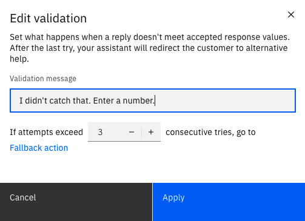

---

copyright:
  years: 2018, 2021
lastupdated: "2021-09-01"

subcollection: watson-assistant

---

{:shortdesc: .shortdesc}
{:new_window: target="_blank"}
{:external: target="_blank" .external}
{:deprecated: .deprecated}
{:important: .important}
{:note: .note}
{:tip: .tip}
{:pre: .pre}
{:codeblock: .codeblock}
{:screen: .screen}
{:javascript: .ph data-hd-programlang='javascript'}
{:java: .ph data-hd-programlang='java'}
{:python: .ph data-hd-programlang='python'}
{:swift: .ph data-hd-programlang='swift'}

{{site.data.content.classiclink}}

# Handling errors in the conversation
{: #handle-errors}

No matter how well your assistant is designed, sometimes customers can run into problems getting it to understand them or do what they want. Your assistant can automatically help customers recover from many such situations, and you can configure how it responds.
{: shortdesc}

## How error conditions are handled

There are several kinds of error situations your assistant might need to recover from:

- Your assistant cannot understand your customer's request
- Your customer does not provide a valid response to a question
- Your customer asks to talk to a human agent

Your assistant has a built-in capabilities to detect error conditions and give customers the chance to correct them. In addition, the built-in *Fallback* action provides a way to automatically connect customers to a human agent if they need more help.

### When the assistant can't understand your customer's request
{: #no-action-matches}

When you build actions, you train your assistant on what your customers might ask for. The **Customer starts with** section of each action provides examples of customer input that trigger the action; the assistant uses natural language processing to recognize customer input that is similar to these examples. This happens at the beginning of the conversation, or after any action has completed and the assistant is ready for another action.

But you can't anticipate every possible request, so sometimes customers will send input that your assistant can't match to any action. This might happen because the input isn't phrased in a way that the assistant can understand; it can also happen if customers ask for things that your assistant isn't designed to handle.

Unrecognized input of this sort triggers the built-in *No action matches* action. To see how this action works, click **Set by assistant** in the list of actions, and then click *No action matches*.

By default, this action has two steps, each step conditioned on the *No action matches count* session variable. This is a built-in variable that is automatically incremented with each consecutive unrecognized input. Therefore, the behavior of the *No action matches* action differs depending on how many times in a row the user has said something the assistant didn't understand:

- For the first three unrecognized messages, step 1 executes. This step simply outputs a message saying that the assistant did not recognize the user's input, and asking the user to try again. You can edit this step to change the message, or modify the step condition to change how many times the assistant responds with this message.

  When the user sends input that successfully triggers an action, the *No action matches count* session variable is reset to 0.

- If the user tries more than three times but the assistant still doesn't understand, step 2 executes. Step 2 calls the *Fallback* action, which offers other options like connecting to a human agent. (For more information about the *Fallback* action, see [Fallback action](#fallback-action).)

You can edit the *No action matches* action just as you can any other action. This includes changing the existing steps and adding or deleting steps. Note that if you change the *No action matches* action, you might accidentally break your assistant's ability to recover from errors in the conversation. If this happens, you can recreate the default steps based on the information in this section.
{: tip}

#### Adding examples of unsupported input

By default, the *No action matches* action is triggered only when the user's input does not match any defined action.

If there are certain user requests that you can anticipate, but that your assistant does not support, you can add these requests as examples in the **Customer starts with** section of the *No action matches* action. Adding examples helps to ensure that these requests are sent directly to the *No action matches* action rather than triggering a different action by mistake.

### When your customer gives invalid answers
{: #step-validation}

When a step in an action asks your customer to answer questions or provide additional information, the assistant expects a particular response type, such as a number, date, or text string. (For more information about customer response types, see [Collecting information from your customer](/docs/watson-assistant?topic=watson-assistant-collect-info).) The assistant checks the customer's response to make sure it fits the expected response type; this process is called _validation_.

For most customer response types, the assistant is able to understand valid responses provided in a variety of formats. For example, for a time value, `2:15 PM` and `a quarter past two in the afternoon` are both acceptable. But if the user provides a value that the assistant cannot interpret as matching the expected response type (for example, a response of `purple` when asked for a number), a validation error results.

When there is a validation error, the assistant asks the customer to try again. By default, the assistant allows three attempts to provide a valid response.
After the third attempt, another invalid attempt triggers the *Fallback* action, which offers other options like connecting to a human agent. (For more information about the *Fallback* action, see [Fallback action](#fallback-action).)

#### Customizing validation for a response

When you edit a step that expects a customer response, you can customize how validation errors are handled. Click **Edit validation** to see the validation options:

You can customize the following options:

- In the **Validation message** field, specify the text of the message the assistant sends when the customer's response doesn't match the expected response type. For example, the default validation error message for a numeric value is `I didn't catch that. Enter a number.` You might want to customize this message to be more specific (for example, `Enter the number of people in your group.`).

- Click **`+`** or **`-`**, or directly edit the number, to change how many consecutive tries the customer can make before the *Fallback* action is triggered.

### When your customer asks to speak to a human agent

At any point in the conversation, your customer might ask to speak to a human agent. The built-in *Fallback* action is preconfigured with example input that detects such requests; you can edit the **Customer starts with** section of the *Fallback* action to add more examples.

## Editing the fallback action
{: #fallback-action}

The built-in *Fallback* action is automatically provided with each assistant and cannot be deleted. However, you can edit the *Fallback* action to modify the conversation your users have with the assistant when errors occur. For example, you might want to add steps or modify step conditions to provide more control over how specific error conditions are handled.

To edit the *Fallback* action, click **Set by assistant** in the list of actions, and then click *Fallback*.

Whenever the *Fallback* action is triggered, the assistant also sets a value for the *Fallback reason* session variable. This value indicates what kind of situation led to the *Fallback* action being triggered. By default, this variable can have one of three values:

- *Step validation failed*: The customer repeatedly gave answers that were not valid for the expected customer response type.
- *Agent requested*: The customer directly asked to be connected to a human agent.
- *No action matches*: The customer repeatedly made requests or asked questions that the assistant did not understand.

The *Fallback* action defines three conditional steps, one for each possible value of the *Fallback reason* variable. Each step sends a message to the customer, based on the error condition, and then uses the *Connect to human agent* feature to transfer the conversation to a human agent. (For more information about this feature, see [Handing off to a human agent](/docs/watson-assistant?topic=watson-assistant-human-agent).) You can modify these steps if you want to handle an error condition in a different way.
