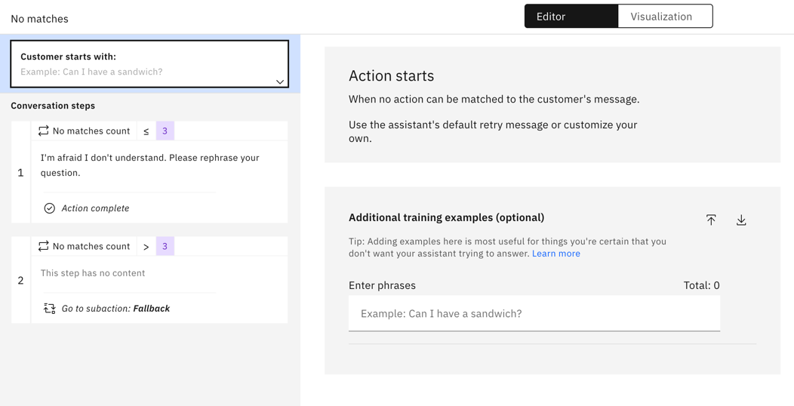

---

copyright:
  years: 2018, 2024
lastupdated: "2024-05-09"

subcollection: watson-assistant

---

{{site.data.keyword.attribute-definition-list}}

# Providing options when a question or request cannot be answered
{: #handle-errors}

No matter how well your assistant is designed, customers can sometimes encounter issues with the chatbot understanding them or doing what they want. Your assistant can automatically help customers recover from many situations, and you can configure how it responds.
{: shortdesc}

## How error conditions are handled
{: #handle-errors-how-error-conditions-handled}

Error situations that your assistant can recover from:

- Your assistant cannot understand your customer's request.
- Your customer does not provide a valid response to a question.
- Your customer requests to speak to a live agent.

Your assistant can detect error conditions and give customers the chance to correct them. In addition, the built-in *Fallback* action provides a way to automatically connect customers to a live agent if they need more help.

### When the assistant can't understand your customer's request
{: #no-action-matches}

When you build actions, you train your assistant on what your customers might ask for. The **Customer starts with** section of each action provides examples of customer input that trigger the action. The assistant uses natural language processing to recognize customer input that is similar to these examples. This happens at the beginning of the conversation, or after an action completes and the assistant is ready for another action.

You cannot anticipate every possible request, so sometimes customers send input that your assistant fails to match to any action. The input may be phrased in a way that the assistant cannot understand, or customers ask for things that your assistant is not designed to handle.

Unrecognized input of this sort triggers the built-in **No matches** action. To see how this action works, click **Set by assistant** in the list of actions, and then click **No matches**.

{: caption="No action matches built-in action." caption-side="bottom"}

By default, this action has two steps, and each step is conditioned on the *No action matches count* session variable. This built-in variable is automatically incremented with each consecutive unrecognized input. Therefore, the behavior of the **No matches** action differs depending on how many times in a row the user says something that the assistant fails to understand.

- For the first three unrecognized messages, step 1 executes. This step outputs a message that the assistant did not recognize the user's input, and asks the user to try again. You can edit the message, or modify the number of times that the assistant responds with this message.

    When the user sends input that successfully triggers an action, the *No action matches count* session variable is reset to 0.

- If the user tries more than three times and the assistant still does not understand, step 2 executes. Step 2 calls the *Fallback* action, which offers other options such as connecting to a live agent. For more information, see [Editing the fallback action](#fallback-action).

You can edit the **No matches** action just as you can any other action by changing the existing steps and adding or deleting steps. If you change the **No matches** action, you might accidentally break your assistant's ability to recover from errors in the conversation. If this happens, you can re-create the default steps.
{: tip}

#### Configuring the search routing when no action matches
{: #config-search-routing}

When no matches are available for a user input, you can configure the routing behavior of an action by selecting one of the following options:

- **Route to conversational search**

   You can use this option to route the assistant users to the search integration when there are no matches for the user responses. Before you select **Route to conversational search**, you must configure the search integration and the conversational search. 

   

- **Route directly to No matches action**

   You can use this option to route the assistant users to the **No matches** action when there are no matches for the user responses.

   

To configure **Search routing**, go to **Home** > **Actions** > **Global settings** > **Conversation routing** > **Search routing**. After you select an option **Search routing**, click the **Save** button.

For any new assistant, the **Route to conversational search** option is the default selction in the **Search routing** section.{: tip}

The **Search routing** feature is enabled for any assistant in draft environment, but not for assistants in live environment. However, the **Search routing** feature is enabled for the assistant in the live environment, if you created the assistant in live environment from a draft environment for which **Search routing** is configured earlier. {: tip}

#### Adding examples of unsupported input
{: #no-action-matches-add-examples}

By default, the **No matches** action is triggered only when the user's input does not match any defined action.

If you can anticipate certain user requests that your assistant does not support, you can add these requests as example phrases in the **Customer starts with** section of the **No matches** action. Adding example phrases helps to ensure that these requests are sent directly to the **No matches** action rather than triggering a different action by mistake. You can also upload or download example phrases in a comma-separated value (CSV) file. For more information, see [Adding more examples](/docs/watson-assistant?topic=watson-assistant-understand-questions#understand-questions-adding-more-examples).

### When your customer gives invalid answers
{: #step-validation}

When a step in an action asks your customer to answer questions or provide additional information, the assistant expects a particular response type, such as a number, date, or text string. (For more information, see [Collecting information from your customer](/docs/watson-assistant?topic=watson-assistant-collect-info).) The assistant checks the customer's response to ensure it fits the expected response type; this process is called *validation*.

For most customer response types, the assistant is able to understand valid responses in various formats. For example, for a time value, `2:15 PM` and `a quarter past two in the afternoon` are both acceptable. But if the user provides a value that the assistant cannot interpret as matching the expected response type (for example, a response of `purple` when asked for a number), a validation error results.

When a validation error occurs, the assistant asks the customer to try again. By default, the assistant allows three attempts for a valid response.
After the third attempt, another invalid attempt triggers the *Fallback* action, which offers other options such as connecting to a live agent. For more information, see [Editing the fallback action](#fallback-action).

#### Customizing validation for a response
{: #customize-validation}

When you edit a step that expects a customer response, you can customize how validation errors are handled. 

1. Click **Edit validation** to see the validation options.

1. For all customer responses except *free text*, you can customize the following options:

   - In the **Response 1** field, specify the text of the message the assistant sends when the customer's response does not match the expected response type. For example, the default validation error message for a numeric value is `I didn't catch that. Enter a number.` You might want to customize this message to be more specific, such as `Enter the number of people in your group.`
   
   - If you want to use several validation responses, click **Add Response** to add more validation messages. The number of validation responses you can enter depends upon the value in the **If attempts exceed** field.

   - In the **If attempts exceed** field, click **`+`** or **`-`**, or directly edit the number, to change how many consecutive attempts the customer can make before the *Fallback* action is triggered. Or, if you enabled [response modes](/docs/watson-assistant?topic=watson-assistant-action-response-modes), you can use the number of step validation attempts from the response mode that you are using.
   
   - Select **Repeat Assistant Says response** if you want the customer to see or hear the original question. For example, following a validation message of `I’m sorry, please choose a day when we are open`, the assistant repeats `When do you want to visit? We are open Monday through Friday`.
   
For date, time, and numeric customer responses, you can customize the validation to check for a specific answer, such as a range of dates or a limited currency amount. Each choice is optional so you can build a validation specific to the response.

| Response type | Validation choices |
| --- | --- |
| Number | Minimum, maximum |
| Date | After date, before date, specific days of the week |
| Time | Start time, end time |
| Currency | Minimum, maximum |
| Percentage | Minimum, maximum |
{: caption="Validation choices" caption-side="top"}

### When your customer asks to speak to a live agent
{: #fallback-human-agent}

At any point in the conversation, your customer might ask to speak to a live agent. The built-in *Fallback* action is preconfigured with example input that detects such requests; you can edit the **Customer starts with** section of the *Fallback* action to add more examples. You can also upload or download example phrases in a comma-separated value (CSV) file. For more information, see [Adding more examples](/docs/watson-assistant?topic=watson-assistant-understand-questions#understand-questions-adding-more-examples).

## Editing the fallback action
{: #fallback-action}

The built-in *Fallback* action is automatically provided with each assistant and cannot be deleted. However, you can edit the *Fallback* action to modify the conversation that your users have with the assistant when errors occur. For example, you might want to add steps or modify step conditions to provide more control of how specific error conditions are handled.

To edit the *Fallback* action, click **Set by assistant** in the list of actions, and then click *Fallback*.

{: caption="Fallback built-in action" caption-side="bottom"}

Whenever the *Fallback* action is triggered, the assistant also sets a value for the *Fallback reason* session variable. This value indicates what caused the *Fallback* action to be triggered. By default, this variable can have one of five values:

- *Step validation failed*: The customer repeatedly replied with invalid answers for the expected customer response type.
- *Agent requested*: The customer directly asked to be connected to a live agent.
- **No matches**: The customer repeatedly made requests or asked questions that the assistant did not understand.
- *Danger word detected*: The customer uses words or phrases that match the *Connect to agent* step in the *Trigger word detected* action. 
- *Profanity detected*: The customer repeatedly used words or phrases that match the *Show warning* step in the *Trigger word detected* action.

For more information about the *Trigger word detected* action, see [Detecting trigger words](/docs/watson-assistant?topic=watson-assistant-trigger-phrases).

The *Fallback* action defines five conditional steps, one for each possible value of the *Fallback reason* variable. Each step sends a message to the customer, based on the error condition, and then uses the *Connect to agent* feature to transfer the conversation to a live agent. (For more information about this feature, see [Connecting to a live agent](/docs/watson-assistant?topic=watson-assistant-human-agent).) You can modify these steps if you want to handle an error condition in a different way.
