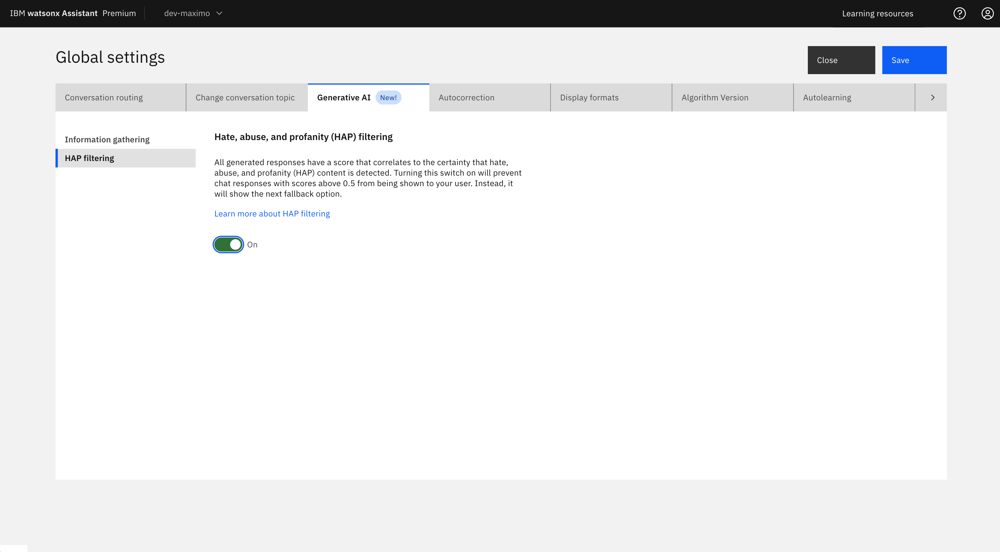

---

copyright:
  years: 2023, 2024
lastupdated: "2024-07-18"

keywords: hap filter

subcollection: watson-assistant

---

{{site.data.keyword.attribute-definition-list}}

# Hate, Abuse, and Profanity Filter

The Hate, Abuse, and Profanity (HAP) filter in {{site.data.keyword.conversationshort}} helps maintain an inclusive environment by identifying and addressing hate speech, abuse, and profanity. This feature filters content to provide a positive online atmosphere and a safe community for your customers. 

By enabling HAP detection, you create a more consistent and reliable user experience, safeguarding against the rare instances where HAP content might be generated. 

{: caption="HAP filter" caption-side="top"}

## Turning on the HAP filter

To turn on the HAP filter, do the following steps:

1. Go to **Global settings** > **Generative AI** > **HAP filtering**
2. Click the toggle to turn it on.

Turning on the HAP filter applies to the following areas:

- Conversational search
- Content-grounded answering
- General-purpose answering
- AI-guided actions

Consider the following key points when you use the HAP filter:

**HAP detection**
- If HAP is detected, the assistant provides a generic fallback response. For more information, see [Conversational search](/docs/watson?topic=watson-conversational-search).

**Recommendation**
- When HAP is on, it minimizes the risk of unintended or inappropriate responses.
