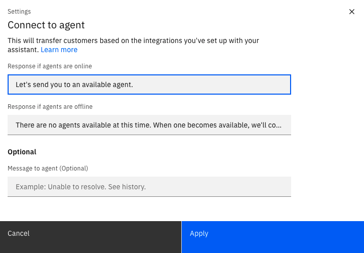

---

copyright:
  years: 2018, 2021
lastupdated: "2021-09-09"

subcollection: watson-assistant

---

{:shortdesc: .shortdesc}
{:new_window: target="_blank"}
{:external: target="_blank" .external}
{:deprecated: .deprecated}
{:important: .important}
{:note: .note}
{:tip: .tip}
{:pre: .pre}
{:codeblock: .codeblock}
{:screen: .screen}
{:javascript: .ph data-hd-programlang='javascript'}
{:java: .ph data-hd-programlang='java'}
{:python: .ph data-hd-programlang='python'}
{:swift: .ph data-hd-programlang='swift'}

{{site.data.content.classiclink}}

# Handing off to a human agent
{: #human-agent}

Your assistant can do a lot, but there might be some situations when your customers need help from a human agent. If your assistant is integrated with one of the supported service desk systems, you can build in logic that will transfer the conversation to a human when necessary. This is referred to as an _escalation_.
{: shortdesc}

To use this feature, your assistant must interact with customers using the web chat or phone integration.<!-- For more information, see **[PUBLISHING TOPIC]**.-->
{: note}

With this feature, your agents work with one of the supported service desk tools, such as Salesforce, Zendesk, or Twilio Flex. When the assistant initiates a transfer, the agent receives a notification within the agent dashboard, and has access to the history of the customer's chat with the assistant.

To see an example of how this works from the agent's perspective, watch this video showing a transfer to an agent using Genesys Cloud:

{: video output="iframe" id="youtubeplayer" frameborder="0" width="560" height="315" webkitallowfullscreen mozallowfullscreen allowfullscreen}

There are two basic scenarios for when your assistant might need to transfer a conversation to a human agent:

- _Planned escalation_ refers to any anticipated situations in which you know you always want to hand off the conversation to a human agent.

- _Fallback escalation_ is an unexpected situation in which the customer is unable to get help from the assistant.

Before you can add human agent transfers to your assistant, you must first add an integration to a service desk system. The supported service desks depend upon how customers connect to your assistant (web chat or phone).<!-- For more information about integrating with a service desk, see **[INTEGRATION TOPIC]**.-->
{: note}

## Planned escalations
{: #planned-escalation}

Examples of planned escalations might include the following:

- The customer asks for a service that cannot be completed without the assistance of a human agent
- The customer needs to deal with a sensitive subject that requires a human touch (such as asking about bereavement benefits, or resolving a complaint)

To set up a planned escalation, you build an action that can recognize a specific situation that requires a human agent. A simple example would be an action that is triggered by the customer input `I want to pay my bill` (you might want to let human agents handle payments).

Within any action, you can create a step that initiates a transfer to a human agent:

1. Add a step, or edit an existing step that you want to transfer the conversation to a human agent.

    Transferring the conversation to a human agent ends the action. If there are situations where you want the conversation to continue within the assistant rather than being transferred, use step conditions as needed.

1. In the **And then** field at the end of the step, select **Connect to agent**.

1. In the Settings window, you can customize the messages the assistant displays as part of the transfer:

    

    - **Response if agents are online**: The message the assistant sends to the customer when the conversation is being transferred to an agent. The default message is `Let's send you to an available agent`.

    - **Response if agents are offline**: The message the assistant sends to the customer when no agents are currently available to take over the conversation. The default message is `There are no agents available at this time. When one becomes available, we'll connect you.`

    - **Message to agent**: An optional message the assistant sends to the human agent when transferring the conversation.

1. Click **Apply**.

If you want to edit the transfer settings later, click **Edit settings** in the **And then** field.
{: note}

## Fallback escalations

Examples of fallback escalations include:

- The customer repeatedly asks a question or makes a request that the assistant cannot match to any defined action.
- The customer repeatedly gives an invalid answer to a question.
- The customer explicitly asks to speak to a human.

Fallback escalations use the _Fallback_ action, which is a built-in system action that is automatically triggered in any of these fallback scenarios. By default, the *Fallback* action handles these error conditions by initiating a transfer to a human agent.

For more information about this automatic error handling and the *Fallback* action, see [Handling errors in the conversation](/docs/watson-assistant?topic=watson-assistant-handle-errors).

## Testing the transfer in the Preview pane

After you have configured an action to connect to a human agent, you can preview it by clicking **Preview**. Note that in the action Preview pane, no actual transfer takes place, but the *Connect to an agent* message confirms that it was correctly triggered.

If you want to test the actual transfer using a working service desk integration, you can do so using the assistant Preview page. For more information, see [Previewing and sharing your assistant](/docs/watson-assistant?topic=watson-assistant-preview-share).
